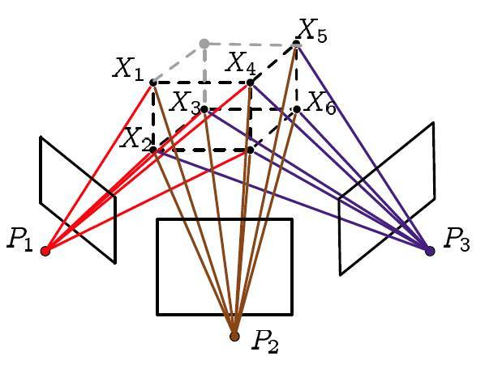
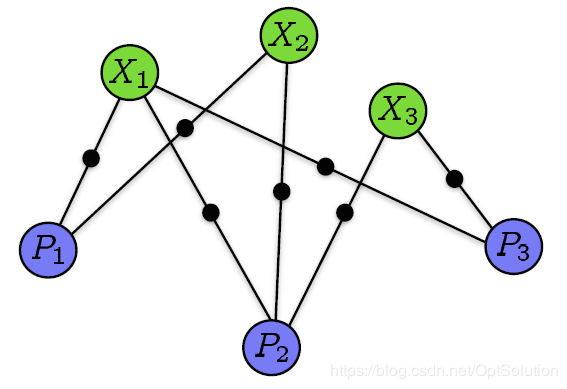
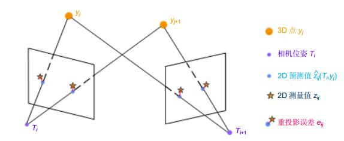
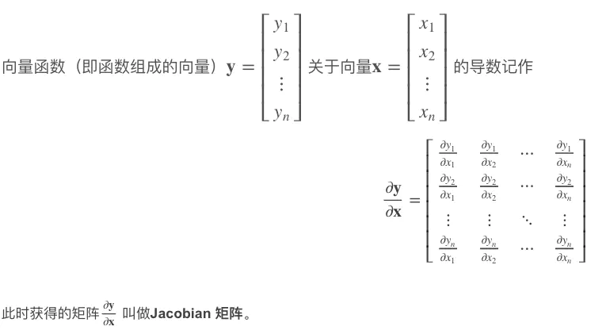

## TODO:

- [2019浙大SLAM暑期学校--刘浩敏《集束调整》](https://blog.csdn.net/qq_15698613/article/details/97263646) | 讲得广度深度都不错，找一下回放看看。

## BA为什么叫BA

**BA ( Bundle Adjustment )**，中文翻译为**捆集调整**、**光束法平差**等等。所谓bundle(捆集)，来源于bundle of light，其本意就是指的光束，这些光束指的是三维空间中的点投影到像平面上的光束，也就是投影的光束和相机相互之间的约束。如下图，一个相机对应一堆三维点，这些三维点通过一条条光束投影到相机成像平面上，每一条光束就是一个约束，在优化相机pose和三维点时，是不是像极了把这些光束捆集打包一起计算？

所以g2o中才把BA看做一个图优化问题。如下图，每个相机pose节点 $P_i$，能够看到多个三维点节点 $X_i$ ，他们之间存在映射关系，即有边（映射关系是三维点通过投影矩阵投影到相机成像平面上）。而有一些三维节点又同时被其他相机看到，所以与其他相机节点也有边这。些相机pose节点、三维点节点以及他们之间的边，就构成了一个图。

**重投影误差**：为什么叫“重”投影？假设有两个相机拍摄空间中的一些点，得到了两张照片，照片上的这些二维点其实是空间三维点“投影”到了这两个相机上得到的。现在我们需要通过投影得到的二维点，去估计这些点在空间中的坐标（一般是通过三角测量去估计），假设我们估计得到了这些点的三维坐标，我们怎么判断估计得好不好呢？一般的做法是将估计得到的三维坐标，再“重”投影到两个相机上，看与拍摄得到的二维点比较，有什么区别，这个投影就叫“重投影”，这个区别，就叫”重投影误差“。

## BA要解决的问题

上面说到重投影误差，有了重投影误差以后，BA其实就是通过最优化的方法，使得重投影误差最小。一般来说，是通过修改相机旋转、相机平移和三维点坐标，来使得重投影误差最小，所以自变量是相机旋转、平移和三维点坐标。

剩下的就是最优化问题了，这是一个非线性最优化问题，参考高翔的《SLAM十四讲》，非线性最优化问题一般有**最速下降法**、**高斯牛顿法**和**LM算法**。一般我们采用LM算法，但无论哪种算法，在优化过程中都要求解一个叫做**增量方程**的东西，这个方程是个线性方程，有着Ax=b的形式。

### TODO：下面可能不对

而解Ax=b的方程，通常有高斯消元、Cholesky分解、QR分解、SVD分解等方法，具体采用的方法，还要看方程是超定还是欠定的，看方程是否满秩，数值解是否稳定，求解速度是否够快等等。虽然在一般问题里，都是用QR分解和SVD分解，他们有较好的数值稳定性，但在SLAM问题中，系数矩阵维度通常非常非常大（试想一下，每一个点和相机之间的边，就是一个方程），用QR分解和SVD分解是十分缓慢的，所以大家通常用Cholesky分解去求解这个增量方程。

为什么用Cholesky分解去求解呢？因为增量方程的系数矩阵A是个稀疏矩阵，矩阵中大多数元素为0，非0元素符合某种规律，而对于这种稀疏矩阵，采用Cholesky分解可以大大简化计算量。

## TODO：为什么说我们的矩阵是稀疏的，稀疏带来的优点

可以参考这里：

《视觉SLAM十四讲》10.2.3 | 讲得很好

https://blog.csdn.net/optsolution/article/details/64442962

### 矩阵为什么是稀疏的

### 稀疏带来的优点

认识到矩阵是稀疏的，并且是有规律的稀疏矩阵，利用这个规律，我们可以在求解 $H\Delta x=g$ 时，进行 **Schur消元** ，先求解关于相机参数的那部分，再将求解结果回代，然后求解关于三维坐标点的那部分，这个过程也叫边缘化，将三维点进行了 **边缘化(Marginalization)**。 

- 优点1：消元后系数矩阵纬度低，便于求解。原方程系数矩阵H维度很高，求解速度很慢，现在变成了和B矩阵维度相同的矩阵，而B矩阵纬度很低（看上面的图就知道了，与相机个数和相机参数纬度有关），这样子计算量就少了很多。另外，求解时涉及到求  $C^{-1}$，虽然C矩阵维度很高，但是它是对角分块矩阵，对角线上分布着一堆3x3的小矩阵块，求逆比较容易，所以计算量也不大。
- 优点2：消元后的 系数矩阵S的条件数往往比之前的H矩阵的条件数要小，所以有更好的数值稳定性。（条件数的知识见附录）

## 李群及李代数

不知道有没有人注意到，在优化迭代的过程中，我们求的值为 $\delta_x$，然后利用 $x+\delta_x$ 来更新xx*x*的值。这里就应该出现一个问题了，对于空间点的坐标和平移向量这么处理自然没有什么问题，但是对于旋转矩阵呢？难道用 $R+\delta_R$  来更新 R 的值吗？好像不太对吧。

对于旋转矩阵R而言是不存在加法的，按理讲应该用 $R\delta_R$ 来更新RR*R*的值，但是优化算法的迭代过程又不能是乘法，这就出现了矛盾。

这时候就需要李群及李代数了，因为 $R\delta_R$ 转换到李群及李代数中，就变成了加法的形式，所以我们一般将将旋转矩阵变换到其对应的李代数上进行计算，计算完成后再变回李群。打个不是那么恰当的比方，在计算卷积的时候常常通过傅里叶变换计算乘积然后再反变换回来就是要求的卷积了，这个也是转换到李代数上计算然后再变回李群。具体的推导可以参看李群及李代数相关内容。

具体的推导可以参看李群及李代数相关内容。

## 附录

### 向量对向量求导-雅克比矩阵

参考：https://www.jianshu.com/p/6b64b7ee6ec2

### 矩阵的条件数

参考：[矩阵条件数_百度百科](https://baike.baidu.com/item/矩阵条件数/10150161)

条件数怎么影响矩阵数值稳定性，可以看：[矩阵的条件数](https://zhuanlan.zhihu.com/p/91393594)

- **定义**：矩阵A的**条件数**等于A的范数与A的逆的范数的乘积，即 $cond(A)=‖A‖·‖A^{-1}‖$ ，是判断矩阵病态与否的一种度量，条件数越大矩阵越病态。
- **作用**：条件数事实上表示了矩阵计算对于误差的敏感性。对于线性方程组Ax=b，如果A的条件数大，b的微小改变就能引起解x较大的改变，数值稳定性差。如果A的条件数小，b有微小的改变，x的改变也很微小，数值稳定性好。

## 参考文献

- [Bundle Adjustment简述](https://blog.csdn.net/optsolution/article/details/64442962) | 讲得很好
- Triggs B, McLauchlan P F, Hartley R I, et al. **Bundle adjustment—a modern synthesis[C]**//International workshop on vision algorithms. Springer Berlin Heidelberg, 1999: 298-372.
- 《视觉SLAM十四讲》第一版 - 高翔
- 《计算机视觉的数学方法》附录A4.3
- 《计算机视觉中的多视图几何》第一版
- [2019浙大SLAM暑期学校--刘浩敏《集束调整》](https://blog.csdn.net/qq_15698613/article/details/97263646) | 讲得广度深度都不错，找一下回放看看。