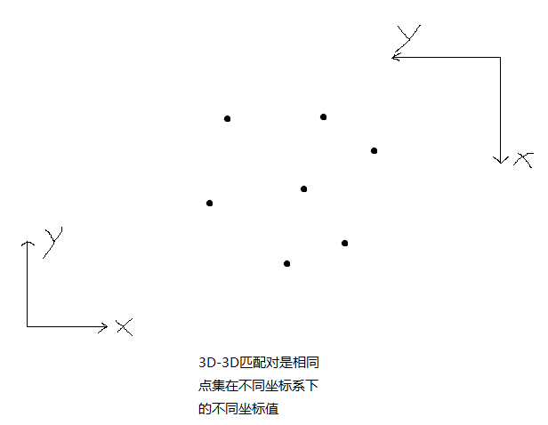
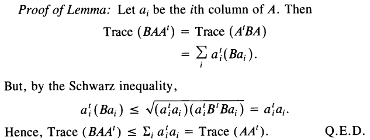

## 介绍

本文介绍的ICP问题，是在3D点已配对情况下的ICP，并且，3D点坐标的尺度相同。如果两个点云的尺度不同，需要另外考虑。可以搜索关键字"scale of ICP"。

视觉中的ICP问题描述如下，假设我们有一组配对好的3D点：

$$
P = \{p_1, ... , p_n\} \\
P' = \{p'_1, ... , p'_n\}
$$
现在，我们想找一个欧式变换 R, t，使得：
$$
p'_i = Rp_i+t, 对任意i成立
$$
这个问题的一种解法（SVD分解的方法）：解耦R和t，先求出R，再代入求得t。

## 基于SVD的ICP算法

参考论文：K. S. Arun, T. S. Huang and S. D. Blostein, "Least-Squares Fitting of Two 3-D Point Sets," in IEEE Transactions on Pattern Analysis and Machine Intelligence, vol. PAMI-9, no. 5, pp. 698-700, Sept. 1987, doi: 10.1109/TPAMI.1987.4767965.

这是1987年提出的方法。


### 误差函数的构建

首先，假设有 N 组 3D-3D 匹配点对，存在误差 $e_i$ ，则有
$$
e_i = p'_i - (Rp_i+t)
$$
构建最小二乘问题，求使误差平方和 $J$ 达到极小的R和t
$$
\underset{R,t}{min}J = \frac{1}{2}\sum_{i=1}^{N}||e_i||_2^2 = \frac{1}{2}\sum_{i=1}^{N}||p'_i - (Rp_i+t)||_2^2
$$
**注意：**与平常的单应矩阵、基本矩阵的配对点不同，在3D-3D配对点中，匹配的那一对3D点，其实是空间中同一个点在不同坐标系下的不同表示而已，如下图：



### 解耦R和t

首先，引入质心的定义：假设有N个点，每个点的坐标为 $p_i$ ，则质心为
$$
\boldsymbol{p} = \frac{1}{N}\sum_{i=1}^{N}\boldsymbol{p_i}
$$

#### 角度一：从几何的角度理解

首先要明确一点：在3D-3D配对点中，匹配的那一对3D点，其实是空间中 **同一个点** 在不同坐标系下的不同表示而已。

我们可以进行一个坐标变换，移动两个点集的坐标轴，使得两个坐标系的原点重合于各自的质心：
$$
q_i = p_i - p \\ 
q'_i = p'_i - p'
$$
其中，$p$ 和 $p'$ 是各自坐标系下的质心：
$$
\boldsymbol{p} = \frac{1}{N}\sum_{i=1}^{N}\boldsymbol{p_i} \\
\boldsymbol{p'} = \frac{1}{N}\sum_{i=1}^{N}\boldsymbol{p'_i}
$$
注意到**这两个质心在空间中其实是同一个点**。所以坐标变换后的两个点集坐标系原点重合，平移分量t为0，只存在旋转分量。因此误差平方和 $J$ 变为
$$
\underset{R}{min}J = \frac{1}{2}\sum_{i=1}^{N}||q'_i - Rq_i||_2^2
$$
这样就实现了R和t的解耦，可以单独对R进行求解（求解R的方法后面再说，先假设已经求得到）。

那么求出R后，怎么求t呢？假设我们所要求得最小二乘解为 $\hat{R}, \hat{t}$ ，记 $$p''_i = \hat{R}p_i+\hat{t}$$  ，那么 $p'_i$ 和 $p''_i$ 将有相同的质心，即
$$
p'=p''
$$
其中，
$$
p''= \frac{1}{N}\sum_{i=1}^{N}\boldsymbol{p''_i} = \hat{R}p+\hat{t} \\
$$
所以可以求出t
$$
\hat{t} = p'' - \hat{R}p = p' - \hat{R}p
$$

#### 角度二：从数学的角度理解

根据质心的定义，对误差函数进行变换：
$$
\begin{aligned}
\underset{R,t}{min}J 
 &= \frac{1}{2}\sum_{i=1}^{N}||p'_i - (Rp_i+t)||_2^2 \\
 &= \frac{1}{2}\sum_{i=1}^{N}||(p'_i - p' - R(p_i - p)) + (p'-Rp-t)||_2^2 \\
 &= \frac{1}{2}\sum_{i=1}^{N}(||p'_i - p' - R(p_i - p)||_2^2 + ||p'-Rp-t||_2^2 + 2(p'_i - p' - R(p_i - p))^T(p'-Rp-t)) \\
\end{aligned}
$$
注意到交叉相部分中 $(p'_i - p' - R(p_i - p))$ 在求和之后为零，因此优化目标函数可以简化为
$$
\begin{aligned}
\underset{R,t}{min}J 
 &= \frac{1}{2}\sum_{i=1}^{N}(||p'_i - p' - R(p_i - p)||_2^2 + ||p'-Rp-t||_2^2) \\
 &= \frac{1}{2}\sum_{i=1}^{N}(||q'_i - Rq_i||_2^2 + ||p'-Rp-t||_2^2) \\
\end{aligned}
$$
观察等式右边的左右两项，左边只和旋转矩阵R有关(解耦了t)，而右边既有R也有t。我们先通过左边求解R，再代入右边的部分，另右边部分为零就能得到t。

### 求解R

前面介绍了怎么解耦R和t，解耦后，只要求得R，就能代入式子直接求得t。下面叙述一下R如何求解，以及为什么可以这么求。

思路是，通过只有R的误差项求解出R。首先展开只有R的误差项：
$$
\begin{align}
\frac{1}{2}\sum_{i=1}^{N}||q'_i - Rq_i||_2^2 &= \frac{1}{2}\sum_{i=1}^{N}(q'^T_iq_i + q^T_iR^TRq_i - 2q'^T_iRq_i) \\
 &= \frac{1}{2}\sum_{i=1}^{N}(q'^T_iq_i + q^T_iq_i - 2q'^T_iRq_i)
\end{align}
$$
注意到前两项都与R无关，因此实际上优化函数变为：
$$
\sum_{i=1}^{N}-q'^T_iRq_i
$$
注意到上面式子结果是个1x1的标量的和，所以标量再套个迹的运算，也不影响结果：
$$
\begin{align}
\sum_{i=1}^{N}-q'^T_iRq_i
 &= \sum_{i=1}^{N}tr(-q'^T_iRq_i) \\
 &= -\sum_{i=1}^{N}tr(q'^T_i(Rq_i)) \\
 &= -\sum_{i=1}^{N}tr((Rq_i)q'^T_i) \\
 &= -\sum_{i=1}^{N}tr(R(q_iq'^T_i)) \\
 &= -tr(R\sum_{i=1}^{N}q_iq'^T_i) \\
\end{align}
$$
上面的推导用到了迹的性质，详情看附录。

为了求解R，定义矩阵W：
$$
W = \sum_{i=1}^{N}q_iq'^T_i
$$
W是一个3x3的矩阵，对其进行SVD分解，有
$$
W = UDV^T
$$
令 $X = VU^T$ ，这里不考虑它是怎么想到的，但可以证明它是使得误差函数最小的最小二乘解。

#### 证明 $X = VU^T$ 是最小二乘解

将 $R = X = VU^T$ 代入误差函数，取代R那一项，有
$$
\begin{align}
-tr(R\sum_{i=1}^{N}q_iq'^T_i) 
 &= -tr(RW) \\
 &= -tr(XW) \\
 &= -tr(VU^TUDV^T) \\
\end{align}
$$
由于V和U都是正交矩阵，所以 $U^TU = E$ ，则上式变为
$$
-tr(VDV^T)
$$
因为 $VDV^T$ 是一个对称正定矩阵，所以可以推断 $XW$ 是一个对称正定矩阵。

由附录中的辅助定理1，对于任意正交矩阵B，和对称正定矩阵 $XW$ ，我们有
$$
tr(XW) \ge tr(BXW)
$$
所以取 $X = VU^T$ 时，$tr(BXW)$ 取得最大值，也就是 $-tr(BXW)$ 取得最小值。但是，  $-tr(BXW)$ 取得最小值，与我们要求的误差函数 $-tr(RW)$ 取最小值有什么关系呢？ 

可以看一下，B和X都是正交矩阵，而B是一个任意的正交矩阵，所以BX可以表示任意的正交矩阵。这表明了我们在所有正交矩阵中，找到了一个解 $VU^T$ 使得误差函数最小，那这个解也能使得 $-tr(RW)$ 取最小值。我们只需要进一步判断这个解是不是旋转矩阵即可。

#### 判断X是否为所需的解

上面已经说了， X 是最小二乘解，它使得误差函数最小。但是由于噪声和匹配点共线的原因，X 不一定是一个旋转矩阵，也就是说不一定是我们需要的解。

接下来分析其什么时候 X 是我们所需的解，什么时候不是，如果不是的时候，能不能通过它找到我们所需的解（我们需要的解必须要是一个旋转矩阵）。简要的说明如下，如果需要详细说明请看论文：

- **$q_i$ 不共面。** 此时另误差函数取最小值的X，必定是旋转矩阵。
  - **特殊情况：$q_i$ 不共面，但$det(x)=-1$ ，即得到的解是个反射矩阵。**这种情况发生在噪声特别大的情况下，此时没有旋转矩阵能比反射矩阵使得误差更小。这种情况下不能用最小二乘法求解该问题，考虑使用RANSAC方法。
- **$q_i$ 共面，但不共线。**当W的奇异值有且仅有一个为0时，$q_i$ 共面。此时有两个解都能使得误差函数取最小，分别是一个旋转矩阵和一个反射矩阵。
  - 此时改变 $v_3$ (W奇异值分解后V矩阵的第3列向量) 的正负号不会改变W的值，但是却能使得X从反射矩阵变为旋转矩阵，或者从旋转矩阵变为反射矩阵.
  - 所以当 $det(x)=-1$ 时(反射矩阵的行列式为-1)，通过改变 $v_3$ 的正负号，使得X变为我们所需要的旋转矩阵。
- **$q_i$ 共线。**当且仅当有两个奇异值相等时，$q_i$ 共线。此时有无穷多的旋转矩阵和反射矩阵X，都能使误差函数最小，这种情况下用最小二乘法可能不能求解该问题，考虑使用RANSAC方法。

总的来说就是，当  $det(x)=+1$ 时，得到的就是所需的解； 反之当 $det(x)=-1$ 时，只有点共面的情况下，我们能通过修改结果得到解，其他情况下都不行，考虑用RANSAC方法。


在大部分情况下，这就是ICP的解。具体证明见下一小节，这里先分三种情况简要说明：

- $q_i$ 不共面。只有旋转矩阵X能使得误差为0

其中D是奇异值组成的对角阵，并且奇异值按照从上到下，按照从大到小排列。

下面求解R，分三种情况：

- 第一种：无噪声情况
  - $q_i$ 不共面。只有旋转矩阵X能使得误差为0
  - qi共面，但不共线。有一个旋转矩阵X和一个反射矩阵X能使得误差为0，但是很容易验证。 具体咋弄？
    - 对H进行SVD分解 H = UDV^T ，当且仅当只有一个奇异值为0时，这些点共面。
    - 此时改变v_3的正负号不会改变H的值，但是却能使得X从反射矩阵变为旋转矩阵，或者从旋转矩阵变为反射矩阵
    - 所以当det(x)=-1时（反射矩阵），通过改变v_3的正负号，使得X变为我们需要的旋转矩阵。
  - qi共线。有无穷多的旋转矩阵和反射矩阵X，能使得误差为0. 这种情况时，该方法解不了。
    - 当且仅当有两个奇异值相等时，这些点共线。
- 第二种：有噪声情况
  - s
  - qi共面，结论和无噪声的一样，只是误差不能为0了，只是取最小。特殊的情况是只有3对匹配点的情况
  - 不能处理的情况是：解X为反射矩阵(det(X)=-1) ，且H没有奇异值为0的情况（即点qi不共面）。此时没有旋转矩阵能比反射矩阵使得误差更小，这种情况一般只发生在噪声特别大的情况下，此时用最小二乘解可能始终得不到正确答案。这时候用RANSAC之类的方法剔除外点可能更好（一次只用3个点计算ICP）。

### $R=UV^T$ 还是 $VU^T$ ?

如果同时看过《视觉slam十四讲》和论文  "Least-Squares Fitting of Two 3-D Point Sets" ，你可能会产生一个困惑：在论文中，$R=VU^T$ ， 但在书《视觉slam十四讲》中， $R=UV^T$ ，他们的公式并不相同，这是因为在推导过程中对W的定义不同导致的。

在论文中，推导用的相关公式如下：
$$
\begin{align}
 p'_i &= Rp_i + T + N_i \\
 W &= \sum_{i=1}^{N}q_iq'^T_{i} \\
 R &= VU^T \\
\end{align}
$$
在书《视觉slam十四讲》中，推导用的相关公式如下：
$$
\begin{align}
 p_i &= Rp'_i + t + e_i \\
 W &= \sum_{i=1}^{N}q_iq'^T_{i} \\
 R &= UV^T \\
\end{align}
$$
可以看到，它们的旋转矩阵R，一个是从 $p_i$ 到 $p'_i$ 的，另一个正好相反，但是W的矩阵定义却是一样的，这就是差异所在。实际上，书《视觉slam十四讲》中的定义不够直观，它的W应该定义为 $\sum_{i=1}^{N}q_iq'^T_{i}$ 的转置才更合适，正是由于它们对W的定义差了一个转置，所以导致得到的解R，也差一个转置($UV^T=(VU^T)^T$)。

### 算法流程总结

>1. 求两组点的质心 $p,p'$
>
>$$
>\boldsymbol{p} = \frac{1}{N}\sum_{i=1}^{N}\boldsymbol{p_i} \\
>\boldsymbol{p'} = \frac{1}{N}\sum_{i=1}^{N}\boldsymbol{p'_i}
>$$
>
>
>
>2. 得到两组点的去质心坐标
>
>$$
>q_i = p_i - p \\ 
>q'_i = p'_i - p'
>$$
>
>
>
>3. 计算矩阵W
>
>$$
>W = \sum_{i=1}^{N}q_iq'^T_i
>$$
>
>
>
>4. 对W进行SVD分解，得到可能的解 $X = VU^T$
>
>$$
>W = UDV^T \\
>X = VU^T
>$$
>
>5. 判断X是否为所需解
>
>   1. 如果 $det(X) = +1$  ， X是一个旋转矩阵，即为所需的解。
>
>   2. 如果 $det(X) = -1$  ， X是一个反射矩阵。
>
>      1. 如果W有且仅有一个奇异值为0，那么所需的旋转矩阵解为
>         $$
>         X' = V'U^T
>         $$
>         其中，$V' = [v1, v2, -v3]$ ，即把V的最后一列向量符号取反。
>
>      2. 如果W没有奇异值为0，那么用最小二乘的方法解不出来，改用RANSAC方法求解ICP问题。
>
>6. 若计算得到了所需的解R = X，代入公式求得t
> $$
>   t = p'-Rp
> $$
>   至此，R和t都已经求出来了。

### 代码实现

下面摘自《视觉SLAM十四讲》第七章。（这应该是本书第二版的代码，因为第一版代码中并没有判断解X是否为反射矩阵）

```cpp
void pose_estimation_3d3d (
    const vector<Point3f>& pts1,
    const vector<Point3f>& pts2,
    Mat& R, Mat& t
)
{
    Point3f p1, p2;     // center of mass
    int N = pts1.size();
    for ( int i=0; i<N; i++ )
    {
        p1 += pts1[i];
        p2 += pts2[i];
    }
    p1 = Point3f( Vec3f(p1) /  N);
    p2 = Point3f( Vec3f(p2) / N);
    vector<Point3f>     q1 ( N ), q2 ( N ); // remove the center
    for ( int i=0; i<N; i++ )
    {
        q1[i] = pts1[i] - p1;
        q2[i] = pts2[i] - p2;
    }

    // compute q1*q2^T
    Eigen::Matrix3d W = Eigen::Matrix3d::Zero();
    for ( int i=0; i<N; i++ )
    {
        W += Eigen::Vector3d ( q1[i].x, q1[i].y, q1[i].z ) * Eigen::Vector3d ( q2[i].x, q2[i].y, q2[i].z ).transpose();
    }
    cout<<"W="<<W<<endl;

    // SVD on W
    Eigen::JacobiSVD<Eigen::Matrix3d> svd ( W, Eigen::ComputeFullU|Eigen::ComputeFullV );
    Eigen::Matrix3d U = svd.matrixU();
    Eigen::Matrix3d V = svd.matrixV();
    
    if (U.determinant() * V.determinant() < 0)
	{
        for (int x = 0; x < 3; ++x)
        {
            U(x, 2) *= -1;
        }
	}
    
    cout<<"U="<<U<<endl;
    cout<<"V="<<V<<endl;

    Eigen::Matrix3d R_ = U* ( V.transpose() );
    Eigen::Vector3d t_ = Eigen::Vector3d ( p1.x, p1.y, p1.z ) - R_ * Eigen::Vector3d ( p2.x, p2.y, p2.z );

    // convert to cv::Mat
    R = ( Mat_<double> ( 3,3 ) <<
          R_ ( 0,0 ), R_ ( 0,1 ), R_ ( 0,2 ),
          R_ ( 1,0 ), R_ ( 1,1 ), R_ ( 1,2 ),
          R_ ( 2,0 ), R_ ( 2,1 ), R_ ( 2,2 )
        );
    t = ( Mat_<double> ( 3,1 ) << t_ ( 0,0 ), t_ ( 1,0 ), t_ ( 2,0 ) );
}
```


## 附录

### 矩阵的迹

参考：[百度百科-矩阵的迹]([https://baike.baidu.com/item/%E7%9F%A9%E9%98%B5%E7%9A%84%E8%BF%B9](https://baike.baidu.com/item/矩阵的迹))

在[线性代数](https://baike.baidu.com/item/线性代数/800)中，一个n×n矩阵***A***的[主对角线](https://baike.baidu.com/item/主对角线/4269887)（从左上方至右下方的对角线）上各个元素的总和被称为[矩阵](https://baike.baidu.com/item/矩阵/18069)***A***的**迹**（或**迹数**），一般记作**tr(A)**。

性质：

- 迹是所有对角元素的和
- 迹是所有[特征值](https://baike.baidu.com/item/特征值)的和
- tr(AB)=tr(BA)
- $tr(mA+nB)=m*tr(A)+n*tr(B)$

### Lemma 1（辅助定理 1）

《Least-Squares Fitting of Two 3-D Point Sets》中使用的一个辅助定理。

对于任何正定矩阵 $AA^T$ 和任何正交矩阵B(orthonormal)，有
$$
tr(AA^T) \ge tr(BAA^T)
$$

证明：



### $AA^T$ 和 $A^TA$  的性质

参考：https://blog.csdn.net/Europe233/article/details/86720864

对于任意一个矩阵 $A\in R^{m×n}$，则 $AA^T$ 和 $A^TA$ 都是**对称半正定矩阵**。

证明：

$AA^T$ 显然对称，同时有：$∀x∈R^n,x^TA^TAx=(Ax)^T(Ax)≥0$

同理可证 $A^TA$ 对称半正定.

### 正交矩阵的性质

- 两个正交矩阵的积也是正交矩阵
- 任意正交矩阵的行列式只有两种取值：+1和-1

## 参考文献

- 《视觉SLAM十四讲》第一版 - 高翔

- K. S. Arun, T. S. Huang and S. D. Blostein, "Least-Squares Fitting of Two 3-D Point Sets," in IEEE Transactions on Pattern Analysis and Machine Intelligence, vol. PAMI-9, no. 5, pp. 698-700, Sept. 1987, doi: 10.1109/TPAMI.1987.4767965.

  利用SVD分解求ICP问题的方法，看了十四讲后再看这个就容易很多。如果还看不懂可以先看看下面的参考链接“多视图几何之SVD”。

- [多视图几何之SVD](https://blog.csdn.net/u012348774/article/details/72246643) | 证明了多个问题下为何能用SVD求解 | ICP中为何SVD可行 | 8点法求基本矩阵求解，为何是用SVD的最后一列向量 | 本质矩阵恢复R和t为什么可以用SVD | SVD为什么能求最小二乘解

- [$AA^T$ 和 $A^TA$  的性质](https://blog.csdn.net/Europe233/article/details/86720864)