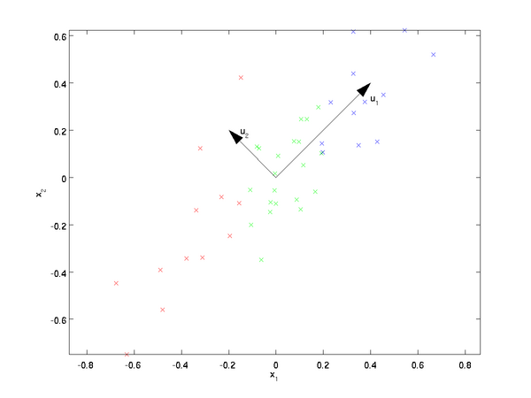
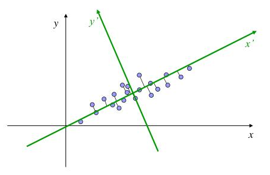
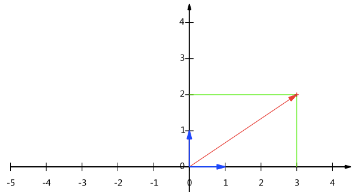
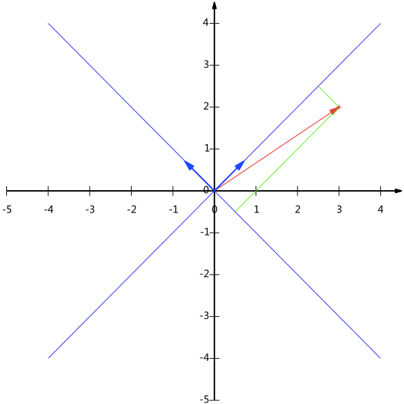
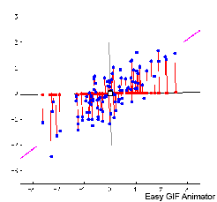
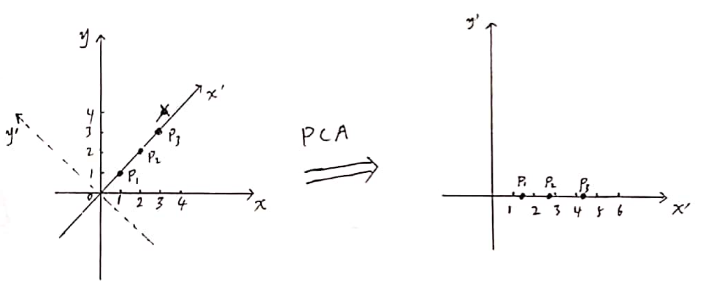

## 介绍

CA（Principal Component Analysis）是一种常用的数据分析方法。PCA通过线性变换将原始数据变换为一组各维度线性无关（但不一定正交）的表示，可用于提取数据的主要特征分量，常用于高维数据的降维。

主要思想：找出数据中最主要的成分，用主要的成分去描述数据，达到降维的效果。具体一点就是说，找到另一个基，将变量变换到这个基下面，由这个基表示，如果基的维度小于原始基的维度，那么就达到了降维的效果。

举例：对于一些二维数据点，希望将其降到一维，如下图：



图中画了两个方向向量 $u_1$ 和 $u_2$ ，那么用哪个方向向量做为新的基呢？从直观上看，$u_1$ 比 $u_2$ 要好。

为什么 $u_1$ 比 $u_2$ 要好，有两种解释：

- 最近重构性的角度：样本点到这个直线（在高维空间中称为超平面）的距离足够近。
- 最大可分性的角度：样本点在这个直线（在高维空间中称为超平面）上的投影能尽可能的分开。

基于上面的两种标准，我们可以得到PCA的两种等价推导。

## PCA推导——从最大可分性的角度

**首先明确PCA的目的：对数据降维度，同时尽量保证数据可分。**如下图



二维平面x-y上，有一些样本点，我们构建另一个坐标系 x'-y'，可以发现其样本点主要分布在x'绿色直线两侧，如果我们仅仅保留 x' 坐标，而丢弃 y'的坐标，那么每个样本点重二维降低到一维，同时可以看到，这些样本点在 x' 上的投影没有重合的，也就是说仅仅用一维坐标 x' 去表示样本点，也能区分各个不同的样本点。这就达到了降维且尽量保证数据可分。

那么这里有两个问题：

1. 如何选择新的坐标系？这些应满足坐标轴有优先次序，以便降维时可以根据优先次序丢弃影响不大的维度。
2. 当需要降维时，优先保留哪些坐标轴，丢弃哪些坐标轴？

为了解答这两个问题，首先介绍一下基的概念以及基的矩阵表示。

### 基的概念

如下图，红色的向量可以表示为 (3, 2)，实际上这种描述是不够准确的，它的意思其实是：红色向量在 基(1, 0) 和 基(0, 1) 下的投影分别是 3 和 2。也就是说，当描述一个向量或点的坐标时，应该说明是在什么坐标系下的坐标。



一种比较正式的描述是，在 基(1, 0) 和 基(0, 1) 下的 向量(x,y)，实际上表示的是如下线性组合：
$$
x(1,0)^\mathsf{T}+y(0,1)^\mathsf{T}
$$
所以，**要准确描述向量，首先要确定一组基，然后给出在基所在的各个直线上的投影值，就可以了**。只不过我们经常省略第一步，而默认以(1,0)和(0,1)为基。

### 基变换的矩阵表示

以下图为例，蓝色的两个坐标轴是一组新的基 $(\frac{1}{\sqrt2}, \frac{1}{\sqrt2})$ 和 $(-\frac{1}{\sqrt2}, \frac{1}{\sqrt2})$ ，要求出向量(3, 2)在新基下的表示



我们可以用矩阵相乘的形式给出表示这个变换：
$$
\begin{pmatrix} 1/\sqrt{2} & 1/\sqrt{2} \\ -1/\sqrt{2} & 1/\sqrt{2} \end{pmatrix} \begin{pmatrix} 3 \\ 2 \end{pmatrix} = \begin{pmatrix} 5/\sqrt{2} \\ -1/\sqrt{2} \end{pmatrix}
$$
可以得到向量(3, 2)在新基下的表示为 $(\frac{5}{\sqrt2}, -\frac{1}{\sqrt2})$ 。稍微推广一下，如果我们有m个二维向量，只要将二维向量按列排成一个两行m列矩阵，然后用“基矩阵”乘以这个矩阵，就得到了所有这些向量在新基下的值。例如(3,2)，(2,2)，(3,3)，想变换到刚才那组基上，则可以这样表示：
$$
\begin{pmatrix} 1/\sqrt{2} & 1/\sqrt{2} \\ -1/\sqrt{2} & 1/\sqrt{2} \end{pmatrix} \begin{pmatrix} 3 & 2 & 3 \\ 2 & 2 & 3 \end{pmatrix} = \begin{pmatrix} 5/\sqrt{2} & 4/\sqrt{2} & 6/\sqrt{2} \\ -1/\sqrt{2} & 0 & 0 \end{pmatrix}
$$
**一般的，如果我们有M个N维向量，想将其变换为由R个N维向量表示的新空间中，那么首先将R个基按行组成矩阵A，然后将向量按列组成矩阵B，那么两矩阵的乘积AB就是变换结果，其中AB的第m列为A中第m列变换后的结果**。

数学表示为：
$$
\begin{pmatrix} p_1 \\ p_2 \\ \vdots \\ p_R \end{pmatrix} \begin{pmatrix} a_1 & a_2 & \cdots & a_M \end{pmatrix} = \begin{pmatrix} p_1a_1 & p_1a_2 & \cdots & p_1a_M \\ p_2a_1 & p_2a_2 & \cdots & p_2a_M \\ \vdots & \vdots & \ddots & \vdots \\ p_Ra_1 & p_Ra_2 & \cdots & p_Ra_M \end{pmatrix}
$$
其中$p_i$是一个行向量，表示第i个基，$a_j$是一个列向量，表示第j个原始数据记录。

**特别要注意的是，这里R可以小于N，而R决定了变换后数据的维数。也就是说，我们可以将一N维数据变换到更低维度的空间中去，变换后的维度取决于基的数量。因此这种矩阵相乘的表示也可以表示降维变换。**

最后，上述分析同时给矩阵相乘找到了一种物理解释：**两个矩阵相乘的意义是将右边矩阵中的每一列列向量变换到左边矩阵中每一行行向量为基所表示的空间中去**。更抽象的说，一个矩阵可以表示一种线性变换。

### 如何选择坐标系？

了解了基的概念后，下面介绍如何选择合适的坐标系，或者说如何选择合适的基。

先看下图，下图中演示了将二维坐标降到一维的情况，新的一维坐标轴改变时，样本点投影到一维坐标轴上的位置也会改变。可以看到，有的时候样本点的投影很紧密，有的时候样本点的投影很稀疏，按照前面讨论的，我们希望样本点投影到低维空间中后，还能保持较好的可区分性，这就意味着我们希望样本点投影后尽可能的稀疏，不要重叠在一起。



那么现在问题是

- 我怎么描述样本点投影到新基上的稀疏程度？
- 我怎么选择一组基，能让样本点投影后尽量稀疏？

### 稀疏程度的表示

第一个问题，我怎么描述样本点投影到新基上的稀疏程度。

我们可以用在该维度上的方差，表示样本点在该维度上的稀疏程度，方差越大，则样本点越稀疏，样本点也就越好区分开来。下面用协方差矩阵来表示稀疏程度。

假设我们有n个样本点，每个样本点 $x = (x_1, x_2, ..., x_m)^T$ 为m维，其中 $x_j = (x_{1j}, x_{2j}, ..., x_{mj})^T$ 表示第 $j$ 个样本点，$x_{ij}$ 表示第 $j$ 个样本点的第 $i$ 维坐标。这里 $i = 1,2,...,m$ 并且 $j = 1,2,...,n$。观测数据用**样本矩阵X**表示，记作
$$
X = \begin{bmatrix}
 x_1 & x_2 & \dots & x_n
\end{bmatrix}
= \begin{bmatrix}
 x_{11} & x_{12} & \dots & x_{1n} \\
 x_{21} & x_{22} & \dots & x_{2n} \\
 \vdots & \vdots &  & \vdots \\
 x_{m1} & x_{m2} & \dots & x_{mn} 
\end{bmatrix}
$$
样本点各个维度的均值可用向量 $\bar{x}$ 表示，记作
$$
\bar{x} = 
\begin{bmatrix}
 \bar{x}_1 \\
 \bar{x}_2 \\
 \vdots \\
 \bar{x}_m 
\end{bmatrix}
= \frac{1}{n}(
\begin{bmatrix}
 x_{11} \\
 x_{21} \\
 \vdots \\
 x_{m1} 
\end{bmatrix}
+ \dots +
\begin{bmatrix}
 x_{1n} \\
 x_{2n} \\
 \vdots \\
 x_{mn} 
\end{bmatrix}
)
= \frac{1}{n}\sum_{j=1}^{n}x_j
$$
其中，$\bar{x}_i$ 为标量。

样本的的协方差矩阵S，记为
$$
\begin{aligned}
S &= [s_{ij}]_{m \times m} \\
s_{ij} &= \frac{1}{n-1}\sum_{k=1}^{n}(x_{ik}-\bar{x}_i)(x_{jk}-\bar{x}_j), \quad i,j=1,2,...,m
\end{aligned}
$$
将S换成矩阵表示，如下
$$
S = 
\frac{1}{n-1}
\begin{bmatrix}
 \sum_{k=1}^{n}(x_{1k}-\bar{x}_1)^2 & \sum_{k=1}^{n}(x_{1k}-\bar{x}_1)(x_{2k}-\bar{x}_2) & \dots & \sum_{k=1}^{n}(x_{1k}-\bar{x}_1)(x_{mk}-\bar{x}_m) \\
 \vdots & \vdots & & \vdots \\
 \sum_{k=1}^{n}(x_{mk}-\bar{x}_m)(x_{1k}-\bar{x}_1) & \sum_{k=1}^{n}(x_{mk}-\bar{x}_m)(x_{2k}-\bar{x}_2) & \dots & \sum_{k=1}^{n}(x_{mk}-\bar{x}_m)^2 \\
\end{bmatrix}
=
\frac{1}{n-1}X'X'^T
$$
注意到**S是一个对称矩阵**。其中，对角线上元素表示样本在各个维度上的方差，非对角元素表示样本任意两个维度之间的协方差。$X'$ 表示**去均值坐标**
$$
X' = \begin{bmatrix}
 x'_1 & x'_2 & \dots & x'_n
\end{bmatrix}
= \begin{bmatrix}
 x_{11}-\bar{x}_1 & x_{12}-\bar{x}_1 & \dots & x_{1n}-\bar{x}_1 \\
 x_{21}-\bar{x}_2 & x_{22}-\bar{x}_2 & \dots & x_{2n}-\bar{x}_2 \\
 \vdots & \vdots &  & \vdots \\
 x_{m1}-\bar{x}_m & x_{m2}-\bar{x}_m & \dots & x_{mn}-\bar{x}_m 
\end{bmatrix}
$$
有了协方差矩阵，我们就可以得到各个维度之间的协方差以及维度与自己的方差，以此来描述样本在某个维度上的稀疏程度。

#### TODO

- 让方差最大可以理解，那为什么要令协方差为0？是因为想要让一组基相互线性无关吗？还是让协方差为0才能使得方差最大？

### 通过SVD分解选择一组基

现在回答第二个问题，如何选择一组基。

**根据前面推导，要使得数据可分，等价于将协方差矩阵对角化：即除对角线外的其它元素化为0，并且在对角线上将元素按从大到小从上到下排列。**

具体来说就是，**我们要找到一组基，每个基作为一个行向量组成一个矩阵P**，设原始的样本矩阵为X，对应的协方差矩阵为C，X通过该矩阵P变换后得到的新样本矩阵Y，即 $Y=PX$ ，Y对应的协方差矩阵为D，那么C和D有如下关系：
$$
\begin{aligned}
D &= \frac{1}{n-1}Y'Y'^T \\
 &= \frac{1}{n-1}(PX')(PX')^T \\
 &= \frac{1}{n-1}PX'X'^TP^T \\
 &= P(\frac{1}{n-1}X'X'^T)P^T \\
 &= PCP^T \\
\end{aligned}
$$
这里，$X',Y'$ 分别是 X 和 Y 的去均值后的坐标。继续变换一下形式，有
$$
C = P^{-1}DP^{-T}
$$
**按照本节开头所说的，我们希望D应该是一个对角矩阵，即除对角线外都为0， 我们的目的是要找到这么一组基组成的矩阵P，满足上面条件。**

由于 $C = \frac{1}{n-1}X'X'^T$ 是一个对称矩阵。回想一下对对称矩阵的奇异值分解， $\frac{1}{n-1}X'X'^T$ 奇异值分解记为 $X'X'^T = U'\Sigma'U'^T$，那么有
$$
\frac{1}{n-1}X'X'^T = U \Sigma V^{T}\left(U \Sigma V^{T}\right)^{T}=U \Sigma V^{T} V \Sigma^{T} U^{T}=U \Sigma \Sigma^{T} U^{T} = U'\Sigma'U'^T
$$
对比前面公式，可知
$$
U' = P^{-1} \\
D = \Sigma'
$$
其中，我们将 $\Sigma'$ 按照奇异值大小从大到小从上到下排列，**奇异值大小，就是对应维度的方差大小**。

也就是说，我们对协方差矩阵 C 进行奇异值分解，得到的矩阵U' 就是我们所要的矩阵P的逆，而U‘是一个正交矩阵，所以
$$
P = U'^{-1} = U'^T
$$
其中 $U'^T$ 的每一行向量（或者说$U'$ 的每一列向量）就是一个基。

计算出来P后，我们可以考虑剔除一些维度来实现降维，那么剔除哪些维度呢？

前面说了，方差大的维度区分度大，应该保留，所以我们剔除方差小的维度。在SVD分解中，每个奇异值对应一个特征向量，这些特征向量组成了矩阵U，而这里奇异值大小就是对应维度的大小，所以我们考虑剔除奇异值小的维度，就是剔除小奇异值所对应的那些特征向量。具体来说，对于矩阵U'
$$
U' =
\begin{bmatrix}
u_1 & u_2 & \dots & u_m
\end{bmatrix}
$$
其中，$u_i$ 是特征向量，为列向量。由于我们已经将特征向量按照特征值从大到小排序过了，所以U'的最左边的列向量对应的奇异值是最大的，右边的列向量对应的奇异值是最小的，降维时，我们优先剔除右边的列向量。

至此，PCA推导——从最大可分性的角度已经推导完了。

# 进一步讨论

这一节内容摘抄自：[PCA的数学原理](https://blog.codinglabs.org/articles/pca-tutorial.html)

根据上面对PCA的数学原理的解释，我们可以了解到一些PCA的能力和限制。PCA本质上是将方差最大的方向作为主要特征，并且在各个正交方向上将数据“离相关”，也就是让它们在不同正交方向上没有相关性。

因此，PCA也存在一些限制，例如它可以很好的解除线性相关，但是对于高阶相关性就没有办法了，对于存在高阶相关性的数据，可以考虑Kernel PCA，通过Kernel函数将非线性相关转为线性相关，关于这点就不展开讨论了。另外，PCA假设数据各主特征是分布在正交方向上，如果在非正交方向上存在几个方差较大的方向，PCA的效果就大打折扣了。

最后需要说明的是，PCA是一种无参数技术，也就是说面对同样的数据，如果不考虑清洗，谁来做结果都一样，没有主观参数的介入，所以PCA便于通用实现，但是本身无法个性化的优化。

## 附录

### 奇异值分解与特征值分解的关系

参考：https://zhuanlan.zhihu.com/p/69540876

假设 $A \in R_{m \times n}$ ，首先，A的SVD分解，是通过求解 $A^TA$ 和 $AA^T$ 的特征值和特征向量得到的（具体看矩阵论或线性代数知识）。

这里有
$$
A A^{T}=U \Sigma V^{T}\left(U \Sigma V^{T}\right)^{T}=U \Sigma V^{T} V \Sigma^{T} U^{T}=U \Sigma \Sigma^{T} U^{T} \\
A^{T} A=\left(U \Sigma V^{T}\right)^{T} U \Sigma V^{T}=V \Sigma^{T} U^{T} U \Sigma V^{T}=V \Sigma \Sigma^{T} V^{T}
$$
因此，当我们对 $A^TA$ 进行SVD分解时，有
$$
A^{T} A = U'\Sigma'V'^T \\ 
U' = V' = V \\
\Sigma' = \Sigma \Sigma^T
$$
同理，对 $AA^T$ 进行SVD分解也有类似结论，即：对 $A^TA$ SVD分解后，可以得到 $\Sigma$ 和 $V$， 对 $AA^T$ SVD分解后，可以得到 $\Sigma$ 和 $U$。

因此，如果我们要求A的SVD分解 $A = U \Sigma V^T$ ，我们可以直接求它的SVD分解；也可以分别求 $A^TA$ 和 $AA^T$ 的奇异值分解来得到 $V,\Sigma$ 和 $U$ 。

个人理解，这么做的好处，可以减少计算量。当我们只需要V时，如果A为 1000x3 的矩阵，那么 $A^TA$ 为 3x3的矩阵，其中 $A^T$ 与A相乘，只需要进行3x3x1000次乘法运算，再对3x3矩阵进行SVD分解，这要比直接对1000x3的矩阵SVD分解快很多，同理，如果我们只需要U时，而矩阵 A为 3x1000的矩阵时，也可以通过类似方法降低计算量。

## 参考代码

直线 y=x 上有3个样本点 (1, 1), (2, 2) 和 (3, 3)，通过PCA选取最大的主成分方向作为基，将样本点降维为1维，求出其一维坐标，正确结果应该是 (1.41421), (2.82843) 和 (4.24264)，如下图：



代码仅仅依赖eigen库，完整代码如下：

```cpp
// 基于这里的代码改的，注意，博主的代码很多错误：https ://blog.csdn.net/qer_computerscience/article/details/71246634
// 比较好的参考资料：https://zhuanlan.zhihu.com/p/77151308
#include<iostream>
#include "Eigen/Dense"

using namespace std;
using namespace Eigen;

int main()
{

	// 输入直线 y=x 上的3个样本点 (1, 1), (2, 2), (3, 3)
	// 构建样本矩阵X
	MatrixXd X(2, 3);  
	X <<	1, 2, 3,
			1, 2, 3;
	
	// 坐标去均值
	VectorXd meanvec = X.rowwise().mean();	// 求每一行的均值，相当于在向量的每个维度上求均值
	MatrixXd X_ = X.colwise() - meanvec;	// 样本减去各自维度的均值，得到去均值后的坐标X'
	

	// 计算协方差矩阵C = X*X^t / (n-1); 
	// 其中，n是样本个数，这里有3个样本
	MatrixXd C = X_*X_.adjoint(); // 协方差矩阵
	C = C.array() / (X_.cols() - 1);

	// 计算特征值和特征向量
	SelfAdjointEigenSolver<MatrixXd> eig(C); // 产生的vec和val将按照特征值升序排列
	MatrixXd vec = eig.eigenvectors(); // 特征向量
	MatrixXd val = eig.eigenvalues();  // 特征值
	
	// 打印
	cout << "X: " << endl << X << endl << endl;
	cout << "C: " << endl << C << endl << endl;
	cout << "val: " << endl << val << endl << endl;
	cout << "vec: " << endl << vec << endl << endl;

	// 将2维xy坐标变换到一维坐标上
	MatrixXd res = vec.col(1).adjoint() * X ; // 取最大特征值对应的特征向量作为基，变换坐标 Y=PX
	cout << "the result is " << res.rows() << "x" << res.cols() << ":" << endl;
	cout << res << endl;

	return 0;
}
```

## 参考文献

- [PCA的数学原理](https://blog.codinglabs.org/articles/pca-tutorial.html) | 主要内容来自于它
- 《统计学习方法》第二版
- [【机器学习】降维——PCA（非常详细）](https://zhuanlan.zhihu.com/p/77151308)
- [PCA算法](https://zhuanlan.zhihu.com/p/33191810)
- 