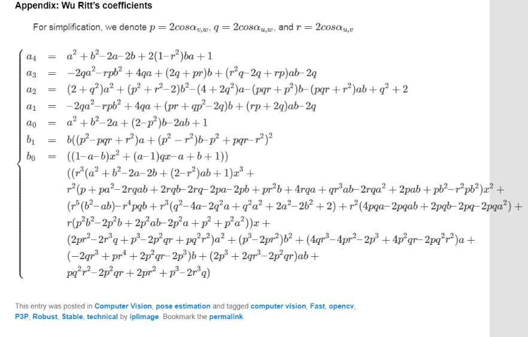

## 介绍

PnP问题：已知2D-3D匹配点对应，求解相机坐标系和世界坐标系之间的R和t的过程。

## DLT方法

参考：

- [如何理解PnP问题的DLT解法以及Python编程实践](https://blog.csdn.net/varyshare/article/details/104395578) | 这个讲得更清楚。
- [PnP问题之DLT解法](https://zhuanlan.zhihu.com/p/58648937)

上面这两个都讲得很好，但是缺点东西。

大概说一下，已知内参的情况下求解R和t需要6对匹配点，每对匹配点提供了2个约束方程。

你将构建一个Ax=0方程，求它的最小二乘解。由于x=0总是一个解，为了避免得到零解，可以给一个约束||x||=1，因此可以用SVD分解求出x。

但是这个x和我们所需要的解还差一个尺度λ，怎么估计这个尺度呢？

我们知道旋转矩阵R的行列式为1，因此我们可以令解x中旋转矩阵那部分的行列式为1，求出尺度λ。

但是还有个问题，上面求解过程中，得到的解x，里面旋转矩阵那部分，并没有考虑旋转矩阵的约束，比如正交的特性，所以我们首先需要恢复这个约束，具体办法是：对旋转矩阵那部分3x3子矩阵，做SVD分解，得到 $UDV^T$ ，其中U和V都正交，为了让R正交，我们要让D这个对角阵元素相等，然后再除以对角元素值，这样就可以实现正交了。

这里另D对角元素相等的办法就是取三个对角元素的均值替换他们原来的值。

这里D的对角元素值也就是上面的尺度λ。

至此，R的约束恢复了，同时[R|t]的尺度λ也恢复了，我们就可以得到真正的[R|t]了

### 代码实现

摘录这里：https://github.com/ydsf16/PnP_Solver

## P3P方法

参考：

- 《视觉SLAM十四讲》第一版 - 高翔 | 看到吴消元法那里，后面的内容再看下面的资料
- [相机位姿求解——P3P问题](https://www.cnblogs.com/mafuqiang/p/8302663.html) | 分析了opencv中P3P源码
- [The P3P (Perspective-Three-Point) Principle](https://web.archive.org/web/20121122082926/http://iplimage.com/blog/p3p-perspective-point-overview/) | 网上的P3P内容基本都是抄这里的，原始页面已经进不去了，现在这个网页是archive的备份。

P3P方法是众多解决PnP问题中的一种方案，是通过已知的3对精准匹配的2D-3D点求解图像间相对的位姿变换的一种方法，所用到的信息较少。我们首先需要知道的是P3P并不是直接根据2D-3D点求出相机位姿矩阵，而是先求出对应的2D点在当前相机坐标系下的3D坐标，然后根据世界坐标系下的3D坐标和当前相机坐标系下的3D坐标通过ICP信息求解相机位姿的。

> 这段话来自：https://blog.csdn.net/ABC1225741797/article/details/108066505

吴消元法的系数：

上面系数中a4那里好像错了，应该是 $(2-r^2)ba$ ，所以系数还是看论文吧，论文的是对的，只是系数的排版方式有些区别：

Gao, Xiao-Shan, et al. "Complete solution classification for the perspective-three-point problem." *IEEE transactions on pattern analysis and machine intelligence* 25.8 (2003): 930-943.

有了系数后，得到4次方程，还需要用下面之类的方法求解4次方程：

- Ferrari’s approach to transform the quartic polynomial to a cubic polynomial ([wolfram’s page](https://web.archive.org/web/20121122082926/http://mathworld.wolfram.com/QuarticEquation.html) for complete description),
- Cardan/Fontana’s approach to solve the resulting cubic polynomial ([wikipedia’s page](https://web.archive.org/web/20121122082926/http://en.wikipedia.org/wiki/Cubic_function) for simple explanations).

### 代码实现

opencv代码实现在 `opencv-4.3.0\modules\calib3d\src\` 目录下的 `p3p.cpp` 和 `p3p.h`，感兴趣可以自己看看。

[[相机位姿求解——P3P问题](https://www.cnblogs.com/mafuqiang/p/8302663.html)](https://www.cnblogs.com/mafuqiang/p/8302663.html) | 分析了opencv中P3P源码

### TODO

- 为防止失联，上传网页[The P3P (Perspective-Three-Point) Principle](https://web.archive.org/web/20121122082926/http://iplimage.com/blog/p3p-perspective-point-overview/) 到github
- 

## EPNP算法

需要4对不共面的点

参考：

- https://zhuanlan.zhihu.com/p/59070440

- https://blog.csdn.net/jessecw79/article/details/82945918

- [ORBSLAM2中的EPnP算法](https://www.jianshu.com/p/312cc524b8d1) | 对于L_6x10那部分的讲解较好，但是里面公式错误比较多，最好自己手推一下。

### 思路

**备注**：EPNP算法的下标上标比较抽象，为了更好的理解，最好借助于源码，自己手动推一下公式的展开形式。

8PNP问题中，得到的是2D-3D匹配点对，要求解R和t。EPNP思路是：在世界坐标系中选取4个控制点，将所有世界坐标系下的3D点都用这4个控制点表示；然后求出这4个控制点在相机坐标系下的坐标，同样地，所有3D点的相机坐标也能用4个控制点的相机坐标表示。这样问题就转换为3D-3D匹配点对求解R和t，调用传统ICP算法即可。

这里有2个问题：

- 每个3D点怎么用4个控制点表示？4个控制点的权重分别取多少合适
- 怎么求解4个控制点在相机坐标系下的坐标

### hb坐标

本文符号与原文[1]中相同。点对数量为 n，三维点的**非齐次**坐标为
$$
P_i, i=1,2,...,n
$$

利用上标 c 和 w 代表三维点在相机和世界坐标系下对应的坐标。EPnP引入了控制点，任何一个3D点都可以表示为四个控制点的线性组合。四个控制点的三维坐标记为
$$
c_j,j=1,2,3,4
$$
**世界坐标系**下的每个三维点可以由4个控制点表达为
$$
P_{i}^{w} = \sum_{j=1}^{4}\alpha_{ij}c_j^{w} \tag{1a} \\
$$

$$
\sum_{j=1}^{4}\alpha_{ij} = 1 \tag{1b}
$$

上面的 $\alpha_{ij}$ 称为 **hb坐标(homogeneous barycentric coordinates)** 。

将(1b)代入(1a)，消掉 $\alpha_{i1}$ 有
$$
\begin{align}
P_{i}^{w} &= \sum_{j=1}^{4}\alpha_{ij}c_j^{w} \\
 &= \alpha_{i1}c_1^{w} + \alpha_{i2}c_2^{w} + \alpha_{i3}c_3^{w} + \alpha_{i4}c_4^{w} \\
 &= (1-\alpha_{i2}-\alpha_{i3}-\alpha_{i4})c_1^{w} + \alpha_{i2}c_2^{w} + \alpha_{i3}c_3^{w} + \alpha_{i4}c_4^{w}
\end{align}
$$
移项后，有
$$
\begin{align}
P_{i}^{w}-c_1^{w} 
 &= \alpha_{i2}(c_2^{w}-c_1^{w}) + \alpha_{i3}(c_3^{w}-c_1^{w}) + \alpha_{i4}(c_4^{w}-c_1^{w}) \\
 &= \begin{bmatrix}
	c_2^{w}-c_1^{w} & c_3^{w}-c_1^{w} & c_4^{w}-c_1^{w}\\
    \end{bmatrix}
    \begin{bmatrix}
    \alpha_{i2} \\
    \alpha_{i3} \\
    \alpha_{i4}
    \end{bmatrix}
\end{align}
$$
令 $CC = \begin{bmatrix}c_2^{w}-c_1^{w} & c_3^{w}-c_1^{w} & c_4^{w}-c_1^{w}\end{bmatrix}$ 因此可求解 $\alpha_{ij}$ 
$$
\begin{align}
\begin{bmatrix}
    \alpha_{i2} \\
    \alpha_{i3} \\
    \alpha_{i4}
    \end{bmatrix} &= CC^{-1}(P_{i}^{w}-c_1^{w}) \\
\alpha_{i1} &= 1-\alpha_{i2}-\alpha_{i3}-\alpha_{i4}
\end{align}
$$
根据上面的推导，可知控制点的选取要使得矩阵 $CC$ 是可逆的。

### 控制点的选取

控制点的选取，除了要保证矩阵 $CC$ 可逆之外，还有其它要求吗？论文提出用**PCA（主成分分析）**选取控制点(这个应该也很好理解，就像你要表示一个向量，一般是取几个标准正交基去表示，这里选择点的主成分去表示点，直观上也是行得通的)。

第一个控制点选择在所有3D点的质心位置，
$$
c_1^w = \frac{1}{n} \sum_{i=1}^{n} P_i^w
$$
其余3个控制点在3D点集的主方向上选取，具体操作如下：

首先构建矩阵A
$$
A=
\begin{bmatrix}
(P_1^w)^T - (c_1^w)^T \\
... \\
(P_n^w)^T - (c_n^w)^T \\
\end{bmatrix}
$$
计算 $A^TA$ 的3个特征值为 $\lambda_1,\lambda_2,\lambda_3$ ，对应的特征向量为 $v_1,v_2,v_3$ 。那么剩余的三个控制点为
$$
\left\{\begin{array}{l}\mathbf{c}_{2}^{w}=\mathbf{c}_{1}^{w}+\sqrt{\frac{\lambda_{1}}{n}} \mathbf{v}_{1} \\ \mathbf{c}_{3}^{w}=\mathbf{c}_{1}^{w}+\sqrt{\frac{\lambda_{2}}{n} \mathbf{v}_{2}} \\ \mathbf{c}_{4}^{w}=\mathbf{c}_{1}^{w}+\sqrt{\frac{\lambda_{3}}{n} \mathbf{v}_{3}}\end{array}\right.
$$
到目前为止，我们已知可以知道4个控制点在世界坐标系下的坐标 $c_j$ ，每一个3D点的hd坐标 $\alpha_{ij}$ 。如果我们能把4个控制点在相机坐标系下的坐标求解出来，再计算出3D点在相机坐标系下的坐标，就可以得到3D-3D的匹配关系，然后通过ICP求解外参R,t，下面就沿着这个思路展开。

### 控制点在相机坐标系下的坐标

#### 计算M矩阵

在相机坐标系下，控制点坐标与3D坐标同样有类似关系
$$
P_{i}^{c} = \sum_{j=1}^{4}\alpha_{ij}c_j^{c} \tag{1a} \\
$$
根据相机投影公式，对于任意一个相机坐标系下的空间点 $P_i^c$ 有
$$
\forall i, w_{i}\left[\begin{array}{c}u_{i} \\ v_{i} \\ 1\end{array}\right]=\left[\begin{array}{ccc}f_{u} & 0 & u_{c} \\ 0 & f_{v} & v_{c} \\ 0 & 0 & 1\end{array}\right] \sum_{j=1}^{4} \alpha_{i j}\left[\begin{array}{c}x_{j}^{c} \\ y_{j}^{c} \\ z_{j}^{c}\end{array}\right]
$$

将式子展开，可得到 $w_i=\sum_{j=1}^{4}\alpha_{ij}z_j^c$，消去 $w_i$ ，有
$$
\sum_{j=1}^{4} (\alpha_{i j} f_{u} x_{j}^{c}+\alpha_{i j}\left(u_{c}-u_{i}\right) z_{j}^{c})=0 \\
\sum_{j=1}^{4} (\alpha_{i j} f_{v} y_{j}^{c}+\alpha_{i j}\left(v_{c}-v_{i}\right) z_{j}^{c})=0
$$
上面式子中，有两个约束方程，而未知量是4个控制点的坐标，每个坐标有3个元素 $x_j^c,y_j^c,z_j^c$ ，所以未知量个数共计12个。将式子写成矩阵的形式，有
$$
\left[
\begin{array}{ccccccc}
 \alpha_{i 1} f_{u} & 0 & \alpha_{i 1}\left(u_{c}-u_{i}\right) & \cdots & \alpha_{i 4} f_{u} & 0 & \alpha_{i 4}\left(u_{c}-u_{i}\right)  \\ 
 
 0 & \alpha_{i 1} f_{v} & \alpha_{i 1}\left(v_{c}-v_{i}\right) & \cdots & 0 & \alpha_{i 4} f_{v} & \alpha_{i 4}\left(v_{c}-v_{i}\right) 
\end{array}
\right]
\left[\begin{array}{c}
 x_{1}^{c} \\ y_{1}^{c} \\ z_{1}^{c} \\ 
  \vdots \\
 x_{4}^{c} \\ y_{4}^{c} \\ z_{4}^{c} 
 \end{array}\right] = 0 \\ 
 \Longrightarrow \mathbf{M} \mathbf{x}=0
$$
其中，矩阵M的大小为2nx12，未知量 $x$ 的大小为12x1，$x = [c_1^{c\;T},c_2^{c\;T},c_3^{c\;T},c_4^{c\;T}]^T$。

方程的解是M的零空间
$$
x = \sum_{i=1}^{N}\beta_iv_i
$$
其中，$v_i$ 是M的SVD分解中，0奇异值对应的右奇异列向量，大小为12x1。0奇异值的个数N，与焦距有关，当焦距很大时，N=4，当焦距很小时，N=1。对于射影相机，N=4。

现在我们有了 $v_i$ ，下一步是找到合适的 $\beta_i$ ，论文中分了N=1,2,3,4，共4种情况讨论，最后选能使重投影误差最小的那种情况下的解。

#### 求解 $\beta_i$

控制点之间的距离，在世界坐标系下还是在相机坐标系下都是相同的（因为这两个坐标系只相差R,t变换，没有尺度s的缩放变换），所以有
$$
||c_i^c-c_j^c||^2 = ||c_i^w-c_j^w||^2
$$
我们将通过上面的式子，求解出 $\beta_i$ 。

论文中分了N=1,2,3,4，共4种情况讨论如何求解 $\beta_i$。不论哪种情况，都是通过构建方程求解，构建的方程形式如下：
$$
L\beta = \rho
$$
这里直接讨论在N=4的情况下，矩阵 $L_{6\times 10}$ 的计算，因为在N=1,2,3的情况下，矩阵L的元素都可以从 $L_{6\times 10}$ 中取部分元素而得到。

N=4时，
$$
x = \beta_1v_1 + \beta_2v_2 + \beta_3v_3 + \beta_4v_4
$$
由控制点在世界坐标系和相机坐标系下距离相等，有
$$
||c_i^c-c_j^c||^2 = ||(\beta_1v_1^{[i]} + \beta_2v_2^{[i]} + \beta_3v_3^{[i]} + \beta_4v_4^{[i]})-(\beta_1v_1^{[j]} + \beta_2v_2^{[j]} + \beta_3v_3^{[j]} + \beta_4v_4^{[j]}||^2) = ||c_i^w-c_j^w||^2
$$
其中 $v_1$ 列向量为12x1大小，每3个元素就表示一个控制点的x,y,z分量， $v_1^{[i]}$ 表示为 $v_1$ 的第 $i$ 个x,y,z分量。

稍微改变一下上面式子的写法，变形为
$$
\begin{align}
||c_i^w-c_j^w||^2 
 &= ||\beta_1(v_1^{[i]}-v_1^{[j]}) + \beta_2(v_2^{[i]}-v_2^{[j]}) + \beta_3(v_3^{[i]}-v_3^{[j]}) + \beta_4(v_4^{[i]}-v_4^{[j]})||^2 \\
 &= ||\beta_1S_1 + \beta_2S_2 + \beta_3S_3 + \beta_4S_4||^2 \\
\end{align}
$$
其中，$S_k^{[ij]} = v_k^{[i]}-v_k^{[j]}$。应用完全平方和公式展开（4项的完全平方和公式见附录），有
$$
\begin{align}
||c_i^w-c_j^w||^2 
 &= ||\beta_1(v_1^{[i]}-v_1^{[j]}) + \beta_2(v_2^{[i]}-v_2^{[j]}) + \beta_3(v_3^{[i]}-v_3^{[j]}) + \beta_4(v_4^{[i]}-v_4^{[j]})||^2 \\
 &= ||\beta_1S_1 + \beta_2S_2 + \beta_3S_3 + \beta_4S_4||^2 \\
 &= \beta_1^2S_1^TS_1 + 2\beta_1\beta_2S_1^TS_2 + \beta_2^2S_2^TS_2 + 2\beta_1\beta_3S_1^TS_3 + 2\beta_2\beta_3S_2^TS_3 + \beta_3^2S_3^TS_3 + 2\beta_1\beta_4S_1^TS_4 + 2\beta_2\beta_4S_2^TS_4 + 2\beta_3\beta_4S_3^TS_4 + \beta_4^2S_4^TS_4 \\
\end{align}
$$
将其写成矩阵的形式，有
$$
\begin{bmatrix}
 S_1^TS_1 & 2S_1^TS_2 & S_2^TS_2 & 2S_1^TS_3 & 2S_2^TS_3 & S_3^TS_3 & 2S_1^TS_4 & 2S_2^TS_4 & 2S_3^TS_4 & S_4^TS_4 \\
 & & & & \vdots & & & & &
\end{bmatrix}_{6\times 10}
\begin{bmatrix}
\beta_{11} \\
\beta_{12} \\
\beta_{22} \\
\beta_{13} \\
\beta_{23} \\
\beta_{33} \\
\beta_{14} \\
\beta_{24} \\
\beta_{34} \\
\beta_{44}
\end{bmatrix}
= 
\begin{bmatrix}
||c_i^w-c_j^w||^2 \\
\vdots
\end{bmatrix}_{6\times 1}
$$
上面引入了记号 $\beta_{ij}=\beta_i\beta_j$，目的是把二次项转换为一次项来求，这样就可以把非线性方程组变为线性方程组来求解了。系数矩阵记为 $L_{6\times 10}$ ，等式右边的列向量记为 $\rho$

注意，限于篇幅，上面只写矩阵的一行，对于不同的ij组合，都有一行类似这样的式子，其中ij组合共有6种，即 $ij \in \{12,13,14,23,24,34\}$

求解该线性方程组，即可得到 $\beta_{ij}$ 的值，由于  $\beta_{ij}=\beta_i\beta_j$ ，可进一步求出 $\beta_i$ 的值（当然，可能的结果有很多，要考虑正负号，具体见代码如何处理）。有了 $\beta_i$ 后，代入前面的公式，即可得到控制点在相机坐标系下的坐标 $c_i^c$ ，这样剩下的问题就是3D-3D的ICP问题了。

注意：论文代码中为了更好的结果，在求解出 $\beta_i$ （注意，不是$\beta_{ij}$）后，还利用了高斯-牛顿法去优化$\beta_i$。

### TODO：高斯-牛顿法优化 $\beta_i$

### ICP问题

至此，已经得到了3D-3D的匹配点，剩下的就是ICP问题了，详情请看之前总结的ICP算法，这里略。

通过ICP求解，可以得到N=1,2,3,4共4组R和t，选择一组使得重投影误差最小的R和t。

### 算法流程总结

1. 选择世界坐标系下的4个控制点 $cw_i,i=1,2,3,4$
2. 计算hb坐标
3. 计算M矩阵，对M奇异值分解得到V
   1. 通过SVD分解，解Mx=0
   2. x为0奇异值对应的v向量的线性组合
4. 计算 $L_{6 \times 10}$ 和 $\rho$
5. 计算4个控制点 $cw_i$ 在相机坐标系下的坐标 $cc_i$
   1. 考虑4种情况求解 $cc_i$，并进行高斯-牛顿迭代优化 $cc_i$
6. 根据 $cc_i$ 和 $cw_i$ ，通过ICP求解R和t
7. 选这4种情况下，使得重投影误差最小的R和t。

### 代码实现

EPNP的作者开源了代码：https://github.com/cvlab-epfl/EPnP

### TODO

- EPNP对点的要求，共面和不共面的情况，要多少个点

- 博文里，Mx=0的解，为什么是多个0奇异值右奇异向量的线性组合？而且为什么会有0奇异值？由于噪声存在不应该 不为0吗？

- PCA分解那里也不太懂，要看一下PCA，并单开一章PCA

- 高斯-牛顿法优化 $\beta_i$

## TODO：PNP无法区分平面的问题

问题：https://github.com/opencv/opencv/issues/8813

https://docs.opencv.org/4.4.0/d9/d0c/group__calib3d.html#ga549c2075fac14829ff4a58bc931c033d

## 附录

### 矩阵相乘的时间复杂度

两个矩阵 $A_{m\times n}$，$B_{n\times p}$相乘，时间复杂度为 O(nmp)。

### SVD分解的时间复杂度

参考：https://www.zhihu.com/question/330672484

SVD 分解的复杂度比较高，假设对一个 m×n 的矩阵进行分解，时间复杂度为 $O\left(n^{2} m+n m^{2}\right)$ 。

### 奇异值分解与特征值分解的关系

参考：https://zhuanlan.zhihu.com/p/69540876

假设 $A \in R_{m \times n}$ ，首先，A的SVD分解，是通过求解 $A^TA$ 和 $AA^T$ 的特征值和特征向量得到的（具体看矩阵论或线性代数知识）。

这里有
$$
A A^{T}=U \Sigma V^{T}\left(U \Sigma V^{T}\right)^{T}=U \Sigma V^{T} V \Sigma^{T} U^{T}=U \Sigma \Sigma^{T} U^{T} \\
A^{T} A=\left(U \Sigma V^{T}\right)^{T} U \Sigma V^{T}=V \Sigma^{T} U^{T} U \Sigma V^{T}=V \Sigma \Sigma^{T} V^{T}
$$
因此，当我们对 $A^TA$ 进行SVD分解时，有
$$
A^{T} A = U'\Sigma'V'^T \\ 
U' = V' = V \\
\Sigma' = \Sigma \Sigma^T
$$
同理，对 $AA^T$ 进行SVD分解也有类似结论，即：对 $A^TA$ SVD分解后，可以得到 $\Sigma$ 和 $V$， 对 $AA^T$ SVD分解后，可以得到 $\Sigma$ 和 $U$。

因此，如果我们要求A的SVD分解 $A = U \Sigma V^T$ ，我们可以直接求它的SVD分解；也可以分别求 $A^TA$ 和 $AA^T$ 的奇异值分解来得到 $V,\Sigma$ 和 $U$ 。

个人理解，这么做的好处，可以减少计算量。当我们只需要V时，如果A为 1000x3 的矩阵，那么 $A^TA$ 为 3x3的矩阵，其中 $A^T$ 与A相乘，只需要进行3x3x1000次乘法运算，再对3x3矩阵进行SVD分解，这要比直接对1000x3的矩阵SVD分解快很多，同理，如果我们只需要U时，而矩阵 A为 3x1000的矩阵时，也可以通过类似方法降低计算量。

### 完全平方和公式

参考：https://www.zybang.com/question/ee363615b55908f268a58e66bb5d9281.html

关于 $L_{6\times 10}$ 的推导要用到4项的完全平方和公式，为了方便，这里直接给出来2、3、4项的平方和公式：
$$
\begin{align}
(a+b)^2 &= a^2+b^2+2ab \\ 
(a+b+c)^2 &= a^2+b^2+c^2+2ab+2ac+2bc \\ 
(a+b+c+d)^2 &= a^2+b^2+c^2+d^2+2ab+2ac+2ad+2bc+2bd+2cd \\ 
\end{align}
$$
规律：展开的项数总和应该是2*n (n是n式项的平方的项数）n式项里的每一项都有平方,而且两两之间都有乘积的两...记得规律在排列组合里学过。

## 参考文献

- 《视觉SLAM十四讲》第一版 - 高翔

- [如何理解PnP问题的DLT解法以及Python编程实践](https://blog.csdn.net/varyshare/article/details/104395578) | 这个讲得更清楚。

- [PnP问题之DLT解法](https://zhuanlan.zhihu.com/p/58648937)

- [相机位姿求解——P3P问题](https://www.cnblogs.com/mafuqiang/p/8302663.html) | 分析了opencv中P3P源码

- [The P3P (Perspective-Three-Point) Principle](https://web.archive.org/web/20121122082926/http://iplimage.com/blog/p3p-perspective-point-overview/) | 网上的P3P内容基本都是抄这里的，原始页面已经进不去了，现在这个网页是archive的备份。

- Gao, Xiao-Shan, et al. "Complete solution classification for the perspective-three-point problem." *IEEE transactions on pattern analysis and machine intelligence* 25.8 (2003): 930-943.

  用吴消元法求P3P

- [1] Lepetit, V.; Moreno-Noguer, F.; Fua, P. Epnp: Efficient perspective-n-point camera pose estimation. International Journal of Computer Vision 2009, 81, 155-166.

- [ORBSLAM2中的EPnP算法](https://www.jianshu.com/p/312cc524b8d1) | 对于L_6x10那部分的讲解较好