[TOC]

## 光流法理论背景

#### 1.什么是光流

​		**光流（optical flow）**是空间运动物体在**观察成像平面**上的**像素运动**的**瞬时速度**。

​		光流法是利用**图像序列中像素在时间域上的变化以及相邻帧之间的相关性**来找到上一帧跟当前帧之间存在的**对应关系**，从而计算出相邻帧之间物体的运动信息的一种方法。

​		通常将**二维图像平面特定坐标点**上的**灰度瞬时变化率**定义为**光流矢量**。

​		一言以概之：所谓光流就是**瞬时速率**，在**时间间隔很小**（比如视频的连续前后两帧之间）时，也等同于**目标点的位移**

#### 2.光流的物理意义

​		一般而言，光流是由于场景中前景目标本身的移动、相机的运动，或者两者的共同运动所产生的。

​		当人的眼睛观察运动物体时，物体的景象在人眼的视网膜上形成一系列连续变化的图像，这一系列连续变化的信息不断“流过”视网膜（即图像平面），好像一种光的“流”，故称之为光流。光流表达了图像的变化，由于它包含了目标运动的信息，因此可被观察者用来确定目标的运动情况。

​		图（1）展示的便是三维空间内物体的运动在二维成像平面上的投影。得到的是一个描述位置变化的二维矢量，但在**运动间隔极小**的情况下，我们通常将其视为一个描述该点瞬时速度的二维矢量u=(u,v)，称为**光流矢量**。

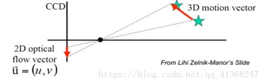

​     										         图（1） 三维运动在二维平面内的投影 

#### 3.光流场

​		在空间中，运动可以用运动场描述，而在一个图像平面上，物体的运动往往是通过图像序列中不同图像灰度分布的不同体现的，从而，**空间中的运动场**转移到图像上就表示为**光流场（optical flow field）**。

​		光流场是一个**二维矢量场**，它反映了图像上每一点**灰度的变化趋势**，可看成是**带有灰度的像素点**在图像平面上运动而产生的**瞬时速度场**。它包含的信息即是各像点的瞬时运动速度矢量信息。

​		研究光流场的目的就是**为了从序列图像中近似计算不能直接得到的运动场**。光流场在理想情况下，光流场对应于运动场。

​		光流场  ->   运动场

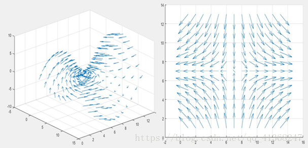

​										 图（2）三维空间的矢量场及其在二维平面内的投影

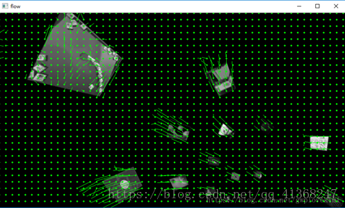

​                                     				          图（3）现实场景的可视化光流场                                       

三言以概之：所谓**光流场**就是很多光流的**集合**。

  					 当我们计算出了一幅图片中每个图像的光流，就能形成光流场。

​      		　      **构建光流场是试图重现现实世界中的运动场，用以运动分析。**

## 光流法基本原理

#### 1.基本假设条件

* **亮度恒定不变**。即同一目标在不同帧间运动时，其亮度不会发生改变。这是基本光流法的假定（所有光流法变种都必须满足），用于得到光流法基本方程；

* **时间连续或运动是“小运动”**。即时间的变化不会引起目标位置的剧烈变化，相邻帧之间位移要比较小。同样也是光流法不可或缺的假定。

#### 2.基本约束方程

​		考虑一个**像素I(x,y,t)**在第一帧的**光强度（其中t代表其所在的时间维度）**。它移动了 (dx,dy)的距离到下一帧，用了dt时间。因为是同一个像素点，依据上文提到的**第一个假设我们认为该像素在运动前后的光强度是不变的**，即：


​		将(1)式右端进行**泰勒展开**，得：

​	

其中**ε代表二阶无穷小项**，可忽略不计。再将(2)代人(1)后同除dt，可得：


​		   设u=dx/dt,v=dy/dt,v分别为光流分别为沿X轴与Y轴的速度矢量，得：


​			令Ix、Iy、Iz分别表示图像中像素点的**灰度沿X,Y,T方向的偏导数**。

​		综上，式(3)可以写为：


​		其中，**Ix,Iy,It**均可由图像数据求得，而**(u,v)即为所求光流矢量**。

​		约束方程只有一个，而方程的未知量有两个，这种情况下**无法求得u和v的确切值**。此时需要引入另外的**约束条件**，从**不同的角度引入约束条件**，导致了不同光流场计算方法。按照理论基础与数学方法的区别把它们分成四种：

1. 基于**梯度（微分）**的方法
2. 基于**匹配**的方法
3. 基于**能量（频率）**的方法
4. 基于**相位的方法和神经动力学方法**。 

## 几种光流估计算法的简介

#### 1) 基于梯度的方法

​		基于梯度的方法又称为**微分法**，它是利用**时变图像灰度（或其滤波形式）的时空微分（即时空梯度函数）**来计算像素的**速度矢量**。

​		由于计算简单和较好的结果，该方法得到了广泛应用和研究。典型的代表是**Horn-Schunck算法与Lucas-Kanade(LK)算法**。

​		**Horn-Schunck算法**在光流基本约束方程的基础上**附加了全局平滑假设**，假设在整个图像上光流的变化是**光滑的**，即**物体运动矢量**是**平滑的或只是缓慢变化**的。

​		基于此思想，大量的改进算法不断提出。

​		**Nagel采用有条件的平滑约束**，即通过**加权矩阵的控制对梯度进行不同平滑处理**；

​		**Black和Anandan**针对多运动的估计问题，提出了**分段平滑**的方法。

#### 2) 基于匹配的方法

​		基于匹配的光流计算方法包括**基于特征和区域**的两种。

​		基于**特征**的方法**不断地对目标主要特征进行定位和跟踪**，对**目标大的运动和亮度变化**具有**鲁棒性**。存在的问题是光流通常很稀疏，而且特征提取和精确匹配也十分困难。

​		基于**区域**的方法**先对类似的区域进行定位，然后通过相似区域的位移计算光流**。这种方法在视频编码中得到了广泛的应用。然而，它计算的光流仍不稠密。另外，这两种方法估计亚像素精度的光流也有困难，计算量很大。

#### 3) 基于能量的方法

​		基于能量的方法又称为**基于频率的方法**，在使用该类方法的过程中，要**获得均匀流场的准确的速度估计**，就必须对输入的图像进行时空滤波处理，即对时间和空间的整合，但是这样会降低光流的时间和空间分辨率。基于频率的方法往往会涉及大量的计算，另外，要进行可靠性评价也比较困难。 

#### 4) 基于相位的方法

​		基于相位的方法是**由Fleet和Jepson提出**的，Fleet和Jepson最先**提出将相位信息用于光流计算的思想**。当我们计算光流的时候，相比亮度信息，图像的相位信息更加可靠，所以利用相位信息获得的光流场具有更好的鲁棒性。基于相位的光流算法的优点是：对图像序列的适用范围较宽，而且速度估计比较精确，但也存在着一些问题：第一，基于相位的模型有一定的合理性，但是有**较高的时间复杂性**；第二，基于相位的方法通过两帧图像就可以计算出光流，但如果要**提高估计精度**，就需要花费一定的时间；第三，基于相位的光流计算法对图像序列的时间混叠是比较敏感的。 

#### 5) 神经动力学方法

​		神经动力学方法是**利用神经网络建立的视觉运动感知的神经动力学模型**，它是对生物视觉系统功能与结构比较直接的模拟。

​		尽管光流计算的神经动力学方法还很不成熟，然而对它的研究却具有极其深远的意义。随着生物视觉研究的不断深入，神经方法无疑会不断完善，也许光流计算乃至计算机视觉的根本出路就在于神经机制的引入。神经网络方法是光流技术的一个发展方向。

## 稠密光流与稀疏光流

​		除了根据原理的不同来区分光流法外，还可以根据所形成的光流场中二维矢量的疏密程度将光流法分为**稠密光流与稀疏光流**两种。

#### 1.稠密光流

​		稠密光流是一种**针对图像或指定的某一片区域**进行逐点匹配的**图像配准方法**，它计算图像上所有的点的偏移量，从而形成一个稠密的光流场。通过这个稠密的光流场，可以进行像素级别的图像配准。

​		Horn-Schunck算法以及基于区域匹配的大多数光流法都属于**稠密光流的范畴**。


​               						               图(4) 基于区域匹配方法生成稠密光流场图例

​		 由于光流矢量稠密，所以其配准后的效果也明显优于稀疏光流配准的效果。但是其副作用也是明显的，由于要计算每个点的偏移量，其**计算量也明显较大，时效性较差。**

#### 2.稀疏光流

​		与稠密光流相反，稀疏光流并不对图像的每个像素点进行逐点计算。它通常需要指定一组点进行跟踪，这组点最好具有某种明显的特性，例如**Harris角点**等，那么跟踪就会相对稳定和可靠。稀疏跟踪的计算开销比稠密跟踪小得多。

上文提到的基于特征的匹配方法是典型的属于稀疏光流的算法。

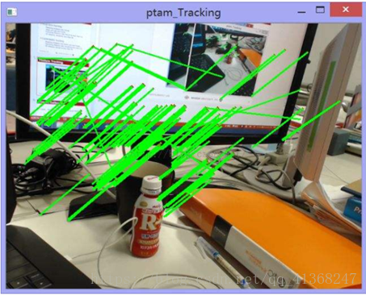

​											 图(5) 基于特征匹配方法生成稀疏光流场图例          

## Horn–Schunck光流算法

Horn–Schunck光流算法用一种全局方法估计图像的稠密光流场（即对图像中的每个像素计算光流）
算法基于两个假设

* 灰度不变假设
  物体上同一个点在图像中的灰度是不变的，即使物体发生了运动。（这个假设在稳定光照的情况可以满足，但是对于存在高光反射的图像是不成立的）
* 光流场平滑假设 （这个是添加的内容）
  假设场景中属于同一物体的像素形成光流场向量应当十分平滑，只有在物体边界的地方才会出现光流的突变，但这只占图像的一小部分。总体来看图像的光流场应当是平滑的。
  算法构造了一个能量函数，求光流场的问题转化为求能量函数的最小值。

#### 数学模型


其中，*α*值越大，光流越平滑。这是一个泛函的极值问题，可以用欧拉-拉格朗日方程求解。对应上式的是[双变量双函数一阶导数的欧拉-拉格朗日方程组](https://en.wikipedia.org/wiki/Euler–Lagrange_equation#Several_functions_of_several_variables_with_single_derivative)


## Lucas-Kanade(LK)光流法

* LK光流法于1981年提出，最初是用于求稠密光流的，由于算法易于应用在输入图像的一组点上，而成为求稀疏光流的一种重要方法。

* LK光流法在原先的光流法两个基本假设的基础上，**增加了一个“空间一致”的假设**，即**所有的相邻像素有相似的行动**。也即在目标像素周围m×m的区域内，每个像素均拥有相同的光流矢量。以此假设解决式  无法求解的问题。

#### LK光流法约束方程

​		在一个小邻域内，**LK光流法**通过对下式的**加权平方和最小化来估计光流矢量**

​			 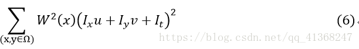

​	上式中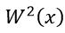是一个**窗口权重函数**，该函数**使得邻域中心的加权比周围的大**。对于Ω内的n个点X1⋯Xn，

以下步骤就是为了将上面的式子化为矩阵的形式

设

​									             

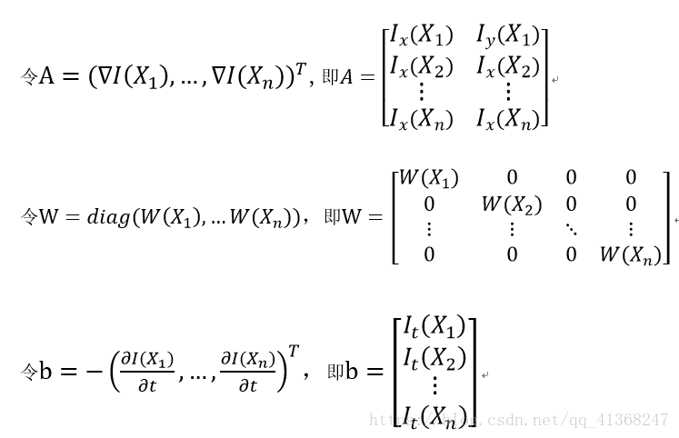

​	故上面方程的解可由最小二乘法得到：


最后得：


​		通过结合几个邻近像素点的信息，LK光流法通常能够消除光流方程里的多义性。而且，与逐点计算的方法相比，LK方法对图像噪声不敏感。

## 金字塔LK光流法

​		LK算法的约束条件即：**小速度，亮度不变以及区域一致性都是较强的假设**，并不很容易得到满足。如当物体运动速度较快时，假设不成立，那么**后续的假设就会有较大的偏差**，使得最终求出的光流值**有较大的误差**。图像金字塔可以解决这个问题。

三个假设

- 亮度恒定，即图像场景中目标的像素在帧间运动时外观上保持不变；
- 时间连续或者运动是”小运动“，即图像的运动随时间的变化比较缓慢；
- 空间一致，即一个场景中同一表面上邻近的点具有相似的运动。

​		考虑物体的运动速度较大时，算法会出现较大的误差。那么就希望能**减少图像中物体的运动速度**。一个直观的方法就是，**缩小图像的尺寸。假设当图像为400×400时，物体速度为[16 16],那么图像缩小为200×200时，速度变为[8,8]。缩小为100*100时，速度减少到[4,4]**。所以在源图像缩放了很多以后，原算法又变得适用了。所以光流可以通过生成 原图像的金字塔图像，**逐层求解，不断精确来求得**。简单来说上层金字塔（低分辨率）中的一个像素可以代表下层的四个。

```
一段以补充：我灵魂画手在画下图时表达稍微不恰当Σ(っ°Д°;)っ，黑色方块实际上应该为方框。表示的是所选区域的大小在金字塔各层中的不变，而并不代表该区域内像素点保持怎样的状态或是有什么联系。没有！在图像缩放过程中每个区域的像素灰度值情况都会在变化。只是说我们基于LK算法假设的“空间一致”让“一片区域具有相同的运动状态”。这个所谓的区域并不是指某一个有相同特征的像素集合，仅仅只是一个框，一个范围的概念，一个大小的概念而已。
```


​		一段以解释：黑色方块代表两个连续的帧内同一目标的不同位置。为了观察方便我才将其放在一张图里。

​		面对“大运动”时我光流法的局限是什么？显然是运动距离大原算法不适用。（hhh）那么其实只要通过图片尺寸的不断缩小，而且目标选框大小保持不变，让**运动前后两个物体的位置看上去“不断靠近”**，直到变成小运动就可以使用光流法了。读者可能会存在很多疑问：

1. 为什么图片整体尺寸缩减时假定的**目标其“尺寸”可以保持不变**？

2. 只在分辨率很小的尺度内计算光流，有什么用？能替代真实的光流矢量的值吗？

   我先粗略解释一下，然后下文会展示详细的算法过程，让读者能有更深刻的认识。

3. 不论是在什么尺寸（尺度，缩小图片其实是模拟观察者的远近）的情况下，我们都坚持LK光流法的假设，**即“空间一致”**，不管我们看到图像是1000x1000还是10x10，我们都**认为一个像素和它周围的一片区域内的若干个像素具有相同的速度**。这是你使用LK光流法就必须承认的一个假设。这一片区域大小不一定是50x50，但始终是存在且不随客观情况改变只由你自己的判断而确定。

4. 在低尺度下只计算一次当然不准，为什么？你把图片弄得很**模糊又很小**，丢失了很多信息，还想检测准确？但是在低尺度下的光流矢量的测量能给我们一个指示，就像是低尺度下它综观全局，告诉你“运动大概是5点钟方向，大小大概是【32,57】”之类的信息。**这条信息够粗糙，但是大体上是有用的**。它使得你在进入金字塔的下一层时有一个大概的头绪，你由此指示可以在下一层金字塔再一次顺利“靠近”真实目标，强行符合“小运动”。这里可能说得很抽象，大家细细看下面的具体算法再回来看这一段或许会有所启示。

   （下面这一部分具体参照CSDN博客：https://blog.csdn.net/sgfmby1994/article/details/68489944 ，写得非常棒，受益匪浅）

1)**算法步骤**简介

​	a. 首先，对每一帧建立一个高斯金字塔，最低分辨率图像在最顶层,原始图片在底层。

​	b. 计算光流。**从顶层(Lm层)开始**，通过最小化每个点的邻域范围内的匹配误差和，得到顶层图像中每个点的光流。

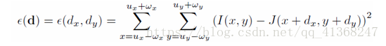

假设图像的尺寸每次缩放为原来的一半，**共缩放了Lm层**，则第0层为原图像。设已知原图的位移为d，则每层的位移为:

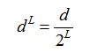

​	c. 顶层的光流计算结果(位移情况)**反馈到第Lm-1层**，作为该层初始时的光流值的估计g。


​	d. 这样沿着金字塔向下反馈，重复估计动作，直到到达金字塔的底层(即原图像)。

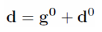

 (准确值=估计值+残差) “残差”即本算法的关键对于每一层L，每个点的光流的计算都是基于邻域内所有点的匹配误差和最小化。

为了更好地理解金字塔LK光流法，下图简单展示了算法的实现过程：


```
一段以解释：低尺度下找到光流矢量d0，将其扔到下一层去指引我们前行。扔下去后首先要放大两倍，此时你开始抱怨：“上一层找到的d0根本不靠谱，差距好大”（图2中蓝方块与右下角黑色方块的差距）但是你也要庆幸，正是“不靠谱”的d0让你到达了蓝色方块的位置，让你离真实区域前进了很多，否则你还在左上角苦于“小运动”寸步难行呢。在蓝色位置你就满足“小运动”了，继续计算光流，得到d1，然后把（2d0+d1）扔到下一层指导我们继续前行，如此往复。
```

2)一些实现细节

​	**金字塔的构建**

​	1. 利用低通滤波器平滑图像

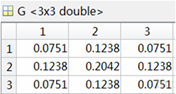

​	1.对平滑图像进行间隔采样，生成金字塔图像，每一层图像的高度与宽度均是下一层的二分之一。


 

**金字塔跟踪**

​		首先，从顶层开始计算金字塔最顶层图像上的光流。然后，根据最顶层(Lm-1) 光流的计算结果估计次顶层光流的初始值，再计算次顶层图像上光流的精确值。最后，根据次上层光流的计算结果估计下一层(Lm-2) 光流的初始值，计算其精确值后再反馈到下一 层，直至计算出最底层 的原始图像的光流。

１．初始化顶层图像光流矢量估计值为0.

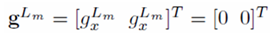

２．邻域内所有像素点的匹配误差和记为：

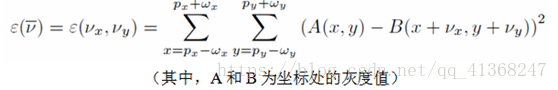

３．对其进行求导，得：

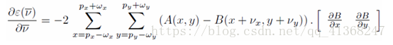

４．对B(x+vx,y+vy)进行泰勒展开：


５．对B(x+*v**x*,y+*v**y*)进行泰勒展开：


６．导数公式可转化为： 

 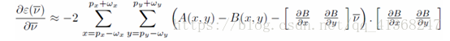

带入得：

 

定义：


有

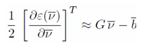

最终得光流矢量最优解为：


​		观察G与b的组成，可知δI其实是两帧同层图像灰度之间的差值。而Ix,Iy分别是图像在该点处梯度的x方向分量与y方向分量。

​		根据δI与Ix,Iy求得空间梯度 矩阵G和b。以此得到Lm层图像的最佳光流dLm。

​		解释一下：前面说得好像很轻松，什么“然后就计算一下光流矢量”。但是具体要怎么做呢？我这里只粗略讲讲思路，具体结合上面的公式再来看或许才能有所感悟。

​		很简单，我不是知道前一帧目标的具体位置(x,y)吗？我还给它画了个假定范围内速度一致对吧？好，现在我来个遍历，我让光流矢量（速度）取[-100,100]到[100,100]一个一个代（比如取[10,10]），然后到后一帧里让原来的目标x,y加上[10,10]，看看得到的这一个点（x+10,y+10）和上一帧的(x,y)点的灰度值差多少（别忘了我们最基础的假设一：同一目标运动过程中灰度值（光强）大小保持恒定，灰度值差当然越小我们就越认为找的没错啦），范围w内的其他像素点小伙伴们也一样加上[10,10]进行比较，看看误差有多大。如果觉得[10,10]误差太大了接受不了，就取[11,10]看看。直到取到一个（例如[73,29]）使得误差最小，那么我们就说[73,29]是（x,y）点的光流矢量了。
​		这种遍历看上去是不是好low？的确如此。所以我们用的并不是这个方法。Σ(っ°Д°;)っΣ(っ°Д°;)っΣ(っ°Д°;)っ

​		上文中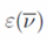 的其实就像是这样的一个函数：自变量是速度矢量，函数值是误差的大小。我们要求在什么速度矢量的输入下得到的误差最小，直接求导嘛！！！！！就不用一个一个v傻傻代入了呀。求导让导函数等于零，此时的v正是所求的光流矢量。此方法与上一段的“傻方法”效果一样，但是计算十分简便了。思路就是这么个思路，具体一些细节还是看上面。

迭代过程

将上层图像得到的光流矢量累加值传递到下一层做为初始值，即：


可以看出，最终光流值就是所有层光流矢量的叠加。

 最后我们可以总结一下使用金字塔图像计算光流的好处，它对于每一次光流的都会保持很小，但是最终计算出来的光流可以进行放大然后累计。所以利用相对较小的邻域窗口就可以处理较大的像素运动。

## 光流法的优缺点

#### 优点

光流法的优点在于它无须了解场景的信息,就可以准确地检测识别运动日标位置,且在摄像机处于运动的情况下仍然适用。

而且光流不仅携带了运动物体的运动信息，而且还携带了有关景物三维结构的丰富信息，它能够在不知道场景的任何信息的情况下，检测出运动对象。

#### 缺点

光流法的适用条件，即两个基本假设，在现实情况下均不容易满足。

###### 假设一：亮度恒定不变

但是实际情况是光流场并不一定反映了目标的实际运动情况,如图,所示。图中,光源不动,而物体表面均一,且产生了自传运动,却并没有产生光流图中,物体并没有运动,但是光源与物体发生相对运动,却有光流产生。因此可以说光流法法对光线敏感, 光线变化极易影响识别效果。

###### 假设二：小运动

前文也有提到，现实情况下较大距离的运动也是普遍存在的。因此当需要检测的目标运动速度过快是，传统光流法也不适用。

孔径问题

观察上图(a)我们可以看到目标是在向右移动，但是由于“观察窗口”过小我们无法观测到边缘也在下降。LK算法中选区的小邻域就如同上图的观察窗口，邻域大小的选取会影响到最终的效果。当然，这是针对于一部分稀疏光流算法而言，属于稠密光流范畴的算法一般不存在这个问题。

但是稠密光流法的显著缺点主要体现在,计算量大,耗时长,在对实时性要求苛刻的情况下并不适用。

## 总结

对于光流法来说，时效性与精确性难以兼得。

在对于运动场景和目标无有效认知，运动模型难以预测、目标特征无法确定的情况下，若使用光流法构建稠密光流场，并且使用金字塔算法补充对于大幅度运动的检测精度，无论是应用于前景检测还是目标跟踪都能起到不错的效果，能够较高的检测精度。但是显而易见，这样的算法复杂度很高，计算量十分巨大，时效性极差。

相反，若结合特征检测算法，针对特征点构建稀疏光流场，能够极大提高算法的执行效率。但是相对的，由于稀疏光流场所能获得的场景运动信息过少，检测精度与准确性难以保证。

此外，光流法理论的基础建立在同一物体亮度恒定的假设上，现实中较难完全满足，这也是光流法的一大不足之处。

## 资料链接

《A Database and Evaluation Methodology for Optical Flow》里面对主流的光流算法做了简要的介绍和对不同算法进行了评估。网址是：http://vision.middlebury.edu/flow/)

[Horn–Schunck光流算法 — Horn–Schunck Method](https://blog.csdn.net/u012841922/article/details/85273852)

[OpenCV：金字塔LK光流法](https://blog.csdn.net/mars_xiaolei/article/details/80526106)

## 参考资料

- [计算机视觉--光流法(optical flow)简介](https://blog.csdn.net/qq_41368247/article/details/82562165)
- [Horn–Schunck光流算法](https://blog.csdn.net/hhyh612/article/details/79216021)

