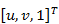
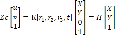
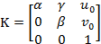
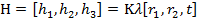
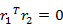
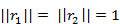
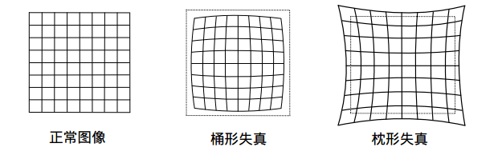

[TOC]

## 张正友相机标定法简介

👉🏻来源：张正友教授1998年提出的**单平面棋盘格**的相机标定方法。

👉🏻与传统标定法与自标定法比较：

* 📙传统标定法：包含三维标定块、二维标定模板、一维标定物，但是都需要空间三维信息（要求非常精确）导致很难制作。
* 📘自标定法：主要分为
  * 1- 多视图几何约束方程 -  kruppa方程、绝对二次曲线、绝对二次曲面
  * 2- 结构化信息约束方程 -  平行线段、圆形和球体和多边形与多面体

* 📗张正友相机标定法：介于传统标定法和自标定法之间
  * 1- 克服了传统标定法需要的高精度标定物的缺点，而仅需棋盘格。
  * 2- 相对于自标定而言，提高了精度，便于操作。

## 张正友相机标定法的标定原理

将标定棋盘格放在不同位置和角度进行拍摄，采集的图片数不少于 3 张，一般选用15张左右。

* \1.  先通过图像处理获得棋盘格的角点，设其像素坐标为 ，设其世界坐标为X,Y,1，设 K 为相机内参矩阵，*r1*_,**r2**,_*r3* 和t分别为相机坐标系相对于世界坐标系的旋转矩阵和平移向量，棋盘格到图像平面的单应性变换为：

其中设定的相机内参矩阵 ，单应性矩阵

* \2. 根据旋转矩阵的性质： 和 ，可以得出内参矩阵 K的约束条件，因为内参数矩阵有 5 个未知数，当采集的标定图片数目≥3 时即可求出内参矩阵 K 。

* \3. 再根据内部参数与映射矩阵求出每幅采集的标定板图像相对于基准图像的旋转矩阵R 与平移向量 t ，即外参矩阵的参数。对求得的参数根据极大似然原则进行优化，求出极大似然估计值。

* \4. 将每张图像的控制点根据求解的参数重投影回三维空间，最小化与真实值的差异，建立非线性最小化模型，用LM(Levenberg-Marquardt)迭代算法优化参数。

## 张正友相机标定法的详细推导

在张氏标定法中，用于标定的棋盘格是三维场景中的一个平面Π，其在成像平面的像是另一个平面*π*，知道了两个平面的对应点的坐标，就可以求解得到两个平面的单应矩阵*H*。其中，标定的棋盘格是特制的，其角点的坐标是已知的；图像中的角点，可以通过角点提取算法得到，这样就可以得到棋盘平面Π和图像平面*π*的单应矩阵*H*。
 通过上面的相机模型有：

​																								*p*=*K*[*R*|*t*]P

其中*p*是像点坐标，*P*是标定的棋盘坐标。 这样就可以得到下面的等式：

​																								H*=*K*[*R*|*t]

H*表示的是成像平面和标定棋盘平面之间的单应矩阵。通过对应的点对解得*H*后，则可以通过上面的等式得到相机的内参数*K*，以及外参旋转矩阵*R*和平移向量*t*。

相机的内参矩阵为

​																		K

​												K(Inv) = 

其中，值得注意的是*γ*为扭曲参数，

#### 🟩棋盘平面和成像平面间的单应

将一个平面映射到另一个平面，将棋盘格所在的平面映射到相机的成像平面，则有

​																										p*=*HP

*p*为棋盘格所成像的像点坐标，P棋盘格角点在世界坐标系的坐标。

设棋盘格所在的平面为世界坐标系中*Z*=0的平面，这样棋盘格的任一角点*P*的世界坐标为(*X*,*Y*,0)，根据小孔相机模型：

根据平面间的单应性，有

将上面两个等式进行整合，则可以得到单应矩阵*H*和相机矩阵（包含内参和外参）的相等，如下：

这样就可以使用棋盘平面和成像平面间的单应矩阵来约束相机的内参和外参。单应矩阵*H*可以通过棋盘平和成像平面上对应的点计算出来。

#### 🟩内参的约束条件

通过平面间的单应，可以得到如下的等式

将旋转矩阵*R*的各个列向量和平移向量*t*使用*H*的列向量表示，

又由于，*R*是旋转矩阵，则其是**正交矩阵**，也就是其任意两个列向量的内积为0，列向量的模为1。故有：

则对于一幅棋盘标定版的图像（一个单应矩阵）可以获得两个对内参数的约束等式：

#### 🟩求解内参数

通过一幅标定板的图像可以的得到关于内参数的两个等式，定义，令

注意，矩阵*B*是一个对称矩阵，其未知量只有6个，将6个未知量写为向量的形式

令hi为单应矩阵*H*的第*i*个行向量，则有

故：

有了上边的等式，再来看从一幅标定板图像得到的等式

写成矩阵的形式有：

上面的一幅标定板图像取得的约束等式，假如有*n*幅图像，则

​																									Vb=0

其中，*V*是一个2*n*×6的矩阵，b是一个6维向量，所以

- 当*n*≥3，可以得到*b*的唯一解;
- 当*n*=2，则可以假设扭曲参数*γ*=0作为额外的约束条件
- 当*n*=1，则值能计算两个相机的内参数

对于方程Vb=0可以使用SVD求得其最小二乘解。对*V**T**V*进行SVD分解，其最小特征值对应的特征向量就是Vb=0的最小二乘解，从而求得矩阵*B*。由于这里得到的*B*的估计值是在相差一个常量因子下得到的，所以有：

注：上式的A即是相机的内参矩阵，同K 

从而可以得到相机的各个内参数：

#### 🟩最大似然估计

上面使用最小二乘法得到估计得到的解，并没有物理上的实际意义，。为了进一步增加标定结果的可靠性，可以使用最大似然估计(Maximum likelihood estimation)来优化上面估计得到的结果。

假设同一相机从*n*个不同的角度的得到了*n*幅标定板的图像，每幅图像上有*m*个像点。*M**i**j*表示第*i*幅图像上第*j*个像点对应的标定板上的三维点，则

表示*M**i**j*的像点。其中，Ri,ti表示第*i*幅图像对应相机的旋转矩阵和平移向量，*K*是相机的内参数。则像点*m**i**j*的概率密度函数是

构造似然函数

为了能够让*L*取得最大值，需要最小化下面的值

这是一个非线性优化问题，可以使用Levenberg-Marquardt的方法，利用上面得到的解作为初始值，迭代得到最优解。

#### 🟩消除径向畸变

为了取得好的成像效果，通常要在相机的镜头前添加透镜。在相机成像的过程中，透镜会对光线的传播产生影响，从而影响相机的成像效果，产生畸变：

- 透镜自身的形状对才光线的传播产生影响，形成的畸变称为**径向畸变**。在小孔模型中，一条指向在成像平面上的像仍然是直线。但是在实际拍摄的过程中，由于透镜的存在，往往将一条直线投影成了曲线，越靠近图像的边缘，这种现象越明显。透镜往往是中心对称的，使得这种不规则的畸变通常是径向对称的。主要有两大类：桶形畸变和枕形畸变。如下图
  
- 由于在相机组装的过程中，透镜不能和成像平面严格平行，会引入**切向畸变**。

张氏标定法中只关注了影响较大的径向畸变。
设，(*μ*,*ν*)是理想的无畸变的像素坐标；是畸变后的像素坐标；(*μ*0,*ν*0)是相机的主点；(*x*,*y*)和理想的无畸变的归一化的图像坐标和畸变后的归一化图像坐标，使用下面的式子表示径向畸变：

*k*1,*k*2表示径向畸变的系数。径向畸变的中心和相机的主心是在相同的位置，

假设*γ*=0，则有：

将上面的式子改写为矩阵的形式

上面的等式是从一幅图像上的一个点取得，设有*n*幅图像，每幅图像上有*m*个点，则将得到的所有等式组合起来，可以得到2mn个等式，将其记着矩阵形式

​																Dk=d

则可得

和上面类似利用最大似然估计取得最优解，使用LM的方法估计使得下面式子是最小值的参数值

得到畸变参数*k*1,*k*2后，可以先将图像进行去畸变处理，然后用去畸变后的图像坐标估计相机的内参数。

## 相机标定步骤

* 打印一张棋盘格A4纸张（黑白间距已知），并贴在一个平板上

* 针对棋盘格拍摄若干张图片（一般10-20张）

* 在图片中检测Harris特征点

* 利用解析解估算方法计算出5个内部参数，以及6个外部参数

* 根据极大似然估计策略，设计优化目标并实现参数的refinement

## 代码实现

完整的代码放在[这里](../src/3D_Vision/张正友标定法)

[refine_all.py](../src/3D_Vision/张正友标定法/refine_all.py)     用于微调参数的文件

[distortion.py](../src/3D_Vision/张正友标定法/distortion.py)    用于求解畸变矫正系数的文件

[extrinsics.py](../src/3D_Vision/张正友标定法/extrinsics.py)     用于求解外参矩阵的文件

[intrinsics.py](../src/3D_Vision/张正友标定法/intrinsics.py)      用于求解内参矩阵的文件

[homography.py](../src/3D_Vision/张正友标定法/homography.py)  用于求解单应性矩阵的文件

[main.py](../src/3D_Vision/张正友标定法/main.py)

## 参考资料

- [相机自标定方法思维导图](https://blog.csdn.net/qq_40245549/article/details/81394931)
- [张正友标定算法原理详解](https://www.cnblogs.com/excellentlhw/p/10664460.html)
- [张正友标定算法原理详解](https://www.jianshu.com/p/9d2fe4c2e3b7)
- [张正友相机标定法原理与实现)](https://blog.csdn.net/qq_40369926/article/details/89251296)
- [SLAM入门之视觉里程计(6):相机标定 张正友经典*标定法*详解](http://www.baidu.com/link?url=iORV_CV73qScTAg_LE9L7HKEmty3bp8v1dXmV9ZbRIZu87b0DeMp4xLRO3gXSsZkNRXcylnNCIaDju5PKx4Jw_&wd=&eqid=8bbb9bab0006fdcb000000035f047769)
- [张正友标定法原理及实验](https://my.oschina.net/u/2460402/blog/3083984)

