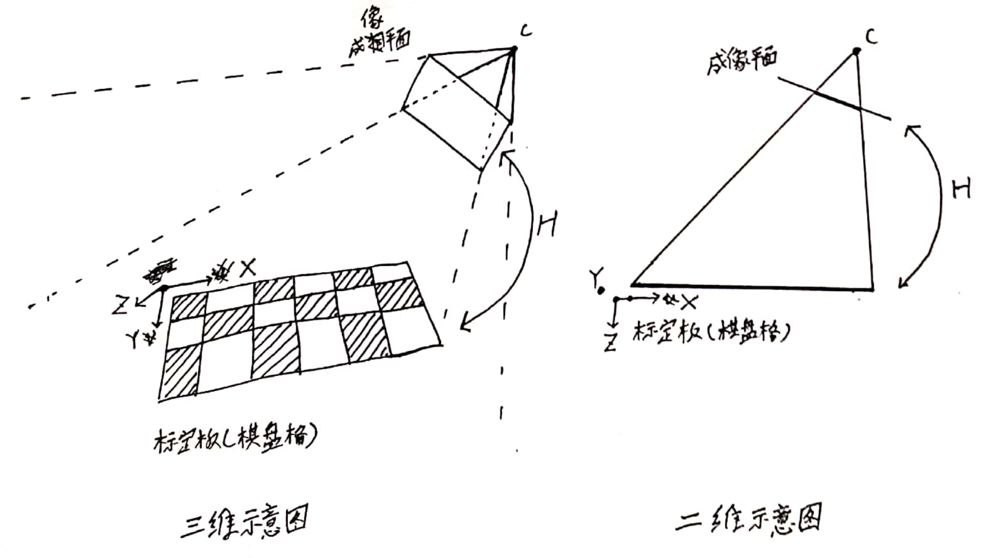

[TOC]

## 介绍

张在论文中把相机标定方法分为两类：`摄影测量标定法(Photogrammetric calibration)` 和 `自标定法(Self-calibration)`，

- **摄影测量标定法(Photogrammetric calibration)** ：采用已知尺寸的高精度3D标定物进行标定的方法。该类方法标定结果准确，但是需要昂贵的标定物以及复杂的标定设置。属于该类方法的一些工作如下：
  - O. Faugeras. Three-Dimensional Computer Vision: a Geometric Viewpoint. MIT Press, 1993.
  - R. Y. Tsai. A versatile camera calibration technique for high-accuracy 3D machine vision metrology using off-the-shelf tv cameras and lenses. IEEE Journal of Robotics and Automation, 3(4):323–344, Aug. 1987.
- **自标定法(Self-calibration)** ：不需要任何标定物，只需要在静态场景中移动相机。该类方法标定结果并不总是可靠的，但是标定比较灵活。属于该类方法的一些工作如下：
  - S. Bougnoux. From projective to euclidean space under any practical situation, a criticism of self-calibration. In Proceedings of the 6th International Conference on Computer Vision, pages 790–796, Jan. 1998.
  - Q.-T. Luong. Matrice Fondamentale et Calibration Visuelle sur l’Environnement-Vers une plus grande autonomie des systemes robotiques. PhD thesis, Universitede Paris-Sud, Centre d’Orsay, Dec. 1992.

  -  Q.-T. Luong and O. Faugeras. Self-calibration of a moving camera from point correspondences and fundamental matrices. The International Journal of Computer Vision, 22(3):261–289, 1997.
  - S. J. Maybank and O. D. Faugeras. A theory of self-calibration of a moving camera. The International Journal of Computer Vision, 8(2):123–152, Aug. 1992.

根据这两种分类原则，张认为自己提出的方法介于二者之间，其采用高精度的2D标定平面（棋盘格），并且只需要移动相机或者移动棋盘格。采用的标定物便宜且易于获取（打印棋盘格在纸张上即可），标定配置灵活（移动棋盘格平面，拍摄各个方向的棋盘格即可），且标定结果鲁棒精度较高（实验表明仿真和真实数据表现都不错）。

> 其实，除了这两类方法，张还提到了一些其他方法，不太好分类，例如： 
>
> - vanishing points for orthogonal directions [3, 14],  | 这个标定内参效果好像不错，就是vanishing points不好找。
>   - B. Caprile and V. Torre. Using Vanishing Points for Camera Calibration. The International Journal of Computer Vision, 4(2):127–140, Mar. 1990.
>   - D. Liebowitz and A. Zisserman. Metric rectification for perspective images of planes. In Proceedings of the IEEE Conference on Computer Vision and Pattern Recognition, pages 482–488,Santa Barbara, California, June 1998. IEEE Computer Society.
> - calibration from pure rotation [11, 21].
>   - R. Hartley. Self-calibration from multiple views with a rotating camera. In J.-O. Eklundh, editor, Proceedings of the 3rd European Conference on Computer Vision, volume 800-801 of Lecture Notes in Computer Science, pages 471–478, Stockholm, Sweden, May 1994. Springer-Verlag.
>   - G. Stein. Accurate internal camera calibration using rotation, with analysis of sources of error. In Proc. Fifth International Conference on Computer Vision, pages 230–236, Cambridge, Massachusetts, June 1995.

## 理论基础

### 棋盘格检测

在标定之前，需要得到标定板上棋盘格的世界坐标和投影到图像上的像素坐标。因为标定板的尺寸已知，我们将坐标系原点放到标定板的某一点上，所以棋盘格世界坐标是已知的；而棋盘格的像素坐标，是通过棋盘格的角点检测算法检测得到的。

角点检测算法也是一个大领域，且不是张氏标定法的重点，本文不打算展开讨论。

#### TODO: 以后开单章去介绍标定中的角点检测算法。

### 基本符号

相机拍摄已知尺寸的棋盘格，得到的投影点记为 $m=[u, \; v]^T$，对应的3D点记为 $M=[X, \; Y, \; Z]^T$ ，采用齐次坐标表示，对应的齐次坐标为  $\widetilde{m} =[u, \; v, \; 1]^T$ 和 $\widetilde{M}=[X, \; Y, \; Z, \; 1]^T$ ，根据针孔相机模型，我们可以知道他们满足如下关系：
$$
s\widetilde{m} = A[R \; t]\widetilde{M}
$$
其中，s为标量，表示尺度， $[R \; t]$ 为相机外参，表示从世界坐标系转到相机坐标系下所需要进行的变换，A为相机内参矩阵，有如下形式：
$$
A = \begin{bmatrix}
 \alpha & \gamma & u_0\\
 0 & \beta & v_0\\ 
 0 & 0 & 1
\end{bmatrix}
$$
其中，$\alpha, \beta$ 分别是像素坐标系u和v坐标系方向像素焦距， $u_0, v_0$ 是相机主点坐标(即相机光心在图像平面上的投影)，而 $\gamma$ 表示像素坐标系u和v之间的倾斜程度(skewness)，在现在的相机中，由于工艺的改善，u和v坐标轴几乎垂直，所以 $\gamma=0$ 。

### 图像平面与棋盘格平面之间的单应矩阵

不失一般性，为了简化推导过程，我们假设标定板在 Z=0 平面上，如下图

因此投影关系变为
$$
s\begin{bmatrix}
u \\
v \\
1
\end{bmatrix} = A [r_1 \; r_2 \; r_3 \; t]\begin{bmatrix}
X \\
Y \\
Z \\
1
\end{bmatrix}
 = A [r_1 \; r_2 \; t]\begin{bmatrix}
X \\
Y \\
1
\end{bmatrix}
$$
为了方便，这里仍然用 M 去表示世界坐标系的点，只不过由于 Z=0 ，这里只关注X和Y，所以 $M=[X, \; Y]^T, \; \widetilde{M}=[X, \; Y, \; 1]^T$ ，因此上述关系可以记为
$$
\begin{aligned}
s\widetilde{m} &= H\widetilde{M} \\
H &= A [r_1 \; r_2 \; t]
\end{aligned} \tag{2}
$$
其中，这里的 H 其实就是两个平面之间的单应矩阵。

单应矩阵 H 的求法比较固定，需要4对匹配点即可计算出来，这里就不展开讨论了，假设你已经求出单应矩阵 H ，下面讨论如何根据 H 的结果计算出相机内外参数。(H 的求法，可以看论文的附录A，用的最大似然估计直接进行优化得到，另外4点求解的方法也可以看[2015年大疆算法工程师笔试题](./3D_Vision/2015年大疆算法工程师笔试题.md))

## 计算 $A^{-T}A^{-1}$

本节将利用旋转矩阵是个正交矩阵的性质，去计算相机内参。

将 H 记为 $H=[h_1, \; h_2, \; h_3]$ ，其中每个 $h_i$ 都是一个3x1的列向量，因此我们有：
$$
H = \lambda A [r_1 \; r_2 \; t]
$$
其中， $\lambda$ 是一个任意尺度，之所以会突然多出这一个，是因为求解H时候，得到的结果就可能差一个尺度(但是不影响H变换的结果)，所以解出来的H和 $A [r_1 \; r_2 \; t]$ 可能会差一个尺度。

由于旋转矩阵是个正交矩阵，因此其列向量 $r_1, r_2$ 均为单位向量，且相互正交。因此我们有两个约束，即单位向量的二范数相等，都为1，且正交向量的向量积为0，用数学表达如下：
$$
\begin{aligned}
r_1^Tr_2 &= 0 \\
||r_1||_2^2 &= ||r_2||_2^2 = 1
\end{aligned}
$$
即
$$
\begin{aligned}
h_1^TA^{-T}A^{-1}h_2 &= 0 \\
h_1^TA^{-T}A^{-1}h_1 &= h_2^TA^{-T}A^{-1}h_2 = 1
\end{aligned}
$$
将 $A^{-T}A^{-1}$ 记为B：
$$
B = A^{-T}A^{-1} = \begin{bmatrix}
B_{11} & B_{12} & B_{13} \\
B_{12} & B_{22} & B_{23} \\
B_{13} & B_{23} & B_{33} 
\end{bmatrix} =
=\left[\begin{array}{ccc}
\frac{1}{\alpha^{2}} & -\frac{\gamma}{\alpha^{2} \beta} & \frac{v_{0} \gamma-u_{0} \beta}{\alpha^{2} \beta} \\
-\frac{\gamma}{\alpha^{2} \beta} & \frac{\gamma^{2}}{\alpha^{2} \beta^{2}}+\frac{1}{\beta^{2}} & -\frac{\gamma\left(v_{0} \gamma-u_{0} \beta\right)}{\alpha^{2} \beta^{2}}-\frac{v_{0}}{\beta^{2}} \\
\frac{v_{0} \gamma-u_{0} \beta}{\alpha^{2} \beta} & -\frac{\gamma\left(v_{0} \gamma-u_{0} \beta\right)}{\alpha^{2} \beta^{2}}-\frac{v_{0}}{\beta^{2}} & \frac{\left(v_{0} \gamma-u_{0} \beta\right)^{2}}{\alpha^{2} \beta^{2}}+\frac{v_{0}^{2}}{\beta^{2}}+1
\end{array}\right]
$$
**注意到B是一个对称矩阵，只有6个未知数** ，记为列向量b，即
$$
b = [B_{11}, B_{12}, B_{13}, B_{22}, B_{23}, B_{33}]^T
$$
将 H 矩阵的第 $j$ 列向量表示为  $h_j = [h_{1j}, h_{2j}, h_{3j}]$  (注意这里定义的 $h_{ij}$ 表示 H 矩阵的第 $i$ 行，第 $j$ 列的元素，与论文中的定义不太一样)，为了方便的求解B，我们将 $h_i^TBh_j$ 表示成向量的形式(最终目的是为了将上面的约束转换成 $Ax=0$ 的形式，这是经典的线性方程组形式，容易求解):
$$
h_i^TBh_j = v_{ij}^Tb
$$
其中
$$
v_{ij} = [h_{1i}h_{1j}, \; h_{1i}h_{2j}+h_{2i}h_{1j}, \; h_{2i}h_{2j}, \; h_{3i}h_{1j}+h_{1i}h_{3j}, \; h_{3i}h_{2j}+h_{2i}h_{3j}, \; h_{3i}h_{3j}]^T
$$

所以每一张标定板图片带来的两个约束可表示如下：
$$
\left\{  
\begin{aligned}
h_1^TA^{-T}A^{-1}h_2 &= 0 \\
h_1^TA^{-T}A^{-1}h_1 &= h_2^TA^{-T}A^{-1}h_2
\end{aligned}
\right.
\Rightarrow 
\begin{bmatrix}
v_{12}^T \\
v_{11}-v_{22}
\end{bmatrix}b = 0 \tag{8}
$$
当有n张标定板图片时，公式 (8) 系数矩阵用 V 表示，变为：
$$
Vb=0
$$
其中，V 是一个 $2n \times 6 $ 大小的矩阵， b 是一个 $6 \times 1$ 的列向量，n表示不同平面上的标定板图片个数（这里的 **不同平面上的定义** 将在退化配置中详细讨论），n不同时，方程的解不同：

- 当*n*≥3，可以得到*b*的唯一解(差一个尺度 $\lambda$ ，因为齐次方程 $Vb=0=\lambda Vb$ 的解有无数多个，求解时只取了其中一个，取模为1的那个解作为b );
- 当*n*=2，强制假设扭曲参数*γ*=0作为额外的约束条件，即 $[0, 1, 0, 0, 0, 0]b = 0$，也能求解；
- 当*n*=1，强制假设*γ*=0且 $u_0, v_0$ 已知，作为额外的约束，可以求解出相机的两个内参数 $\alpha, \beta$ 。

如此，便求出了 b ，注意到方程 $Vb=0$ 通过 b 可得到矩阵 B。

## 计算相机内参矩阵

前面计算出来了矩阵 B ，注意到由于 b 和真实的 b 差一个尺度 $\lambda$ ，所以还原的矩阵 B 也和真实的 B 差一个尺度 $\lambda$ ，因此有
$$
B = \lambda A^{-T}A^{-1}
$$
上面左边的 B 是我们求解出来的，右边的 $A^{-T}A^{-1}$ 是我们想要的 B ，他们相差一个尺度。

下面我们要通过B求解A了。首先展开B矩阵，有：
$$
B = \lambda A^{-T}A^{-1} = \lambda \left[\begin{array}{ccc}
\frac{1}{\alpha^{2}} & -\frac{\gamma}{\alpha^{2} \beta} & \frac{v_{0} \gamma-u_{0} \beta}{\alpha^{2} \beta} \\
-\frac{\gamma}{\alpha^{2} \beta} & \frac{\gamma^{2}}{\alpha^{2} \beta^{2}}+\frac{1}{\beta^{2}} & -\frac{\gamma\left(v_{0} \gamma-u_{0} \beta\right)}{\alpha^{2} \beta^{2}}-\frac{v_{0}}{\beta^{2}} \\
\frac{v_{0} \gamma-u_{0} \beta}{\alpha^{2} \beta} & -\frac{\gamma\left(v_{0} \gamma-u_{0} \beta\right)}{\alpha^{2} \beta^{2}}-\frac{v_{0}}{\beta^{2}} & \frac{\left(v_{0} \gamma-u_{0} \beta\right)^{2}}{\alpha^{2} \beta^{2}}+\frac{v_{0}^{2}}{\beta^{2}}+1
\end{array}\right]
$$
这里有6个已知数 $[B_{11}, B_{12}, B_{13}, B_{22}, B_{23}, B_{33}]$ ，也有6个未知数 $[\lambda, \alpha, \beta, \gamma, u_0, v_0]$ ，可以按下列顺序依次求解出所有未知数：
$$
\begin{aligned}
v_0 &= (B_{12}B_{13}-B_{11}B_{23})/(B_{11}B_{22}-B_{12}^2) \\
\lambda &= B_{33}-[B_{13}^2+v_0(B_{12}B_{13}-B_{11}B_{23})]/B_{11} \\
\alpha &= \sqrt{\lambda / B_{11}} \\
\beta &= \sqrt{\lambda B_{11} / (B_{11}B_{22}-B_{12}^2)} \\
\gamma &= -B_{12} \alpha^2 \beta / \lambda \\
u_0 &= \gamma v_0 / \beta - B_{13} \alpha^2 / \lambda \\
\end{aligned}
$$

> 上面公式是论文里给出来的，我只验证了前两个是对的，后面可能有笔误，建议自己动手推一下。

至此，内参矩阵 A 的所有未知参数已计算出来。下面利用 A 计算相机外参。

## 计算相机外参矩阵

当相机内参矩阵 A 已知时， 由前面公式 (2) 可以求解出相机外参：
$$
r_1 = \lambda A^{-1}h_1 \\
r_2 = \lambda A^{-1}h_2 \\
r_3 = r_1 \times r_2 \\
t = \lambda A^{-1}h_3 \\
$$
这里的 $\lambda = 1/||A^{-1}h_1|| = 1/||A^{-1}h_2||$ 。

$r_1, r_2, r_3$ 可以恢复出旋转矩阵 R ，但由于数据带有噪声，恢复的 $R = [r_1, r_2, r_3]$ 通常不满足旋转矩阵的性质(即R为正交矩阵，且行列式为1)。所以在恢复出R后，还需要通过 SVD 分解的方式在 R 附近，去找到一个满足旋转矩阵性质的 R 。

### SVD精调R

**通过SVD精调R的方法很常用，你会在许多算法的推导里看到，建议弄懂。**

为了不混淆，这里将上面求解出来的，不一定满足旋转矩阵性质的解记为 Q ，而将我们期待得到的，符合性质的旋转矩阵记为 R 。那么寻找这么一个矩阵 R 的问题是一个最优化问题，代价函数为：
$$
\underset{R}{min} ||R-Q||_F^2, \quad subject \; to \; R^TR=I. \tag{15}
$$
因为
$$
\begin{aligned}
||R-Q||_F^2 &= trace((R-Q)^T(R-Q)) \\
 &= trace(R^TR + Q^TQ - 2R^TQ) \\
 &= 3 + trace(Q^TQ) - 2trace(R^TQ) \\
\end{aligned}
$$

> 上述推导中，因为 R 为 3x3 正交矩阵，所以 $trace(R^TR) = 3$

由于 $3 +trance(Q^TQ)$ 为固定值，因此优化的代价函数简化为
$$
\underset{R}{max} \; trace(R^TQ), \quad subject \; to \; R^TR=I.
$$
下面看看怎么用SVD求解这个最优化问题。

记 Q 的 SVD 分解为 $Q = UDV^T$ ，其中 $D=diag(\sigma_1, \sigma_2, \sigma_3)$ 。记 $Z = V^TR^TU$ ，由于 $V,R,U$ 都是正交的，所以 Z 是一个正交矩阵，因此有
$$
\begin{aligned}
trace(R^TQ) &= trace(R^TUDV^T) = trace(V^TR^TUD) \\
 &= trace(ZD) = \sum_{i=1}^{3}z_{ii}\sigma_i \le \sum_{i=1}^{3}\sigma_i
\end{aligned}
$$

> 上述推导用到了
>
> - 矩阵的迹就是矩阵对角线元素和
> - 迹的性质 $trace(AB) = trace(BA)$
> - 正交矩阵Z的列向量都是单位向量，且相互正交，所以每个元素 $z_{ij} \le 1$ 

所以 $trace(R^TQ)$ 的最大值在 $Z=I$ 单位阵时候得到，因此
$$
Z = V^TR^TU = I \quad \Rightarrow \quad R = UV^T
$$

> 注意：注意：这里虽然看上去和ICP那里很像，但是推导依据不一样，ICP是根据正定矩阵迹的性质推的，而这里Q不是正定矩阵。

至此，我们通过SVD找到了更好的旋转矩阵R(符合旋转矩阵的性质)。

### 优化外参

前面已经计算出了相机内外参，但是一方面由于数据存在噪声，另一方面在计算R时通过SVD找了个最近的解，所以得到的相机内外参并不一定能使得相机匹配点的投影误差最小，可以通过最优化的方法进一步调整内外参。

假设拍摄了n张标定板的图片，每张图片上棋盘格的角点个数有m个，则代价函数如下：
$$
\sum_{i=1}^{n}\sum_{j=1}^{m} ||m_{ij} - \hat{m}(A, R_i, t_i, M_j)||^2
$$
其中，$\hat{m}(A, R_i, t_i, M_j)$ 是 $M_j$ 通过公式 (2) 投影到图像上的投影点。

> 张的方法中，将R用旋转向量表示，来进行优化。我个人觉得旋转向量优化时还是会出问题，因为存在周期，360°等于0°。用李代数可能更好。

具体优化过程略，可以参考常见的最优化方法，如最速下降法、高斯-牛顿法、LM算法。

## 估计镜头的畸变系数

实际情况中相机总是要配备镜头，而镜头都是带有畸变的，前面的讨论都没有涉及到镜头畸变，所以算出来的内外参，哪怕优化后也是有误差的。

估计畸变系数的方法，论文里没有明确说，个人理解大概能分成三种：

1. 反复迭代的方法。先不考虑畸变，计算出内外参，再通过内外参求解畸变系数，再考虑畸变系数，计算出内外参，再通过内外参求解畸变系数，再考虑畸变系数....一直反复迭代到收敛。张的论文中提到这种方法在实验过程中收敛较慢。

2. 最优化方法。在代价函数中添加畸变系数项，畸变系数初始值设置为0，把前面算出来的内外参作为初始值丢进去，一起优化。

3. 结合上述两种方法。在代价函数中添加畸变系数项，先不考虑畸变，计算出内外参，再通过内外参求解畸变系数，此时的畸变系数和内外参作为优化问题的初始值，优化。该方法与第二种方法的区别就是，畸变系数的初始值不是0，而是先大概计算了一下初始值。

这里直接讨论第三种方法。

### 估计畸变的初值

首先估计畸变的初值。论文中说镜头畸变包括径向畸变和轴向畸变以及一些其他畸变，但起主要作用的，主要是径向畸变的前两项 $k_1, k_2$ ，考虑更多的畸变参数并不一定能得到更好结果，反而可能因为数值稳定性问题使得去畸变效果变差。

论文仅仅考虑径向畸变的前两项，畸变公式为：
$$
\hat{x} = x + x[k_1(x^2+y^2) + k_2(x^2+y^2)^2] \\
\hat{y} = y + y[k_1(x^2+y^2) + k_2(x^2+y^2)^2]
$$
这里，  $k_1, k_2$ 为径向畸变的前两项系数， $(x, y)$ 为无畸变的相机成像平面坐标(即归一化平面坐标，不是像素坐标)， $(\hat{x}, \hat{y})$ 是镜头畸变后的相机成像平面坐标。

根据归一化平面坐标与像素坐标的变换关系：
$$
\hat{u} = u_0 + \alpha\hat{x} + \gamma\hat{y} \\ 
\hat{v} = v_0 + \beta\hat{y} \\
$$
畸变公式在像素坐标系下表示为：
$$
\hat{u} = u + (u-u_0)[k_1(x^2+y^2) + k_2(x^2+y^2)^2] \\ 
\hat{v} = v + (v-v_0)[k_1(x^2+y^2) + k_2(x^2+y^2)^2] \\
$$
为了计算未知数 $k_1, k_2$ ，将畸变公式改写成 $Ax=b$ 的形式：
$$
\begin{bmatrix}
 (u-u_0)(x^2+y^2) & (u-u_0)(x^2+y^2)^2 \\
 (v-v_0)(x^2+y^2) & (v-v_0)(x^2+y^2)^2
\end{bmatrix}
\begin{bmatrix}
k_1 \\
k_2
\end{bmatrix}
=
\begin{bmatrix}
\hat{u}-u \\
\hat{v}-v
\end{bmatrix}
$$
其中， $(u, v)$ 是将标定板坐标通过前面估计的内外参投影得到， $(\hat{u},\hat{v})$ 是对标定板图像执行棋盘格检测得到的像素坐标。

对于每一个像素点，都能得到上述的两个约束方程，假设我们拍摄了n张标定板的图像，每张图像上有m个点，那么我们可以得到2nm个约束方程，我们将系数矩阵记为D，有
$$
Dk=d
$$
其中，D为 $2nm \times 2$ 大小的系数矩阵， $k = [k_1, \; k_2]^T$ ， d 为 $2nm \times 1$ 大小的列向量。

求解该方程组的方法有很多，具体可以看我写的另一篇文章 [矩阵分解与线性方程组]() 。 张的论文里是通过正规方程的方式求解的：
$$
k = (D^TD)^{-1}D^Td
$$
求解该方程组后，我们就可以得到畸变系数 $k_1, k_2$ ，将这作为初值，与前面计算得到的内外参一起进行最优化即可。

### 带畸变的代价函数

同前面的优化部分一样，这里只给出代价函数，具体优化过程略，可以参考常见的最优化方法，如最速下降法、高斯-牛顿法、LM算法。

假设拍摄了n张标定板的图片，每张图片上棋盘格的角点个数有m个，则代价函数如下：
$$
\sum_{i=1}^{n}\sum_{j=1}^{m} ||m_{ij} - \hat{m}(A, k_1, k_2, R_i, t_i, M_j)||^2
$$
其中，$\hat{m}(A, k_1, k_2, R_i, t_i, M_j)$ 是 $M_j$ 通过公式 (2) 投影到图像上的投影点。

> 张的方法中，将R用旋转向量表示，来进行优化。我个人觉得旋转向量优化时还是会出问题，因为存在周期，360°等于0°。用李代数可能更好。

其中对于畸变系数 $k_1, k_2$ 的初值，可以给0，也可以给前一小节中估计出来的值。当然，给的初值越好，优化收敛速度越快，且越不容易收敛到错误的极小值中去。

## TODO : 退化配置

数学推导请看原论文，以后有时间再补吧。

一句话概括：若有标定板之间平行，则只有一个标定板提供了约束，因为其他标定板的单应矩阵，都能由这个标定板单应矩阵的列向量线性组合得到。所以若想得到好的标定结果，则标定板之间不应该平行。

> 个人看法：虽然说多余的平行标定板没有用，但这是对于无畸变图像来说的，对于有畸变图像来说，在标定相机内外参初值时用处可能较小，但在估计畸变时，是有用的。
>
> 另外，越靠近图像边缘，畸变越明显，如果因为某些原因仅能拍摄少数标定板图像，则建议拍摄不平行的，位于画面四周的标定板（画面正中心拍摄一两张应该就可以了）。

## 标定流程总结（包括算法）

标定板采用的是棋盘格，标定板棋盘格尺寸已知。标定流程总结如下：

1. 拍摄多张不同方向的标定板图像，并进行棋盘格角点检测
2. 对于每张图像，根据检测到的角点信息和棋盘格尺寸信息，都可以计算出一个对应的单应矩阵 H 
3. 利用单应矩阵 H 计算 B 矩阵 $B = A^{-T}A^{-1}$ 
4. 求解出 B 矩阵后，进一步求解得到内参 A
5. 求解出 A 矩阵后，进一步求解得到外参 R 和 t
6. 根据 A, R, t 估计出相机畸变系数(初值)
7. 构建带畸变系数的最优化问题，同时优化 A, R, t 直到收敛

## TODO：代码实现

代码实现中，涉及到：棋盘格检测算法、H矩阵的求解方法（四点法和最大似然估计法）、LM算法、求解线性方程组Ax=0和Ax=b的方法。

代码涉及部分较多，暂时留空，等上面各个小部分都写完了，再整合到这里。

## 附录

### 矩阵的F范数

和向量的2范数类似，矩阵也有2范数，只不过矩阵中叫做 $m_2$ 范数，或者叫F范数。对于 $m \times n$ 大小的矩阵 A ，其F范数定义如下：
$$
||A||_F = (\sum_{i=1}^{m} \sum_{j=1}^{n} |a_{ij}|^2)^{1/2} = (trace(A^HA))^{1/2}
$$
其中 $A^H$ 表示是 A 的 `共轭转置` 矩阵， 若 A 是实矩阵，则 $A^H = A^T$ 。

## 参考文献

- Zhang, Zhengyou. "A flexible new technique for camera calibration." *IEEE Transactions on pattern analysis and machine intelligence* 22.11 (2000): 1330-1334.
- [张正友标定算法原理详解](https://blog.csdn.net/u010128736/article/details/52860364) | 不错的资料，借鉴了部分

