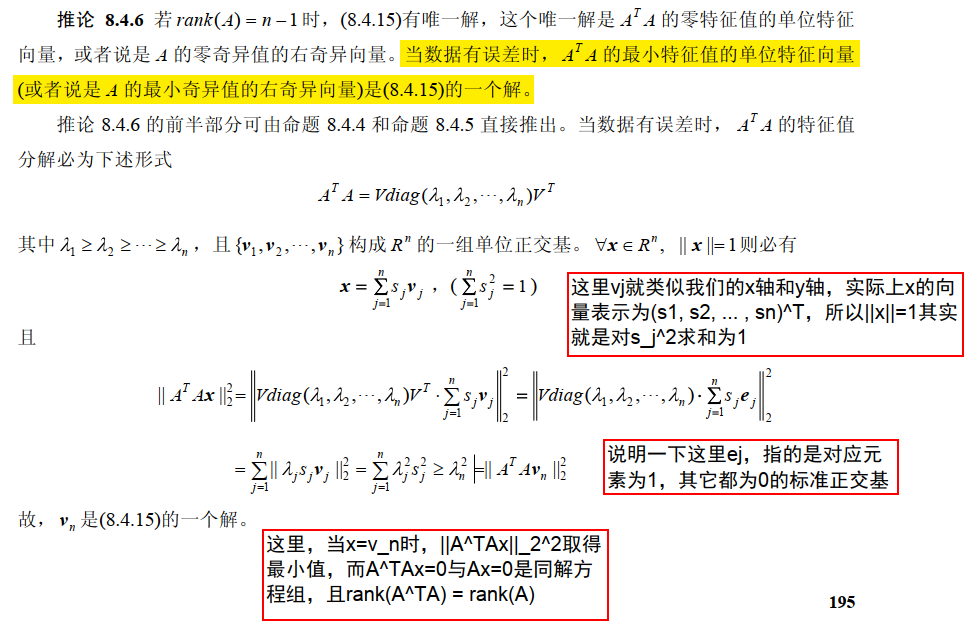
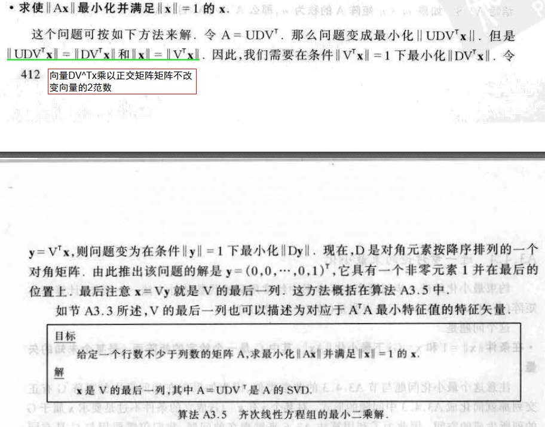

 

[TOC]


在MVG(多视图几何)和机器学习领域，求解线性方程组几乎是所有算法的根本，本文旨在帮助读者搞懂矩阵分解与线性方程组的关系，并给出利用SVD求解线性方程组的实战代码。


---


## 本文解决的问题

看完本文后，应解决以下问题：

- [x] 投影矩阵怎么通过QR分解得到相机内外参？

- [x] 求解非齐次线性方程组Ax=b的方法有哪些？

    - 其他一些方法通用性不大，比如克莱姆法则只用于方阵，这里不考虑。
    - 高斯消元法 | 常规方法。主要思路是讲矩阵通过初等行变换，转变为行阶矩形，然后**后向代入**(或者称为**回代算法**)可以很容易求解。
        - 根据增系数矩阵A和广矩阵B = (A, b) 的秩可判断解的个数。
        - 对于齐次线性方程组Ax=0，用初等行变换将A变为行最简形矩阵A'，即可得到同解方程组A'x=0，然后计算
        - 对于非齐次线性方程组Ax=0，用初等行变换将增广矩阵B = (A, b)变为行最简形矩阵A'，即可得到同解方程组A'x=0，然后计算
    - 方程Ax=b ,其中 A 为mxn。
        - 当m >n时，对于这样的方程不能直接利用高斯或者其他的分解法进行求解 , 往往需要把方程转换为另外一种更容易求解的模式，也就是我们常常说的各种分解。
        - 当m<n时，有无穷解，高斯消元等常规方法能解，但是如果我们要求使得二范数最小的最小二乘解，还是需要用SVD分解。
        - 当m=n时，一般可以用高斯消元等方法解。但是如果秩小于n，此时有无穷解，如果我们要求使得二范数最小的最小二乘解，还是需要用SVD分解。
    - 通过分解，将矩阵分解为特殊的形式，这些形式求逆或者对方程求解比较简单，比如上三角矩阵、下三角矩阵、对角矩阵、正交矩阵(求逆简单，就是其转职)。分解完后，方程可以转换为比较好求解的形式，用常规方法求解即可。常用方法有：LU分解、QR分解、Cholesky分解
    - 通过分解，求出矩阵广义逆矩阵 $A^+$ ，则解为 $x = A^+b$ 。常用方法：正规方程($x = (A^TA)^{-1}A^Tb$)、SVD分解

    **总结：**

    参考：[知呼](https://www.zhihu.com/question/22572629/answer/22499629)

    - LU需要矩阵A可逆，Cholesky是其特殊情况，Cholesky分解的时间复杂度是 $mn^2+(1/3)n^3$

    - QR分解的时间复杂度是 $2 mn^2$ ，因为m>n，所以QR往往比Cholesky慢

    - 在实际应用中，因为数值稳定性的要求 ，稠密矩阵往往用QR求解 ，对于大型的稀疏矩阵则多用Cholesky分解。

    - SVD分解，比QR分解慢，但是比QR分解稳定。

- [x] 非齐次线性方程组Ax=b，什么时候有精确解，什么时候只有最小二乘解？

    - 若矩阵A为列满秩矩阵，
        - 当A为方阵时，有精确解
        - 当A为mxn的矩阵(m>n)时，方程个数大于未知数个数；这时候多出来的方程可能会与前面的方程矛盾，这时候没有精确解，只有最小二乘解，所以不能直接用高斯消元等方法，只能用分解的方法找其主要特征，然后再正常求解。若多出来的方程与前面方程不矛盾，即多出来的方程都可以由前面的方程线性组合得到，这时候还是有精确解的。
    - 若矩阵A为亏秩矩阵 | 即矩阵A独立方程个数小于未知变量个数，这时候有无穷多个解。
        - 此时也只有最小二乘解

- [ ] **TODO：** 为什么要用QR分解来求解非齐次线性方程组Ax=b？

    - $Ax=b \Rightarrow QRx=b \Rightarrow Rx=Q^Tb$ 因为R是上三角矩阵，因此很容易求得方程组的解。$Q^T$表示Q的转置。由于R是三角形，因此方程组通过右侧的简单矩阵矢量乘法和向后替换来求解。
    - QR分解数值稳定性较好。

- [ ] **TODO：** 为什么要用SVD分解来求解非齐次线性方程组Ax=b？

- 为什么大多数解线性方程组用LU分解，而不用QR分解？因为QR分解时间复杂度较高，且LU分解容易并行。注意：SVD分解不容易并行[看这里](https://www.zhihu.com/question/34542161)

- [ ] **TODO：** 求解线性方程组Ax=b时，什么时候用QR分解，什么时候用SVD分解？

- 齐次线性方程组Ax=0的最小二乘解怎么求？

    - 对 A 进行SVD分解后， A 的最小奇异值的右奇异向量就是方程组的一个解。

## QR分解

**注意：除特殊说明外，讨论的矩阵均为实矩阵。**

QR分解是一种正交三角分解。

- **定义 8.1.1** 如果非奇异实矩阵 A 能够表示为正交矩阵 Q 与上三角矩阵 R 的积，即
$$
A＝QR \tag{8.1.1}
$$
与 QR 分解类似，还有 RQ、QL， LQ 分解，其中 L 表示下三角矩阵，R表示上三角矩阵。**矩阵的 QR 分解、 RQ 分解、 QL 分解、LQ 分解统称为矩阵的正交三角分解**。其它类型分解可通过类似 QR 分解的方法获得。

- **定理 8.1.1** 对任**意非奇异实矩阵 A** 总可以分解为正交矩阵 Q 与上三角矩阵 R 的积，如果要求上三角阵 R 的对角元素均为正数，则分解是唯一的。

    > **非奇异矩阵**是行列式不为 0 的矩阵，也就是**可逆矩阵**。意思是n 阶方阵 A 是非奇异方阵的充要条件是 A 为可逆矩阵，也即A的行列式不为零。 即矩阵(方阵)A可逆与矩阵A非奇异是等价的概念。——参考[360百科](https://baike.so.com/doc/6466418-6680110.html)
    >
    > 反之则是非奇异矩阵。
    >
    > 注意：只有方阵才有奇异矩阵和非奇异矩阵的说法。


- **定理 8.1.2** 定理 8.1.1 可以推广到非方阵的情形。对**任意列满秩的实矩阵** A 总可以分解为列正交的矩阵 Q 与上三角矩阵 R 的积， 如果
    要求上三角阵 R 的对角元素均为正数，则这种分解是唯一的。
- 上面用 Schmidt 正交化方法构造性地证明了非奇异矩阵总可以进行 QR 分解，但是在实践中并不使用 Schmidt 正交化方法对矩阵作 QR 分解，而是利用实用的方法： Givens 方法或 Houesholder方法。
    - Givens 旋转方法，对于 n 阶矩阵需要作 n(n-1)/2 个 Givens 旋转矩阵的积，计算量较大。对于高阶矩阵而言，用下述 Householder（反射）矩阵变换进行 QR 分解更有效。它只需要作(n-1)个 Householder 矩阵的积，其计算量大约是 Givens 旋转方法的一半。

### 投影矩阵分解得到内外参

参考：《计算机视觉中的数学方法》——吴朝福 P182、[知乎](https://www.zhihu.com/question/39561632/answer/81993334])、[Camera Calibration](http://homepages.inf.ed.ac.uk/rbf/CVonline/LOCAL_COPIES/EPSRC_SSAZ/node5.html)

RQ 分解是实现摄像机内参数、外参数求解的最为简便的方法。令摄像机内参数矩阵为 K，外参数矩阵为 (R, t) ，由于此时的摄像机矩阵是欧氏的，所以可写成下述形式：
$$
P = αK[R, t] = [αKR, αKt]
$$
将 P 表示成 $P = [H, p_4]$ ，则有
$$
H = αKR\\
p_4 = αKt
$$
其中，$p_4$ 表示P矩阵的第4列。对 H 作 RQ 分解： $H = \hat{K}\hat{R}$ ，其中 $\hat{K}$ 是对角元均为正数的上三角矩阵， $\hat{R}$ 为正交矩阵，并且种分解是唯一的。三角矩阵 $\hat{K}$ 与摄像机参数矩阵相差一个正常数倍，由于内参数矩阵最后一个元素为1，所以内参数矩阵必为： $K = \hat{K}_{33}^{-1}\hat{K}$ ，其中 $\hat{K}_{33}$ 是矩阵 $\hat{K}$ 的第(3, 3)元素。最后得到的K有如下形式：
$$
K = \begin{bmatrix}
 f_x & k & c_x \\
  & f_y & c_y \\
  &  & 1
\end{bmatrix}
$$
其中 $k = tan\theta$ ， $\theta$ 是图像轴之间的夹角。

如果正交矩阵 $\hat{R}$ 是一个旋转矩阵，则它就是摄像机关于世界坐标系的姿态。如果 $\hat{R}$ 是不是旋转矩阵，则表明所估计的摄像机矩阵与实际的(欧氏)摄像机矩阵反号，即 P 中的齐次子的符号 $sgnα = −1$ ，于是 $R = −\hat{R}$ 就是所要求解旋转矩阵。对于平移参数 t，可通过下式来确定：
$$
\left\{\begin{array}{l}
t = K^{-1}P_4,若\hat{R}是旋转矩阵\\
t = -K^{-1}P_4,若\hat{R}不是旋转矩阵
\end{array}\right.
$$
这样，就得到了摄像机内、外参数。

## SVD分解


- **定理 8.3.2(奇异值分解， SVD)** 设 $A \in R_{r}^{m \times n}$ ，则存在 m 阶正交矩阵 U 和 n 阶正交矩阵 V 使
$$
A = U\begin{bmatrix}
     \Sigma & \mathbf{0}  \\
     \mathbf{0} & 0 
    \end{bmatrix}V^T
$$


其中 $Σ = diag(σ_1,σ_2 ,...,σ_r)$ ，即 $σ_1,σ_2 ,...,σ_r$ 是 A 的非零奇异值。式(8.3.2)通常记为
$$
A = UDV^T
$$
**注意：奇异值分解既不要求矩阵 A 是可逆的方阵，也不要求它是方阵。**

- **定理 8.3.4** 设 $A ∈ R_{r}^{m \times r}$ 的奇异值为 $σ_1 ≥ σ_2 ≥ ... ≥ σ_r > σ_{r+1} = ... = σ_n = 0$ ，$(A+Q) ∈ R_{r}^{m \times r}$  的奇异值为 $τ_1 ≥ τ_2 ≥ ... ≥ τ_r > τ_{r+1} = ... = τ_n = 0$ ，则必有
    $$
    |σ_j − τ_j| ≤ || Q ||_2 ( j = 1,2,...,n)
    $$
    定理表明，矩阵 A 在摄动 Q 下，奇异值的变化量不超过 $|| Q ||_2$ 。因此，**矩阵奇异值的计算具有良好的数值稳定性质。**
    
- 奇异值分解还可以表示为

    $$
    A = σ_1u_1v_1^T + σ_2u_2v_2^T + ... + σ_ru_rv_r^T \tag{8.3.8}
    $$
    并且称 $u_i$ 为奇异值 $σ_i$ 的左奇异向量， $v_i$ 为奇异值 $σ_i $的右奇异向量。

顺便一提：SVD的代码实现中，可以选择只计算U，也可以U和V一起计算，他们的时间复杂度是不一样的。所以你可以根据自己的需求，选择合适的方法。

## 最小二乘问题

考虑线性系统：
$$
Ax = b (A ∈ R^{m \times n} (m > n),b ∈ R^m, x ∈ R^n ) \tag{8.4.1}
$$
正常来看，这个方程是没有解的的，但在数值计算领域，我们通常的是其最小二乘解。即求 $x ∈ R^n$ 使得
$$
|| Ax-b ||_2 = min\{|| Av-b ||^2 : v \in R^n\} \tag{8.4.2}
$$
记
$$
X_{LS} = \{ x \in R^n : x 是(8.4.1)的解\}
$$
则称 $X_{LS}$ 是最小二乘问题(8.4.1)的解集； $X_{LS}$中范数最小者称为最小范数解，并记作 $X_{LS}$ ，即
$$
|| x_{LS} ||_2 = min\{|| x ||_2 : x \in X_{LS}\}
$$

- **命题 8.4.1** $x \in X_{LS} ⇔ A^T (Ax − b) = 0$ 。其中，方程 $A^T (Ax − b) = 0$ 称为 $Ax − b = 0$ 的正规方程。

根据命题 8.4.1，有下述推论：

- **推论 8.4.1**： (1) $X_{LS}$ 是凸集； (2) $x_{LS}$ 是唯一的； (3) $X_{LS} = \{x_{LS}\}$ 的充分必要条件是 $rank(A) = n$ 。

### 最小二乘问题的求解方法

#### (列)满秩最小二乘问题

如果(8.4.1)中的矩阵 A 是列满秩的，即 rank(A) = n ，则称它为满秩最小二乘问题。下面考虑满秩最小二乘问题的数值算法。

##### 正规化方法

将求解问题(8.4.1)转化为求解正规化方程组
$$
A^TAx = A^Tb \tag{8.4.8}
$$
由于 rank(A) = n ，所以 $A^TA$ 是**对称正定矩阵**，正定矩阵可逆，所以 $x_{LS} = (A^TA)^{-1}A^Tb$ 但由于逆矩阵 $(A^TA)^{-1}$ 不是特殊的矩阵，求解逆矩阵复杂度会很高，所以一般用其他方法。

因为 $A^TA$ 是**对称正定矩阵**，所以(8.4.8)的唯一解 $x_{LS}$ 还可以用 **Cholesky 分解法(它是LU分解的特殊情况)**求得。基本步骤为：

1. 计算 $C = A^TA, d = A^Tb$ ；
2. 对 C 进行 Cholesky 分解 $C = GG^T$ ；其中 G 为对角元素均大于零的上三角矩阵；
3. 求解三角方程 $Gy = d$ 以及 $G^Tx = y$ 。由于是上三角矩阵，后向迭代的高斯消元即可。

> Cholesky 分解是LU分解的特殊情况。这种算法的缺点很明显：首先，$A^TA$有时候不可逆，不能得出结果，其次，即便可逆，$A^TA$数值稳定性不好，会造成误差。

##### QR分解方法

正规化方法通常比较低效，下面介绍QR分解法。

设 A 有 QR 分解：
$$
A = Q_{m \times m}\begin{bmatrix}
 R_{n \times n} \\
 \mathbf{0}
\end{bmatrix}_{m \times n} = Q_1R
$$
其中 $Q \in R^{m×m}$ 是正交矩阵，$\begin{bmatrix} R \\ \mathbf{0}\end{bmatrix} \in R^{m×n}$，  Q1 是 Q 的前 n 列组成的矩阵，即 $Q = ( \underset{n}{Q_1}  | \underset{m-n}{Q_2} )$ ，$R \in R^{n×n}$ 是对角线上元素均为正数的上三角矩阵。

由于正交矩阵保持范数不变，所以问题 (8.4.1) 等价于
$$
||Q^T(Ax-b)||_2 = min\{||Q^T(Av-b)||_2:v\in R^n\}
$$
记
$$
d = Q^Tb =
\begin{bmatrix}
Q_1^T \\
Q_2^T
\end{bmatrix}b = 
\begin{bmatrix}
d_1 \\
d_2
\end{bmatrix}
$$
则有
$$
||Q^T(Ax-b)||_2^2 = ||
\begin{bmatrix}
R \\
0
\end{bmatrix}
x- 
\begin{bmatrix}
d_1 \\
d_2
\end{bmatrix}
||_2^2 = 
||Rx-d_1||_2^2 + ||d_2||_2^2
$$
因此， x 是 (8.4.1) 的解当且仅当 x 是方程 $Rx=d_1$ 的解。这样 (8.4.1) 的解可由上三角方程组 $Rx=d_1$ 求得。

而上三角方程组用后向迭代的高斯消元是很好求的。

QR 分解方法的基本步骤如下：

1. 求 A 的 QR 分解；
2. 计算 $d_1 = Q_{1}^{T}b$ ；
3. 解方程组 $Rx = d_1$ 。

**注意：** QR 分解方法比正规化方法有较好的数值稳定性，并且计算结果比正规化方法要精确。当然， QR 方法比正规化方法会付出更大的计算代价。

##### SVD 分解方法

由于 rank(A) = n ，所以 A 必有下述形式的 SVD 分解
$$
A = U\begin{bmatrix}
 \Sigma_n \\
 \mathbf{0}
\end{bmatrix}V^T
$$

于是，A的广义逆矩阵 $A^+ = V[\Sigma_n^{-1}, \mathbf{0}]U^T$ 。所以，问题(8.4.1)的解为
$$
x = A^+b = V(\Sigma_n^{-1}, 0)U^Tb = \frac{u_1^Tb}{\sigma_1}v_1 + \frac{u_2^Tb}{\sigma_2}v_2 + \dots + \frac{u_n^Tb}{\sigma_n}v_n = \sum_{j=1}^{n}\frac{u_j^Tb}{\sigma_j}v_j \tag{8.4.9}
$$
上式给出了 SVD 分解方法关于最小二乘解的计算公式。

#### 亏秩最小二乘问题

如果在最小二乘问题(8.4.1)中，矩阵 A 是亏秩的，即 r = rank(A) < n 。**此时(8.4.1)有无穷多解**，**在上面介绍的处理满秩问题(8.4.1)的正规化方法， QR 分解方法都将失败，不能给出最小范数解 $x_{LS}$ 。但是 SVD 分解方法仍然有效**。具体地说，若 rank(A) = r ，则 A 有 SVD 分解：
$$
A = U\begin{bmatrix}
 \Sigma_r & \mathbf{0} \\
 \mathbf{0} & \mathbf{0}_{(m-r)\times(n-r)}
\end{bmatrix}V^T
$$

因此，
$$
x = A^+b = V\begin{bmatrix}
 \Sigma_r^{-1} & \mathbf{0} \\
 \mathbf{0} & 0
\end{bmatrix}U^Tb =
\sum_{j=1}^{r}\frac{u_j^Tb}{\sigma_j}v_j \tag{8.4.10}
$$
在这里， 可以看到 SVD 分解在数值计算中的作用，不论是满秩的还是亏秩的最小二乘问题， SVD分解方法总能给出它们的求解计算公式，并且有统一的形式。

#### 齐次最小二乘问题

对于齐次线性方程组 $Ax=0$ 的最小二乘解，有一点不同。

考虑齐次线性方程组：
$$
Ax = 0 (A ∈ R^{m×n} (m > n), x ∈ R^n ,m > n)
$$
对应的最小二乘问题是
$$
|| Ax ||_2 =min\{||Av||_2 : v \in R^n\} \tag{8.4.13}
$$

**显然， x = 0 总是上述最小二乘问题的最小范数解。在实际中，人们所关心的并非是齐次最小二乘问题的零解，而是它的非零解**。**因此，我们总是考虑相应的约束最小二乘问题**：(之所以取单位特征向量v，是因为若v是一个解，那乘以任意一个尺度s后还是方程的解)
$$
|| Ax ||_2 =min\{||Av||_2 : v \in R^n, ||v||_2=1\} \tag{8.4.13}
$$
或者等价地写成：
$$
\left\{
\begin{aligned}
    & min \; ||Ax||_2^2 \\
    & subject \; to \; ||x||_2 = 1
\end{aligned}
\right. \tag{8.4.15}
$$

- **推论 8.4.6** 若 rank(A) = n −1 时， (8.4.15)有唯一解（rank(A)=n时齐次线性方程组只有零解），这个唯一解是 $A^TA$ 的**零特征值的单位特征向量**，或者说是 A 的零奇异值的右奇异向量。当数据有误差时， $A^TA$ 的**最小特征值的单位特征向量**(或者说是 A 的最小奇异值的右奇异向量)是(8.4.15)的一个解(当数据无误差时，最小特征值就是零)。

  > 个人证明一下，可能不严谨：
  >
  > 矩阵 $A ∈ R_r^{m×n} (m > n), x ∈ R^n ,m > n$ .
  >
  > 一、若矩阵A的秩rank(A) = r ( r<n)，对矩阵A进行SVD分解
  > $$
  > A = U\begin{bmatrix}
  > \Sigma_r & \mathbf{0} \\
  > \mathbf{0} & \mathbf{0}_{(m-r)\times(n-r)}
  > \end{bmatrix}V^T
  > $$
  > 其中正交矩阵 $U_{m \times m}$ 和 $V_{n \times n}$ 的列向量分别为 $u_1,u_2,...,u_m$ 和 $v_1,v_2,...,v_m$ ，则将SVD分解写成向量的形式：
  > $$
  > A = \sigma_1u_1v_1^T + \sigma_2u_2v_2^T + ... + \sigma_ru_rv_r^T
  > $$
  > 其中 $\sigma_i$ 是矩阵A的奇异值，也是 $\Sigma_r$ 对角线上元素，并且 $\sigma_1 \ge \sigma_2 \ge ... \ge \sigma_r \ge 0$ 。则
  > $$
  > ||Ax||_2^2 = ||\sigma_1u_1v_1^Tx + \sigma_2u_2v_2^Tx + ... + \sigma_ru_rv_r^Tx||_2^2
  > $$
  > 由于 $V_{n \times n}$ 是正交矩阵，它的列向量都为单位向量并且相互正交（向量积为0），所以当取 $x = v_i, i \gt r, 满足||x||_2 = 1$ 时，$v_i$ 与 $v_1,v_2,...,v_r$ 都正交，向量积为0，所以 $||Ax||_2^2 = 0$ ，$x = v_i, i \gt r$ 是(8.4.15)的解（若rank(A)=n-1则这个解是唯一解，否则若rank(A)<n-1，则这个解只是其中的一个解，事实上，在带约束的条件下，它所有的解就是所有0奇异值对应的右奇异向量）。
  >
  > 
  >
  > 二、若矩阵A的秩rank(A) = n (列满秩)，对矩阵A进行SVD分解
  > $$
  > A = U\begin{bmatrix}
  > \Sigma_n \\
  > \mathbf{0}_{(m-n)\times1}
  > \end{bmatrix}V^T
  > $$
  > 写成向量的形式：
  > $$
  > A = \sigma_1u_1v_1^T + \sigma_2u_2v_2^T + ... + \sigma_nu_nv_n^T
  > $$
  > 当取 $x = v_n, 满足||x||_2 = 1$ 时，$v_n$ 与 $v_1,v_2,...,v_{n-1}$ 都正交，向量积为0，而 $v_n,u_n$ 都是单位正交向量，有 $v_n^Tv_n = 1, ||u_n||_2^2 = 1$ ，所以 $||Ax||_2^2 = ||\sigma_nu_n||_2^2 = \sigma_n^2||u_n||_2^2 = \sigma_n^2$ ，而 $\sigma_n$ 是所有奇异值中最小的。
  >
  > 注意：这里没有证明为什么 $x = v_n$ 是此时最小二乘解，只是说明了当取这个值时，似乎它能使得(8.4.15)在约束条件下最小。
  >
  > 第二种情况还可以参考《计算机视觉中的数学方法》：
  >
  > 
  >
  > **另外，看一下《计算机视觉中的多视图几何 第一版》，讲得特别好，言简意赅且容易理解：**
  >
  > 

## 数值稳定性问题

参考：[视觉SLAM常见的QR分解SVD分解等矩阵分解方式求解满秩和亏秩最小二乘问题（最全的方法分析总结）](https://blog.csdn.net/wangshuailpp/article/details/80209863)	

**为什么需要矩阵分解?** 

- 一方面，由于一些超定方程或欠定方程，没有精确解，只能通过分解矩阵的方式求其最小二乘解；
- 另一方面，当数据量很大时，将一个矩阵分解为若干个矩阵的乘积可以大大降低存储空间；
- 其次，可以减少真正进行问题处理时的计算量，毕竟算法扫描的元素越少完成任务的速度越快，这个时候矩阵的分解是对数据的一个预处理；
- 再次，矩阵分解可以高效和有效的解决某些问题；
- 最后，**矩阵分解可以提高算法数值稳定性**，关于这一点下面有进一步的说明。

当数据不存在误差时，用一般的方法求解线性方程组即可；但是当我们得到的数据有误差，或者由于计算机精度问题导致误差时，一般的方法求解线性方程组往往会产生很大误差，这里举例说明。例如方程：
$$
\left\{
\begin{aligned}
    & 5x_1 + 7x_2 = 0.7 \\
    & 7x_1 + 10x_2 = 1
\end{aligned}
\right. 
\Rightarrow
Ax=b \\
A = \begin{bmatrix}
 5 & 7 \\
 7 & 10
\end{bmatrix}, 
x = \begin{bmatrix}
 x_1 \\
 x_2
\end{bmatrix}, 
b = \begin{bmatrix}
 0.7 \\
 1
\end{bmatrix}.
$$
直接对方程组求解可以得到：
$$
x = \begin{bmatrix}
 0.0 \\
 0.1
\end{bmatrix}
$$
现在对方程中的 b 进行一个微小扰动：
$$
b = \begin{bmatrix}
 0.69 \\
 1.01
\end{bmatrix}, 其中扰动项为
\begin{bmatrix}
 -0.01 \\
 0.01
\end{bmatrix}
$$
扰动后，直接对方程组求解可以得到：
$$
x = \begin{bmatrix}
 -0.17 \\
 0.22
\end{bmatrix}
$$
结果变成了上式，可以看出当方程组中的常数矩阵发生微小的扰动时，会导致最终的结果发生较大的变化，这种结果的不稳定不是因为方程求解的方法，而是方程组矩阵本身的问题。这回给我们带来很大的危害，例如像上面的情况，计算机求解出现舍入误差，矩阵本身不好的话会直接导致结果失败。
当对矩阵A或者b进行小扰动的时候，最后影响结果的是 $||A|| \cdot ||A^{-1}||$，与矩阵病态性成正相关。定义矩阵的条件数 $cond(A)= ||A|| \cdot ||A^{-1}||$ 来描述矩阵的病态程度，一般认为小于100的为良态，条件数在100到1000之间为中等程度的病态，条件数超过1000存在严重病态。以上面的矩阵A为例，采用2范数的条件数 $cond(A)=222.9955$ 矩阵处于中等病态程度。
矩阵其实就是一个给定的线性变换，特征向量描述了这个线性变换的主要方向，而特征值描述了一个特征向量的长度在该线性变换下缩放的比例，对开篇的例子进一步观察发现，A是个对称正定矩阵，A的特征值分别为 $λ1=14.93303437$ 和 $λ2=0.06696563$ ，两个特征值在数量级上相差很大，这意味着b发生扰动时，向量x在这两个特征向量方向上的移动距离是相差很大的——对于λ1对应的特征向量只需要微小的移动就可到达b的新值，而对于λ2，由于它比起λ1太小了，因此需要x做大幅度移动才能到达b的新值，于是悲剧就发生了.

## Ax=0与Ax=b的选择

对于有些问题比较灵活，既可以构建出Ax=0的方程组，也可以构建出Ax=b的方程组，那么该如何选择呢？

根据我看到的，好像大都选择构建成Ax=0的形式去解，我也不知道为什么，这里说一下我个人的看法。

解Ax=b需要求解A的SVD分解 $A=UDV^T$ ，解Ax=0的最小二乘解，只需要用V的最后一列向量作为解即可，而SVD分解是可以讲U、D和V分开求的，可以只求部分，只求部分时，时间复杂度会大大降低，所以Ax=0的一个优势就是：不用求解完整的SVD，从而减少时间复杂度。（具体SVD的求法，可以自行搜索）


## 代码实现

为了更好地理解本章的内容，下面给出两个求解线性方程组的实战代码。

### 利用SVD求解非齐次线性方程组Ax=b

下面代码仅依赖于eigen库，在VS2015上调试通过。

```cpp
#include <iostream>
#include <ctime>
#include "Eigen/Dense"

using namespace std;
using namespace Eigen;

const int MOD = 100;
int main() {

	// 构造输入数据
	uint32_t seed = time(0);
	srand(seed); // 随机初始化种子
	MatrixXd A(3, 3);
	// 当 A 是一个正常的可逆矩阵时，x的解应该是唯一的
	A << rand() % MOD, rand() % MOD, rand() % MOD,
		rand() % MOD, rand() % MOD, rand() % MOD, 
		rand() % MOD, rand() % MOD, rand() % MOD;

	//// 当 A 的秩为2时，Ax=b是一个欠定方程组，x的解有无数个，求解出来的可能与真值不同，但是Ax的结果仍然为b
	//// 注释这一行去查看一下结果
	//A << rand() % MOD, rand() % MOD, rand() % MOD,
	//	rand() % MOD, rand() % MOD, rand() % MOD,
	//	0, 0, 0;

	// TODO:当 A 为4x3矩阵时，Ax=b是一个超定方程组，只能求其最小二乘解

	cout << "A: \n" << A << "\n\n";

	MatrixXd x(3, 1);
	x << rand() % MOD, rand() % MOD, rand() % MOD;

	MatrixXd b = A*x;

	// 求解方程 Ax=b，未知量为x
	// 对系数矩阵A进行SVD，A = U*D*V^t
	JacobiSVD<MatrixXd> svd(A, ComputeFullU | ComputeFullV); // SVD时不仅计算奇异值，还计算完整的U和V

	MatrixXd U_inv = svd.matrixU().transpose(); //正交矩阵的逆就是它的转置
	MatrixXd V = svd.matrixV(); 
	cout << "U_inv: \n" << U_inv << "\n\n";
	cout << "V: \n" << V << "\n\n";

	// 求对角矩阵的逆，注意由于有0奇异值，对角阵只对左上角非0子矩阵求逆，其他部分为0
	MatrixXd d = svd.singularValues();
	MatrixXd D_inv(3, 3);
	for (int i = 0; i < d.size(); ++i) {
		// 若奇异值大于0
		if (d(i) > 1e-6)
			D_inv(i, i) = 1.0/d(i);
		else
			break;
	}
	cout << "D_inv: \n" << D_inv << "\n\n";

	// 求A的伪逆。A_inv = V*D_inv*U^t
	MatrixXd A_inv = V * D_inv * U_inv;

	// 求解x，并对比与真值是否相同。
	// 当 A 的秩为2时，Ax=b是一个欠定方程组，x的解有无数个，求解出来的可能与真值不同，但是Ax的结果仍然为b
	MatrixXd x_solve = A_inv * b;
	cout << "x: \n" << x << "\n\n";
	cout << "x_solve: \n" << x_solve << "\n\n";

	// 对比b，b应该总是相同的
	cout << "b: \n" << b << "\n\n";
	cout << "A*x_solve: \n" << A*x_solve << "\n\n";

	return 0;
}
```


### 利用SVD求解齐次线性方程组Ax=0

下面代码仅依赖于eigen库，在VS2015上调试通过。

```cpp
#include <iostream>
#include <ctime>
#include "Eigen/Dense"

using namespace std;
using namespace Eigen;

const int MOD = 100;
int main() {

	// 构造输入数据
	uint32_t seed = time(0);
	srand(seed); // 随机初始化种子
	MatrixXd A(3, 3);
	//// 当 A 是满秩矩阵时，只有零解
	//A << rand() % MOD, rand() % MOD, rand() % MOD,
	//	rand() % MOD, rand() % MOD, rand() % MOD, 
	//	rand() % MOD, rand() % MOD, rand() % MOD;

	// 当 A 是亏秩矩阵时，有非零解
	// 注释这一行去查看一下结果
	A << rand() % MOD, rand() % MOD, rand() % MOD,
		rand() % MOD, rand() % MOD, rand() % MOD,
		0, 0, 0;


	cout << "A: \n" << A << "\n\n";

	// 求解方程 Ax=b，未知量为x
	// 对系数矩阵A进行SVD，A = U*D*V^t
	JacobiSVD<MatrixXd> svd(A, ComputeFullV); // SVD时不仅计算奇异值，还计算完整的V，不需要计算U，可以减少SVD的计算量
	MatrixXd V = svd.matrixV(); 
	cout << "V: \n" << V << "\n\n";

	// 求解x。Ax=0方程组有无穷多解，V的最后一列列向量是一个非零解，且|x|=1
	MatrixXd x_solve = V.col(V.cols()-1);
	cout << "x_solve: \n" << x_solve << "\n\n";

	// 当 A 是满秩矩阵时，只有零解，没有非零解，则A*x_solve 与 0 相差比较大
	// 当 A 是亏秩矩阵时，有非零解，则 A*x_solve = 0
	cout << "A*x_solve: \n" << A*x_solve << "\n\n";

	return 0;
}
```


## 附录——一些概念

- 齐次线性方程组：Ax=0
- 非齐次线性方程组：Ax=b
- 超定方程 | 超定方程组是指方程个数大于未知量个数的方程组。对于方程组Ra=y，R为n×m矩阵，如果R列满秩，且n>m。则方程组没有精确解，此时称方程组为超定方程组。超定方程一般是不存在解的矛盾方程，解超定方程组非常普遍。比较常用的方法是最小二乘法。
- 欠定方程 | 方程个数小于未知量个数的方程组。
- 正交矩阵一定是方阵

## 参考资料

- 《计算机视觉中的数学方法》——吴朝福 | 本文主要参考资料
- [线性方程组的几种求解方法](https://wenku.baidu.com/view/a72847a9284ac850ad0242f2.html)
- [求解线性方程组解的方法？](https://www.zhihu.com/question/35784410)
- [Solving linear equation systems](http://qucs.sourceforge.net/tech/node99.html) | 列举了用各种方法解线性方程组
- [百度百科——超定方程组]([https://baike.baidu.com/item/%E8%B6%85%E5%AE%9A%E6%96%B9%E7%A8%8B%E7%BB%84/4663111](https://baike.baidu.com/item/超定方程组/4663111))
- [线性方程组求解](https://blog.csdn.net/MTandHJ/article/details/88915264) | 介绍了哪些线性方程组好解，后续的各种方法都是想办法把方程组转化为这些形式
- [SVD分解为什么是最好的？QR分解和SVD比较？LU呢？SVD并行算法可行么？ - 知乎 ](https://www.zhihu.com/question/22572629/answer/22499629) | QR分解为什么能拿来求最小二乘，LU分解、QR分解、SVD分解的数值稳定性和时间复杂度

