来源：

https://blog.csdn.net/nnnnnnnnnnnny/article/details/67644257

https://nodyoung.blog.csdn.net/article/month/2017/03

https://nodyoung.blog.csdn.net/article/month/2017/02

## 问题

### DJI-齐次坐标、点到直线距离

参考：https://zhuanlan.zhihu.com/p/26307123

直线的一般式：
$$
Ax + By + C=0 (A、B不同时为0)【适用于所有直线】
$$
两垂直直线的斜率积为-1（如果斜率都存在的话）：
$$
k_1 \times k_2 = -1
$$
可以推出点(x, y)到直线的距离公式：
$$
d = \frac{|Ax+By+C|}{\sqrt{A^2+B^2}}
$$

### DJI-方程组的解

### DJI-线性方程解的判定

### DJI-双目立体视觉

### DJI-随机抽样一致算法（RANdom SAmple Consensus, RANSAC）

### DJI-特征点提取方法列举

### DJI-滤波器filter

### DJI-光流算法

### DJI-双目立体视觉测景深

### DJI-实现均值滤波

### BD-参数矩阵求逆

### BD-给三角形三边求面积

参考：[https://baike.baidu.com/item/%E4%B8%89%E8%A7%92%E5%BD%A2%E9%9D%A2%E7%A7%AF%E5%85%AC%E5%BC%8F/8491990](https://baike.baidu.com/item/三角形面积公式/8491990)

海伦公式，三角形三边分别为a, b, c，求面积S:
$$
S = \sqrt{p(p-a)(p-b)(p-c)} \\
p = \frac{a+b+c}{2}
$$
顺便介绍下**正弦定理**和**余弦定理**：

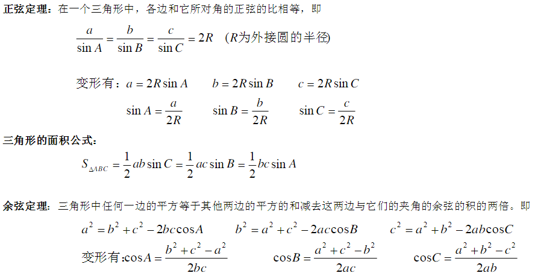

### BD-参数矩阵求逆

下列矩阵A存在可逆矩阵P，求出P和相应的对角矩阵：
$$
A = \begin{bmatrix}
 3 & 2 & -2 \\
 -k & -1 & k \\
 4 & 2 & -3
\end{bmatrix}
$$

### BD-简述SIFT特征点检测、描述和匹配的过程

**SIFT(Scale Invariant Feature Transform)**特征对旋转、尺度缩放、亮度变化等保持不变性，是非常稳定的局部特征。
**SIFT的主要思路**：a)构造图像的尺度空间表示，b)在尺度空间中搜索图像的极值点，c)由极值点建立特征描述向量，d)用特征描述向量进行相似度匹配。
**检测**：通过图像与DOG算子卷积得到一幅二维图像在不同尺度下的尺度空间表示（即DOG图像）；然后通过每个像素点与其三维领域的临近点进行比较，找出DOG局部极值点作为初步的特征点；然后通过曲线拟合（临近信息插补）得到特征点的精确位置，同时也会舍弃那些不明显关键点和边缘响应；接下来利用特征点邻域像素的梯度分布来确定特征点的方向。每个特征点都包含三个信息(x,y,σ,θ)(x,y,σ,θ)，即位置、尺度和方向。
**描述**：描述子将被用来作为目标匹配的依据，所以应具有较高的独特性以保证匹配率。特征描述大致包含三个步骤：1.旋转主方向，即将坐标轴旋转为关键点方向，以确保旋转不变性。2.然后在特征点对应的高斯图像上统计其16∗1616∗16邻域内的方向梯度，将统计向量作为该点的sift描述子。3.特征向量的常规归一化，进一步去除光照变化等影响。
**匹配**：RANSAC(RANdom SAmple Consensus)方法是当前常用的一种特征点对的匹配算法，在OpenCV中我们可以使用暴力匹配（BruteForceMatcher）和FLANN（Fast Library for Approximate Nearest Neighbors，快速最近邻逼近搜索函数库）实现快速高效匹配。另外由于噪声等其他因素影响，有时次优匹配点可能和最优匹配点非常接近（接近0.80.8），实验证明舍弃这些点效果会更好。
**参考**：[Introduction to SIFT (Scale-Invariant Feature Transform)](http://opencv-python-tutroals.readthedocs.io/en/latest/py_tutorials/py_feature2d/py_sift_intro/py_sift_intro.html)；《数字图像处理MATLAB版（左飞著）》12.1章；《OpenCV3编程入门》第11章

## SXF的笔试题

题目和答案参考：https://nodyoung.blog.csdn.net/article/details/65449987

### SXF-斯密特正交化、正交矩阵性质

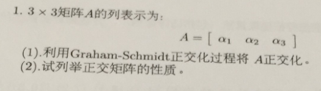

参考：[施密特正交化](https://baike.baidu.com/item/施密特正交化/756386)

[施密特正交化公式如何理解和记忆](https://www.jianshu.com/p/abc206d964da) | 强烈看一下，理解物理含义

注意：斯密特正交化公式只是将向量正交化，而正交矩阵还需要满足向量是单位向量，所以还需要再进行归一化。

物理含义：向量m减去向量m投影到向量1上的向量，就可以得到垂直于向量1的向量（未单位化）。

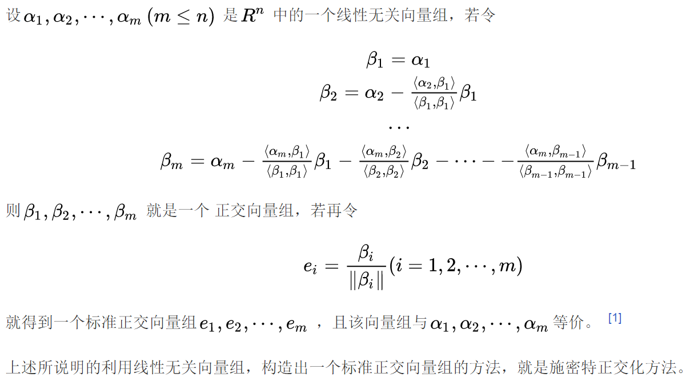

单位正交基的方法：

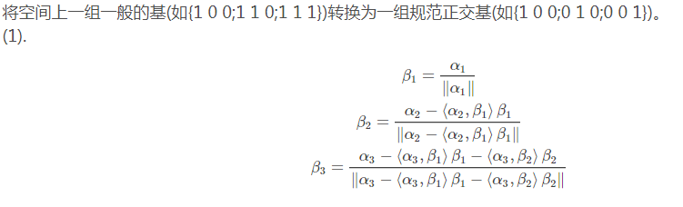

正交矩阵性质：$A^{-1}A = A^TA= I$ , 方阵、可逆、满秩、非奇异矩阵、列向量为单位向量且两两正交、行向量为单位向量两两正交、列向量均为单位向量、行列式为 $\pm1$ 。

### SXF-函数极值、Lagrange乘子法

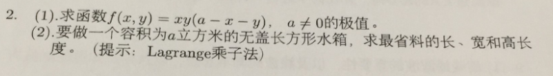

### SXF-最速下降法

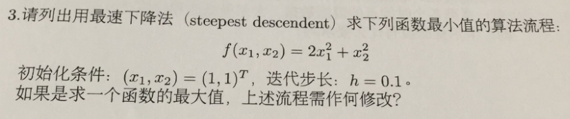

### SXF-乘法函数下求非线性规划问题

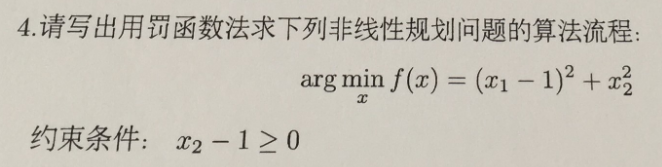

### SXF-多项式拟合

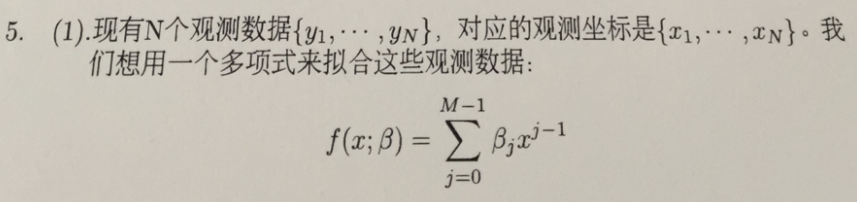

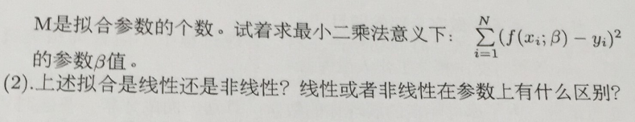

线性拟合参数上不含有x高次方项的系数。

### SXF-列举特征提取、边缘检测算法

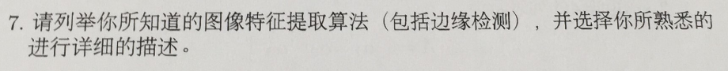

边缘检测：sobel、LoG、Canny

特征提取：harris、SIFT、SURF、ORB

### SXF-KD树的建立和查找

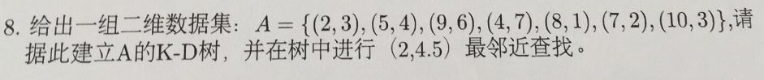

[k-d tree算法](https://www.cnblogs.com/eyeszjwang/articles/2429382.html) | KD树讲得很好，看完基本对算法框架有个大致了解了。

构建k-d树如下：

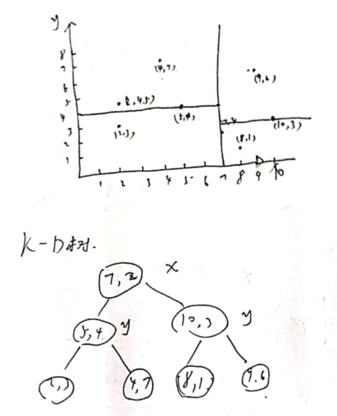

查询：

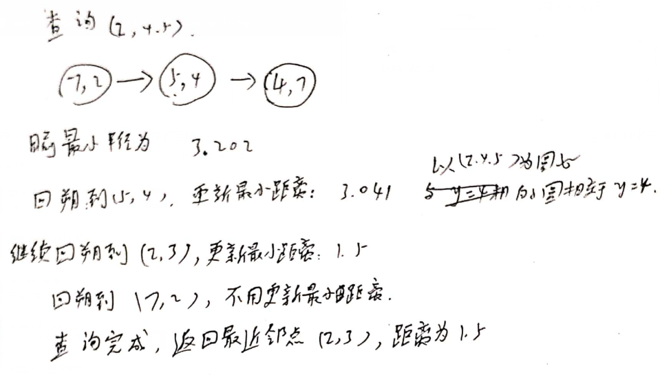

### SXF-卡尔曼滤波

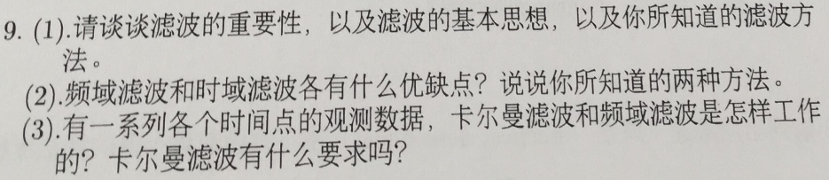

## PV机器人笔试题

参考：https://nodyoung.blog.csdn.net/article/details/64121427

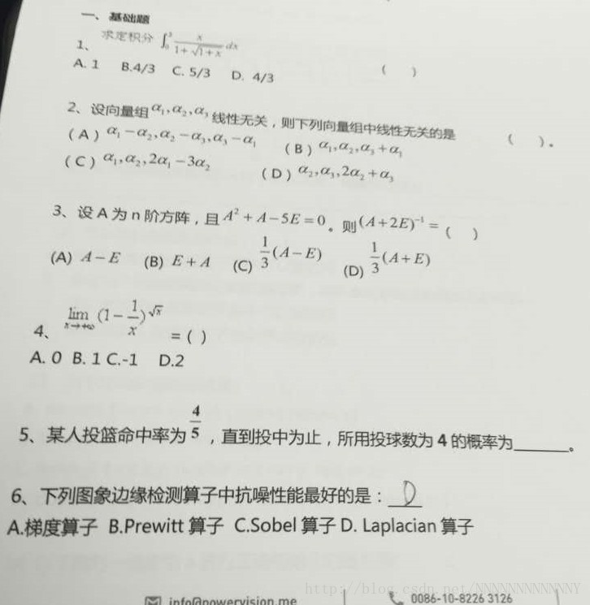

参考答案：1-6 C B C B 4/625 C

拉普拉斯算子对噪声非常敏感，所有才有高斯拉普拉斯算子。
Sobel（下图左）和Prewitt算子（下图右）都属于梯度算子，不同之处在于Sobel在一定程度上结合了高斯平滑和梯度算子微分求导。

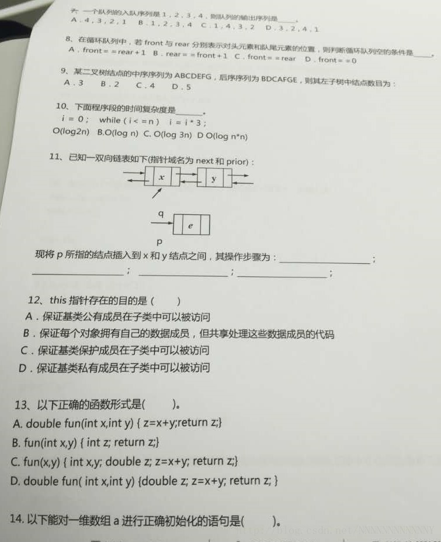

参考答案：

7.B

队列，先进先出

8.C

队列中，head指向第一个元素的位置，tail指向下一个待插入元素的位置。判断队列满的条件为`(head!=0&&head==tail+1) || (head==0&&tail==length-1);` 。

9.C

根结点为E

10.C

题目错了，初始化i应该为1吧；答案应该为

11

q->next=x->next; x->next->prior=q; q->prior=x; x->next=q;
顺序并不唯一，但(1)(2)应该在(4)前面

12.B

this指针是一个指向自己的指针，以访问自己的数据成员。

13.D

14.C