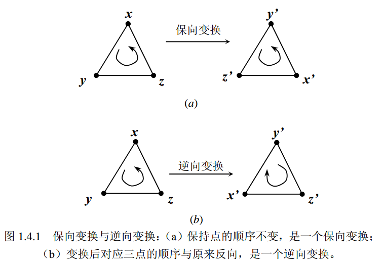
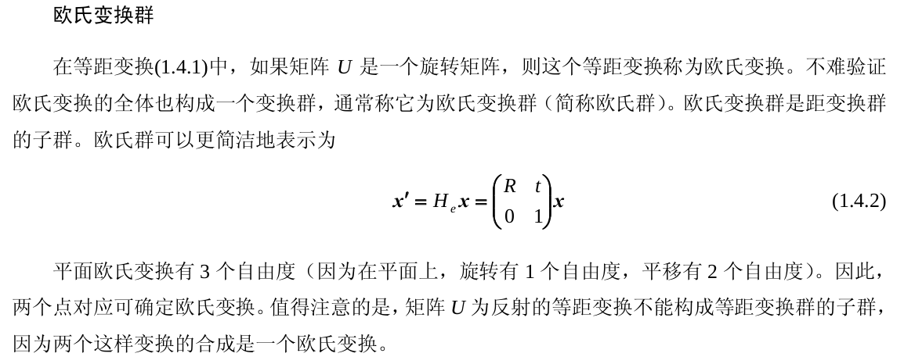
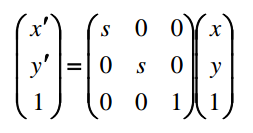
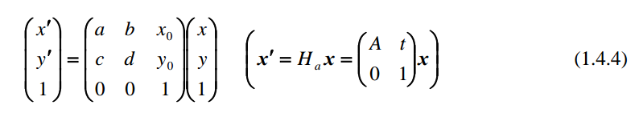
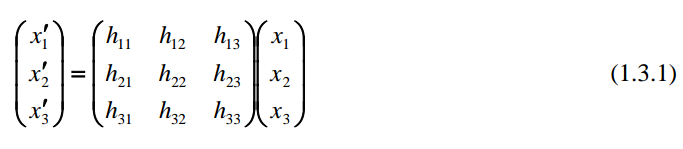
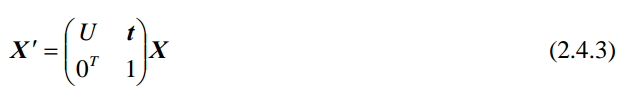
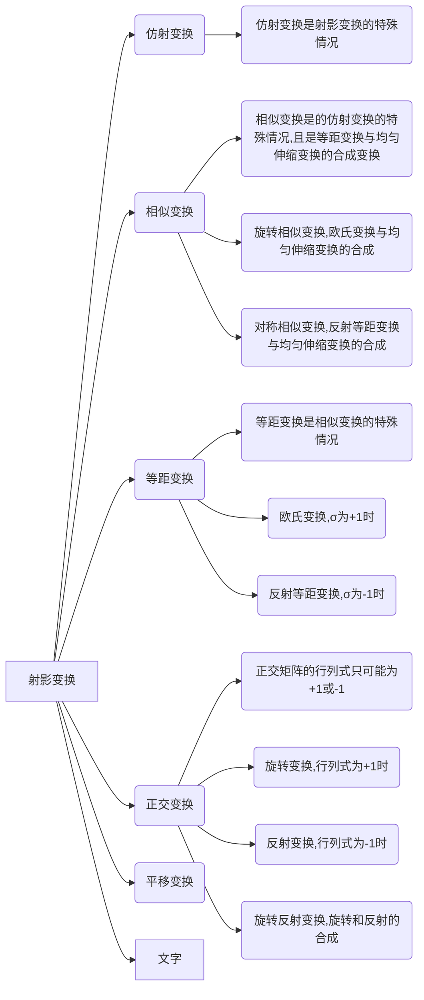

[TOC]

## 2D空间中的变换

### 正交变换

在[线性代数](https://baike.baidu.com/item/线性代数/800)中，**正交变换**是[线性变换](https://baike.baidu.com/item/线性变换/5904192)的一种，它从实[内积空间](https://baike.baidu.com/item/内积空间)*V*映射到*V*自身，且保证向量变换前后，向量之间的内积不变。

因为向量的模长与夹角都是用内积定义的，所以正交变换前后一对向量各自的模长和它们的夹角都不变。特别地，[标准正交基](https://baike.baidu.com/item/标准正交基/4729576)经正交变换后仍为标准正交基。

因为正交矩阵的行列式只可能为+1或−1。行列式为+1和−1的正交变换分别称为第一类的（对应[旋转变换](https://baike.baidu.com/item/旋转变换/8110451)）和第二类的（对应瑕旋转变换）[2]。可见，[欧几里得空间](https://baike.baidu.com/item/欧几里得空间/785521)中的正交变换只包含[旋转](https://baike.baidu.com/item/旋转/2516)、[反射](https://baike.baidu.com/item/反射/37976)及它们的组合（即[瑕旋转](https://baike.baidu.com/item/瑕旋转/15904913)，或称为**旋转反射**rotoreflection，是一种“[旋转](https://baike.baidu.com/item/旋转/2516)后再[反射](https://baike.baidu.com/item/反射/37976)”的[线性变换](https://baike.baidu.com/item/线性变换/5904192)或[仿射变换](https://baike.baidu.com/item/仿射变换/4289056)。）。

正交变换的逆变换也是正交变换，后者的矩阵表示是前者矩阵表示的逆。

内积：又称为标量积，或[点积](https://baike.baidu.com/item/点积/9648528)。两个向量a = [a1, a2,…, an]和b = [b1, b2,…, bn]的点积定义为：$$ a·b=a1b1+a2b2+……+anbn$$ 。

### 等距变换群

**性质：** 变换后距离不变，即平面上2点经过变换后，距离不变。

等距变换是指保持距离不变的变换，其定义如下：

由此可以看出，等距变换是先作正交变换，然后再作平移变换所得到的变换。正交变换与平移变换都保持距离不变，因此等距变换也保持距离不变。等距变换的逆变换仍是一个等距变换，两个等距变换的合成变换也是一个等距变换，所以等距变换的全休构成一个变换群，称为等距变换群。

正交变换 U 根据它的行列式是否等于 1 而分为旋转变换与反射变换。当 det(U ) =1 时，是旋转变换； det(U ) = −1 时，是反射变换。它们的几何意义是旋转变换不但保持两点的距离不变，而且还保持方向(保向)不变，而反射变换是一个逆向变换(如图 1.4.1 所示)。

### 欧式变换

- **自由度：**3个。旋转为1个，平移有2个
- **求解所需点对数：**理论上2对点
- **不变量：**欧氏群是等距变换群的子群，等距变换群的不变量主要有 `两点的距离`、`两线的夹角`、`图形的面积` 等。

### 旋转相似变换

- **自由度：**4个。限制为旋转相似后，旋转为1个，平移有2个，缩放有1个
- **求解所需点对数：**理论上2对点
- **不变量：**两直线的夹角，长度的比值，面积的比值。

相似变换是等距变换与均匀伸缩变换的合成变换，所谓均匀伸缩变换是指下述变换：

其中 s 是均匀伸缩因子。

在初等几何中,相似分为 `旋转相似 ( 保向 )`  和 `对称相似 ( 逆向 )`  。`旋转相似` 是欧氏变换与均匀伸缩变换的合成，而 `对称相似` 是反射等距变换与均匀
伸缩变换的合成。
**在计算机视觉中最关心的是旋转相似**，它可用下面的矩阵形式来表示:

其中s为尺度因子， $\theta$ 表示旋转角度，$(x_0, y_0)$ 表示平移量。旋转相似变换有 4 个自由度,因为它比欧氏变换多一个均匀伸缩因子。与欧氏变换一样,两个点对理论上也可以确定相似变换。

### 仿射变换

- **自由度：**6个。平移有2个，**然后呢？剩下四个是啥，可能是缩放2个，旋转1个，对称1个，**
- **求解所需点对数：**理论上3对点。3个点不能共线。
- **不变量：**
    - `平行性不变`。 不难验证：仿射变换将无穷远点变换到无穷远点。所以，仿射变换保持平行性不变，也就是说平面上任何两条平行线(或线段)经过仿射变换后的两条直线(或线段)仍然是平行的。因此，平行性是仿射变换的不变性质。
    - `面积的比值不变`。 不难验证：若仿射变换将图形 G 变换到图形 $G′ = H_aG$ ，则 $σ (G′) = σ (H_aG) =| det(A) | ⋅σ (G)$  ( σ 代表面积)，这是因为，仿射变换的 Jacobi 行列式为det(A)。所以，仿射变换保持面积的比值不变。
    - `平行线段长度的比值不变`。这一性质可由前两个性质导出。

仿射变换定义为

其中 A 是一个 2 阶可逆矩阵。仿射变换有 6 个自由度， 3 个不共线的点对理论上唯一确定仿射变换。仿射变换的全体也构成一个变换群，称为仿射变换群。 相似变换群是它的子群。

#### 仿射变换的分解

##### SVD分解。

除平移变换外，只须对矩阵 A 进行分解。对矩阵 A 作奇异值分解(SVD 分解，见第 8 章)，我们得到 $A＝ UDV^T$ ，其中 U， V 是正交矩阵， D 对角元为正数的对角矩阵
$$
D = 
\left [\begin{matrix}
s_x & \\ 
 & s_y
\end{matrix} \right ]
$$
**由此可以看出，仿射变换是一个等距变换 $V^T$ 、一个非均匀伸缩变换 D 以及另一个等距变换 U 的合成，因此它与相似变换的差别在于非均匀伸缩**。

仿射变换(1.4.4)是否保向，根据矩阵 A 的行列式 det(A) 是否大于零来确定。为了看出这一点，我们将 A 写成 $A＝ (UV^T)(VDV^T)$，由于 $(VDV^T)$ 总是一个保向的变换(不论 V 是否为旋转矩阵)， ($UV^T$)是否保向是由它的行列式是否为 + 1(即是否为旋转矩阵)来确定，而行列式 det(A)的符号与($UV^T$)的符号是一致的。

所有保向仿射变换构成仿射变换群的子群，而旋转(保向)相似变换群又是它的子群。

##### QR分解

仿射变换的另一种分解。对 A 作 QR 分解*)得到 A＝ UK，其中 U 是一个正交阵， K 是一个对角元素均大于零的上三角阵：
$$
K = 
\left [\begin{matrix}
s_x & e\\ 
 & s_y
\end{matrix} \right ]
$$

变换 $P = \left [\begin{matrix} 1 & e/s_x \\  & 1 \end{matrix} \right ]$  通常称为推移变换(如图 1.4.2 所示)。**因此，仿射变换(除一个平移变换外)是推移变换、非均匀伸缩变换与正交变换的合成。**

而正交变换可能是 `旋转变换` 也可能是 `反射变换` 还可能是他们的叠加， `旋转反射变换` 。

### 射影变换群

暂时略。见 `《计算机视觉中的数学方法》- 吴朝福` 第27页

### 射影变换

- 有时又称为 `单应`
- **自由度：**8个。由于变换是齐次的(点使用了齐次坐标)，所以同一个射影变换矩阵 H 可以相差一个非零常数因子。
- **求解所需点对数：**理论上需要4对点，且任意3点不共线。从 4 个点对应唯一确定二维射影变换的充要条件是 4 个点对应中任意三点不共线，
    并且可以由下述公式计算这个射影变换，证明 `《计算机视觉中的数学方法》- 吴朝福` 第18页
- **不变量：**
    - 保持点的共线性
- 射影变换的逆变换是射影变换
- 射影变换的积是射影变换

射影变换是射影平面上的可逆齐次线性变换，这个变换可由 3 × 3 的矩阵来描述：

或更简略地记为 x′ = Hx 。
**射影变换有时又称为 `单应` ，而矩阵 H 称为 `射影变换矩阵` 或称为 `单应矩阵`** 。**由于变换是齐次的(点使用了齐次坐标)，所以同一个射影变换矩阵 H 可以相差一个非零常数因子，因此射影变换仅有 8个自由度，即射影变换矩阵可由它的元素所构成的 8 个比值所确定。**

**性质：**

`中心投影变换` 的合成是射影变换。如图 1.3.2 所示，图中第一个中心投影变换是 H，第二个中心投影变换是 G，由这两个投影得到一个从第一个像平面到第二个相平面的变换是 F。由于H， G 都是射影变换，它们的逆变换是像点沿投影线反投到物体平面上的点，对应的变换矩阵分别是 H 与 G 的逆矩阵，因此逆变换也是射影变换。变换 F 是 H 的逆变换与变换 G 的合成，它可以用3 × 3 的可逆矩阵 $GH^{-1}$ 来描述，所以也是一个射影变换。**但它不再是中心投影变换而是一般的射影变**
**换。**

> `中心投影` 是指把光由一点向外散射形成的投影。是[航空摄影](https://baike.baidu.com/item/航空摄影/618486)的投影方式。就是指空间任意直线均通过一固定点(投影中心)投射到一平面(承影面)上而形成的透视关系。其特点是每一物点所反射的光线都要通过镜头聚焦在感光胶片上；而且每一光线与底片的焦点，都是在底片上构成负像，晒印后成为正像。中心投影具有成像规律，也称透视规律。

## 3D空间中的变换

### 三维射影变换

- 又叫做单应
- **自由度：**15个。由于变换是齐次的(点使用了齐次坐标)，所以同一个射影变换矩阵 H 可以相差一个非零常数因子。
- **求解所需点对数：**理论上需要5对点，且任意 4 点不共面。注意这里的点对是3D空间点对，所以每个点能带来3个约束方程。证明见 `《计算机视觉中的数学方法》- 吴朝福` 第39页
- **不变量：**
    - 点变换到点
    - 并且保持点的共线(面)性、
    - 线的共面性等性质。
- 性质：
    - 任何三维射影变换的逆变换都是三维射影变换
    - 任何三维射影变换的逆变换都是三维射影变换

### 三维仿射变换群

- **自由度：**12个。
- **求解所需点对数：**
- **不变量：**
    - 保持无穷远平面不变。即将无穷远点变换到无穷远点
    - 平行性。保持直线与直线、直线与平面以及平面与平面之间的平行性
    - 体积比、面积比、长度比不变。保持物体的体积比、平行图形(或在同一平面上的图形)的面积比、平行线段(或在同一直线上的线段)的长度比不变。

三维仿射变换是

其中 A 是一个 3 阶可逆矩阵。三维仿射变换有 12 个自由度。所有三维仿射变换的全体构成一个变换群，称为仿射群。也就是说，仿射变换的逆变换也是仿
射变换，两个仿射变换的合成（矩阵相乘）也是仿射变换。

### 三维旋转相似变换群

- **自由度：**7个？。限制其为旋转相似变换后，尺度s有1个，平移有3个，旋转有3个。
- **求解所需点对数：**
- **不变量：**
    - 保持无穷远平面不变。即将无穷远点变换到无穷远点
    - 平行性。保持直线与直线、直线与平面以及平面与平面之间的平行性
    - 体积比、面积比、长度比不变。保持物体的体积比、平行图形(或在同一平面上的图形)的面积比、平行线段(或在同一直线上的线段)的长度比不变。
    - 最本质的不变性质是绝对二次曲线与绝对二次曲面

相似变换由下述变换所定义

其中， U 是三维正交矩阵， s 是相似比例因子。所有三维相似变换的全体构成一个群，通常称为相似变换群，它是三维仿射群的子群。**如果限制 U 是一个三维旋转矩阵**，则上述变换称为 `旋转相似变换` 。旋转相似变换的全体构成相似变换群的子群。

### 三维等距变换群

- **自由度：**
- **求解所需点对数：**
- **不变量：**
    - 保持无穷远平面不变。即将无穷远点变换到无穷远点
    - 平行性。保持直线与直线、直线与平面以及平面与平面之间的平行性
    - 保持物体形状和体积不变。
    - 绝对二次曲线与绝对二次曲面不变性

等距变换由下式所定义：

其中 U 是 `三维正交矩阵` 。所有三维等距变换的全体构成一个群，通常称为等距变换群，它是三维射影群的子群。**如果限制 U 是一个三维旋转矩阵**，则上述变换称为 `欧氏变换` 。欧氏变换的全体构成等距变换群的子群。等距变换群的重要不变量是保持物体形状和体积不变。等距变换是特殊的相似变换，它具有相似变换的一切特性，如保持绝对二次曲线和绝对二次曲面不变。

## 变换之间的关系

## 附录

### 矩阵群

在[数学](https://baike.baidu.com/item/数学/107037)中，一个**矩阵群**（matrix group）*G* 由某个[域](https://baike.baidu.com/item/域/12740242) *K*（通常为了方便是固定的）上可逆方块矩阵组成，群运算分别为[矩阵乘法](https://baike.baidu.com/item/矩阵乘法/5446029)与逆运算。

个人理解，属于某个矩阵群的两个矩阵，他们之间执行矩阵乘法运算或对自身求逆，得到的结果仍然属于这个矩阵群。例如，在仿射群中，仿射变换的逆变换也是仿射变换，两个仿射变换的合成（即矩阵相乘）也是仿射变换。

### 正交矩阵性质

- 正交矩阵一定是方阵。
- 如果A为正交矩阵，则 $A^{-1}A = A^TA = E$ ，其中E为单位阵。
-  方阵A为正交矩阵的 `充要条件` 是 A 的列向量都是 `单位向量` ，且 `两两正交` 。 

## 参考资料

- 《计算机视觉中的数学方法》- 吴朝福
- [百度百科——正交变换]([https://baike.baidu.com/item/%E6%AD%A3%E4%BA%A4%E5%8F%98%E6%8D%A2](https://baike.baidu.com/item/正交变换))
- [百度百科——中心投影]([https://baike.baidu.com/item/%E4%B8%AD%E5%BF%83%E6%8A%95%E5%BD%B1/10524919](https://baike.baidu.com/item/中心投影/10524919))

- [百度百科——矩阵群]([https://baike.baidu.com/item/%E7%9F%A9%E9%98%B5%E7%BE%A4](https://baike.baidu.com/item/矩阵群))