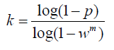
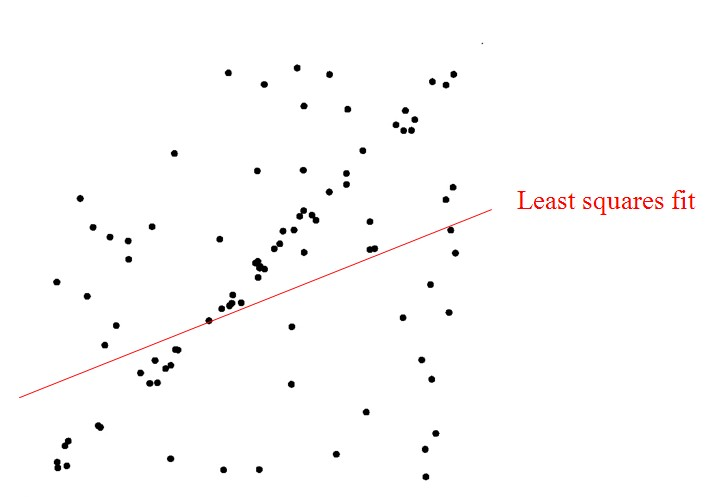
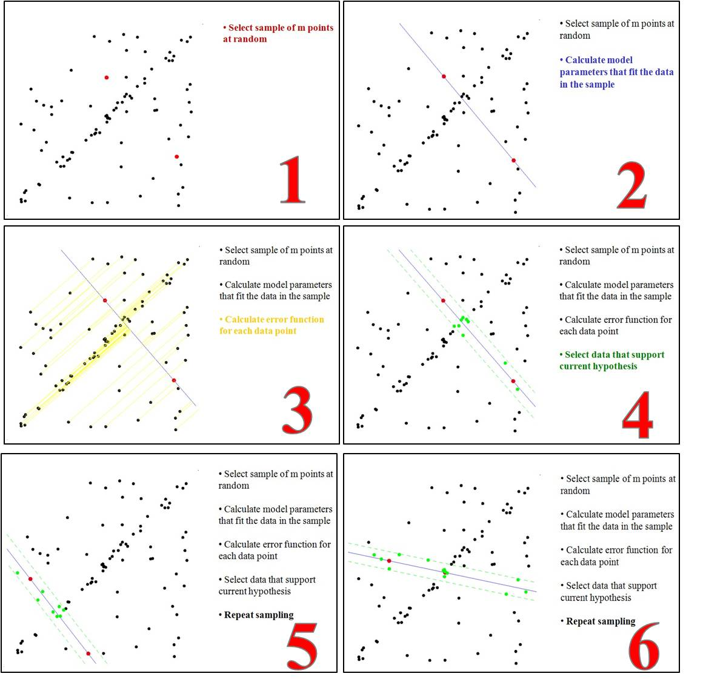
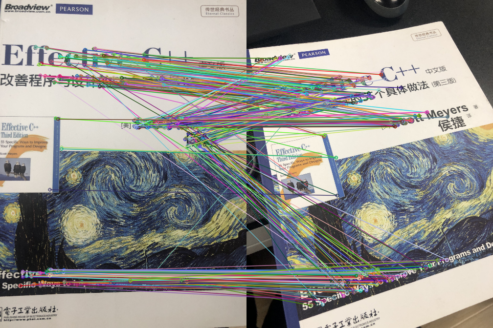
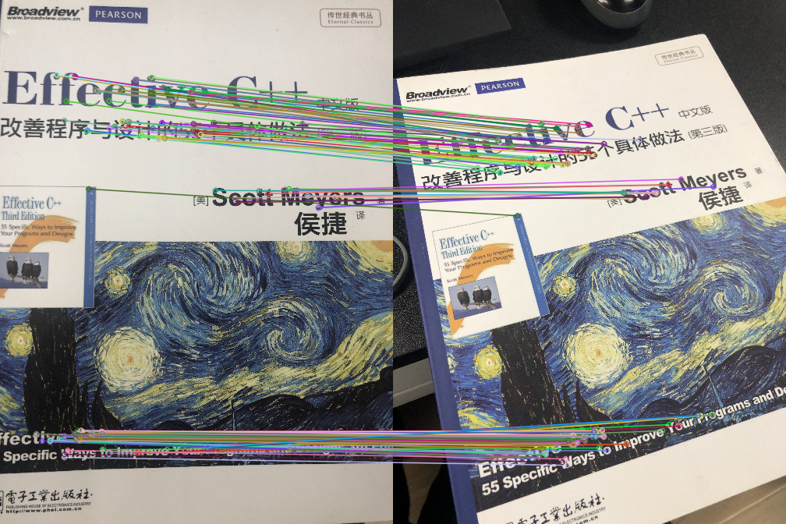

[TOC]

## RANSAC简介

RANSAC（RANdom SAmple Consensus）随机抽样一致算法，是一种在包含离群点在内的数据集里，通过迭代的方式估计模型的参数。举个例子，我们计算单应性矩阵时，初始匹配有很多的误匹配即是一个有离群点的数据集，然后我们估计出单应性矩阵。

RANSAC是一种算法的思路，在计算机视觉中应用较多。它是一种不确定的算法，即有一定的概率得出一个合理的结果，当然也会出现错误的结果。如果要提高概率，一个要提高迭代的次数，在一个就是减少数据集离群点的比例。

RANSAC 在视觉中有很多的应用，比如2D特征点匹配，3D点云匹配，在图片或者点云中识别直线，识别可以参数化的形状。RANSAC还可以用来拟合函数等。

## RANSAC 步骤

RANSAC核心思想就是随机性和假设性，随机性用于减少计算，循环次数是利用正确数据出现的概率。而假设性，就是说随机抽出来的数据都认为是正确的，并以此去计算其他点，获得其他满足变换关系的点，然后利用投票机制，选出获票最多的那一个变换。

1. 随机从数据集中随机抽出4个样本数据 (此4个样本之间不能共线)，计算出变换矩阵H，记为模型M；

2. 计算数据集中所有数据与模型M的投影误差，若误差小于阈值，加入内点集 I ；

3. 如果当前内点集 I 元素个数大于最优内点集 I_best , 则更新 I_best = I，同时更新迭代次数k ;

4. 如果迭代次数大于k,则退出 ; 否则迭代次数加1，并重复上述步骤；						

      注：迭代次数k在不大于最大迭代次数的情况下，是在不断更新而不是固定的；

      

      其中，p为置信度，一般取0.995；w为"内点"的比例 ; m为计算模型所需要的最少样本数=4；
      

## RANSAC 原理

给定两个点p1与p2的坐标，确定这两点所构成的直线，要求对于输入的任意点p3，都可以判断它是否在该直线上。初中解析几何知识告诉我们，判断一个点在直线上，只需其与直线上任意两点点斜率都相同即可。实际操作当中，往往会先根据已知的两点算出直线的表达式（点斜式、截距式等等），然后通过向量计算即可方便地判断p3是否在该直线上。 

生产实践中的数据往往会有一定的偏差。例如我们知道两个变量X与Y之间呈线性关系，Y=aX+b，我们想确定参数a与b的具体值。通过实验，可以得到一组X与Y的测试值。虽然理论上两个未知数的方程只需要两组值即可确认，但由于系统误差的原因，任意取两点算出的a与b的值都不尽相同。我们希望的是，最后计算得出的理论模型与测试值的误差最小。大学的高等数学课程中，详细阐述了最小二乘法的思想。通过计算最小均方差关于参数a、b的偏导数为零时的值。事实上，在很多情况下，最小二乘法都是线性回归的代名词。 

遗憾的是，最小二乘法只适合与误差较小的情况。试想一下这种情况，假使需要从一个噪音较大的数据集中提取模型（比方说只有20%的数据时符合模型的）时，最小二乘法就显得力不从心了。例如下图，肉眼可以很轻易地看出一条直线（模式），但算法却找错了。

 

RANSAC算法的输入是一组观测数据（往往含有较大的噪声或无效点），一个用于解释观测数据的参数化模型以及一些可信的参数。RANSAC通过反复选择数据中的一组随机子集来达成目标。被选取的子集被假设为局内点，并用下述方法进行验证： 

 

- 有一个模型适应于假设的局内点，即所有的未知参数都能从假设的局内点计算得出。
- 用1中得到的模型去测试所有的其它数据，如果某个点适用于估计的模型，认为它也是局内点。
- 如果有足够多的点被归类为假设的局内点，那么估计的模型就足够合理。
- 然后，用所有假设的局内点去重新估计模型（譬如使用最小二乘法），因为它仅仅被初始的假设局内点估计过。
- 最后，通过估计局内点与模型的错误率来评估模型。
- 上述过程被重复执行固定的次数，每次产生的模型要么因为局内点太少而被舍弃，要么因为比现有的模型更好而被选用。

整个过程可参考下图：



## OpenCV RANSAC效果展示[代码]

```cpp
#include <opencv2/opencv.hpp>
#include <iostream>
#include <opencv2/xfeatures2d.hpp>
#include <opencv2/features2d/features2d.hpp>
void extracte_orb(cv::Mat input,std::vector<cv::KeyPoint> &keypoint,cv::Mat &descriptor){
    cv::Ptr<cv::ORB> f2d = cv::ORB::create(500);
    f2d->detect(input,keypoint);
    cv::Mat image_with_kp;
    f2d->compute(input,keypoint,descriptor);
    cv::drawKeypoints(input, keypoint, image_with_kp, cv::Scalar::all(-1),cv::DrawMatchesFlags::DRAW_RICH_KEYPOINTS);
    cv::imwrite("orb"+std::to_string(random())+".png",image_with_kp);
}

void match_two_image(cv::Mat image1,cv::Mat image2, std::vector<cv::KeyPoint> keypoint1,std::vector<cv::KeyPoint> keypoint2,cv::Mat descriptor1,cv::Mat descriptor2){
    cv::BFMatcher matcher(cv::NORM_HAMMING);
    std::vector<cv::DMatch> matches;
    matcher.match(descriptor1,descriptor2, matches);
    cv::Mat good_matches_image;
    cv::drawMatches(image1, keypoint1, image2, keypoint2,
                    matches, good_matches_image, cv::Scalar::all(-1), cv::Scalar::all(-1),
                    std::vector<char>(), cv::DrawMatchesFlags::NOT_DRAW_SINGLE_POINTS);
    cv::imwrite("good_matches_image.png",good_matches_image);
    {
        std::vector <cv::KeyPoint> RAN_KP1, RAN_KP2;
        std::vector<cv::Point2f> keypoints1, keypoints2;
        for (int i = 0; i < matches.size(); i++) {
            keypoints1.push_back(keypoint1[matches[i].queryIdx].pt);
            keypoints2.push_back(keypoint2[matches[i].trainIdx].pt);
            RAN_KP1.push_back(keypoint1[matches[i].queryIdx]);
            RAN_KP2.push_back(keypoint2[matches[i].trainIdx]);
        }

        std::vector<uchar> RansacStatus;
        cv::findFundamentalMat(keypoints1, keypoints2, RansacStatus, cv::FM_RANSAC);
        std::vector <cv::KeyPoint> ransac_keypoints1, ransac_keypoints2;
        std::vector <cv::DMatch> ransac_matches;
        int index = 0;
        for (size_t i = 0; i < matches.size(); i++)
        {
            if (RansacStatus[i] != 0)
            {
                ransac_keypoints1.push_back(RAN_KP1[i]);
                ransac_keypoints2.push_back(RAN_KP2[i]);
                matches[i].queryIdx = index;
                matches[i].trainIdx = index;
                ransac_matches.push_back(matches[i]);
                index++;
            }
        }
        cv::Mat after_ransac_sift_match;
        cv::drawMatches(image1, ransac_keypoints1, image2, ransac_keypoints2,
                        ransac_matches, after_ransac_sift_match, cv::Scalar::all(-1), cv::Scalar::all(-1),
                        std::vector<char>(), cv::DrawMatchesFlags::NOT_DRAW_SINGLE_POINTS);
        cv::imwrite("after_ransac_orb_match.png",after_ransac_sift_match);
    }
}

int main(int argc, char *argv[])
{
    cv::Mat image1 = cv::imread(argv[1]);
    cv::Mat image2 = cv::imread(argv[2]);
    std::vector<cv::KeyPoint> keypoint1,keypoint2;
    cv::Mat descriptor1, descriptor2;
    extracte_orb(image1,keypoint1,descriptor1);
    extracte_orb(image2,keypoint2,descriptor2);
    match_two_image(image1,image2,keypoint1,keypoint2,descriptor1,descriptor2);
    return 0;
}
```

| 初步匹配效果                                                 | ransac后匹配效果                                             |
| ------------------------------------------------------------ | ------------------------------------------------------------ |
|  |  |

## RANSAC源码解析

**1、findHomography内部调用cvFindHomography函数**

**参数：**srcPoints:目标图像点集、dstPoints:场景图像点集、method: 最小中值法、RANSAC方法、最小二乘法、ransacReprojTheshold:投影误差阈值、mask:掩码

```c++
cvFindHomography( const CvMat* objectPoints, const CvMat* imagePoints,
                  CvMat* __H, int method, double ransacReprojThreshold,
                  CvMat* mask )
{
    const double confidence = 0.995;  //置信度
    const int maxIters = 2000;    //迭代最大次数
    const double defaultRANSACReprojThreshold = 3; //默认拒绝阈值
    bool result = false;
    Ptr<CvMat> m, M, tempMask;
    double H[9];
    CvMat matH = cvMat( 3, 3, CV_64FC1, H );  //变换矩阵
    int count;
    CV_Assert( CV_IS_MAT(imagePoints) && CV_IS_MAT(objectPoints) );
    count = MAX(imagePoints->cols, imagePoints->rows);
    CV_Assert( count >= 4 );           //至少有4个样本
    if( ransacReprojThreshold <= 0 )
        ransacReprojThreshold = defaultRANSACReprojThreshold;
    m = cvCreateMat( 1, count, CV_64FC2 );  //转换为齐次坐标
    cvConvertPointsHomogeneous( imagePoints, m );
    M = cvCreateMat( 1, count, CV_64FC2 );//转换为齐次坐标
    cvConvertPointsHomogeneous( objectPoints, M );
    if( mask )
    {
        CV_Assert( CV_IS_MASK_ARR(mask) && CV_IS_MAT_CONT(mask->type) &&
            (mask->rows == 1 || mask->cols == 1) &&
            mask->rows*mask->cols == count );
    }
    if( mask || count > 4 )
        tempMask = cvCreateMat( 1, count, CV_8U );
    if( !tempMask.empty() )
        cvSet( tempMask, cvScalarAll(1.) );
    CvHomographyEstimator estimator(4);
    if( count == 4 )
        method = 0;
    if( method == CV_LMEDS )  //最小中值法
        result = estimator.runLMeDS( M, m, &matH, tempMask, confidence, maxIters );
    else if( method == CV_RANSAC )    //采用RANSAC算法
        result = estimator.runRANSAC( M, m, &matH, tempMask, ransacReprojThreshold, confidence, maxIters);//(2)解析
    else
        result = estimator.runKernel( M, m, &matH ) > 0; //最小二乘法
    if( result && count > 4 )
    {
        icvCompressPoints( (CvPoint2D64f*)M->data.ptr, tempMask->data.ptr, 1, count );  //保存内点集
        count = icvCompressPoints( (CvPoint2D64f*)m->data.ptr, tempMask->data.ptr, 1, count );
        M->cols = m->cols = count;
        if( method == CV_RANSAC )  //
            estimator.runKernel( M, m, &matH );  //内点集上采用最小二乘法重新估算变换矩阵
        estimator.refine( M, m, &matH, 10 );// 
    }
    if( result )
        cvConvert( &matH, __H );  //保存变换矩阵
    if( mask && tempMask )
    {
        if( CV_ARE_SIZES_EQ(mask, tempMask) )
           cvCopy( tempMask, mask );
        else
           cvTranspose( tempMask, mask );
    }
    return (int)result;
}
```

**2、runRANSAC**

**参数：**maxIters:最大迭代次数、m1,m2 :数据样本、model:变换矩阵、reprojThreshold:投影误差阈值、confidence:置信度  0.995

```c++

bool CvModelEstimator2::runRANSAC( const CvMat* m1, const CvMat* m2, CvMat* model,
                                    CvMat* mask0, double reprojThreshold,
                                    double confidence, int maxIters )
{
    bool result = false;
    cv::Ptr<CvMat> mask = cvCloneMat(mask0);
    cv::Ptr<CvMat> models, err, tmask;
    cv::Ptr<CvMat> ms1, ms2;
    int iter, niters = maxIters;
    int count = m1->rows*m1->cols, maxGoodCount = 0;
    CV_Assert( CV_ARE_SIZES_EQ(m1, m2) && CV_ARE_SIZES_EQ(m1, mask) );
    if( count < modelPoints )
        return false;
    models = cvCreateMat( modelSize.height*maxBasicSolutions, modelSize.width, CV_64FC1 );
    err = cvCreateMat( 1, count, CV_32FC1 );//保存每组点对应的投影误差
    tmask = cvCreateMat( 1, count, CV_8UC1 );
    if( count > modelPoints )  //多于4个点
    {
        ms1 = cvCreateMat( 1, modelPoints, m1->type );
        ms2 = cvCreateMat( 1, modelPoints, m2->type );
    }
    else  //等于4个点
    {
        niters = 1; //迭代一次
        ms1 = cvCloneMat(m1);  //保存每次随机找到的样本点
        ms2 = cvCloneMat(m2);
    }
    for( iter = 0; iter < niters; iter++ )  //不断迭代
    {
        int i, goodCount, nmodels;
        if( count > modelPoints )
        {
           //在(3)解析getSubset
            bool found = getSubset( m1, m2, ms1, ms2, 300 ); //随机选择4组点，且三点之间不共线，(3)解析
            if( !found )
            {
                if( iter == 0 )
                    return false;
                break;
            }
        }
        nmodels = runKernel( ms1, ms2, models );  //估算近似变换矩阵，返回1
        if( nmodels <= 0 )
            continue;
        for( i = 0; i < nmodels; i++ )//执行一次 
        {
            CvMat model_i;
            cvGetRows( models, &model_i, i*modelSize.height, (i+1)*modelSize.height );//获取3×3矩阵元素
            goodCount = findInliers( m1, m2, &model_i, err, tmask, reprojThreshold );  //找出内点，(4)解析
            if( goodCount > MAX(maxGoodCount, modelPoints-1) )  //当前内点集元素个数大于最优内点集元素个数
            {
                std::swap(tmask, mask);
                cvCopy( &model_i, model );  //更新最优模型
                maxGoodCount = goodCount;
				//confidence 为置信度默认0.995,modelPoints为最少所需样本数=4,niters迭代次数
                niters = cvRANSACUpdateNumIters( confidence,  //更新迭代次数，(5)解析
                    (double)(count - goodCount)/count, modelPoints, niters );
            }
        }
    }
    if( maxGoodCount > 0 )
    {
        if( mask != mask0 )
            cvCopy( mask, mask0 );
        result = true;
    }
    return result;
}
```

**3、getSubset**

**参数：**ms1,ms2:保存随机找到的4个样本、maxAttempts:最大迭代次数，300

```c++

bool CvModelEstimator2::getSubset( const CvMat* m1, const CvMat* m2,
                                   CvMat* ms1, CvMat* ms2, int maxAttempts )
{
    cv::AutoBuffer<int> _idx(modelPoints); //modelPoints 所需要最少的样本点个数
    int* idx = _idx;
    int i = 0, j, k, idx_i, iters = 0;
    int type = CV_MAT_TYPE(m1->type), elemSize = CV_ELEM_SIZE(type);
    const int *m1ptr = m1->data.i, *m2ptr = m2->data.i;
    int *ms1ptr = ms1->data.i, *ms2ptr = ms2->data.i;
    int count = m1->cols*m1->rows;
    assert( CV_IS_MAT_CONT(m1->type & m2->type) && (elemSize % sizeof(int) == 0) );
    elemSize /= sizeof(int); //每个数据占用字节数
    for(; iters < maxAttempts; iters++)
    {
        for( i = 0; i < modelPoints && iters < maxAttempts; )
        {
            idx[i] = idx_i = cvRandInt(&rng) % count;  // 随机选取1组点
            for( j = 0; j < i; j++ )  // 检测是否重复选择
                if( idx_i == idx[j] )
                    break;
            if( j < i )
                continue;  //重新选择
            for( k = 0; k < elemSize; k++ )  //拷贝点数据
            {
                ms1ptr[i*elemSize + k] = m1ptr[idx_i*elemSize + k];
                ms2ptr[i*elemSize + k] = m2ptr[idx_i*elemSize + k];
            }
            if( checkPartialSubsets && (!checkSubset( ms1, i+1 ) || !checkSubset( ms2, i+1 )))//检测点之间是否共线
            {
                iters++;  //若共线，重新选择一组
                continue;
            }
            i++;
        }
        if( !checkPartialSubsets && i == modelPoints &&
            (!checkSubset( ms1, i ) || !checkSubset( ms2, i )))
            continue;
        break;
    }
    return i == modelPoints && iters < maxAttempts;  //返回找到的样本点个数
}

```

**4、findInliers & computerReprojError**

```c++

int CvModelEstimator2::findInliers( const CvMat* m1, const CvMat* m2,
                                    const CvMat* model, CvMat* _err,
                                    CvMat* _mask, double threshold )
{
    int i, count = _err->rows*_err->cols, goodCount = 0;
    const float* err = _err->data.fl;
    uchar* mask = _mask->data.ptr;
    computeReprojError( m1, m2, model, _err );  //计算每组点的投影误差
    threshold *= threshold;
    for( i = 0; i < count; i++ )
        goodCount += mask[i] = err[i] <= threshold;//误差在限定范围内，加入‘内点集’
    return goodCount;
}

//--------------------------------------

void CvHomographyEstimator::computeReprojError( const CvMat* m1, const CvMat* m2,const CvMat* model, CvMat* _err )
{
	int i, count = m1->rows*m1->cols;
	const CvPoint2D64f* M = (const CvPoint2D64f*)m1->data.ptr;
	const CvPoint2D64f* m = (const CvPoint2D64f*)m2->data.ptr;
	const double* H = model->data.db;
	float* err = _err->data.fl;
	for( i = 0; i < count; i++ )        //保存每组点的投影误差，对应上述变换公式
	{
		double ww = 1./(H[6]*M[i].x + H[7]*M[i].y + 1.);    
		double dx = (H[0]*M[i].x + H[1]*M[i].y + H[2])*ww - m[i].x;
		double dy = (H[3]*M[i].x + H[4]*M[i].y + H[5])*ww - m[i].y;
		err[i] = (float)(dx*dx + dy*dy);
	}

}

```

**5、cvRANSACUpdateNumIters**

对应上述k的计算公式p：置信度、ep:外点比例

```c++

cvRANSACUpdateNumIters( double p, double ep,
                        int model_points, int max_iters )
{
    if( model_points <= 0 )
        CV_Error( CV_StsOutOfRange, "the number of model points should be positive" );
    p = MAX(p, 0.);
    p = MIN(p, 1.);
    ep = MAX(ep, 0.);
    ep = MIN(ep, 1.);
    // avoid inf's & nan's
    double num = MAX(1. - p, DBL_MIN);  //num=1-p,做分子
    double denom = 1. - pow(1. - ep,model_points);//做分母
    if( denom < DBL_MIN )
        return 0;
    num = log(num);
    denom = log(denom);
    return denom >= 0 || -num >= max_iters*(-denom) ?
        max_iters : cvRound(num/denom);
}
```


## 参考资料

- [RANSAC算法学习笔记](https://www.jianshu.com/p/4e426f0c48cc)
- [RANSAC算法原理与源码解析](https://blog.csdn.net/luoshixian099/article/details/50217655)
- [[我的数学之美(一)——RANSAC算法详解](https://www.baidu.com/link?url=X3PPVBu0grFjaHz7XHJ2EyR5k_kUPddaq77JxDX3q7RAYVFCJyPX5PSBY_deA6etGhziTXohFJHVkTg4RlLj2cW1zNcRY_UFZfeCezvIF2bjQpYPwmAfMgp-ad5P2m5M&wd=&eqid=9c9040c5002a6184000000035f01c815)

