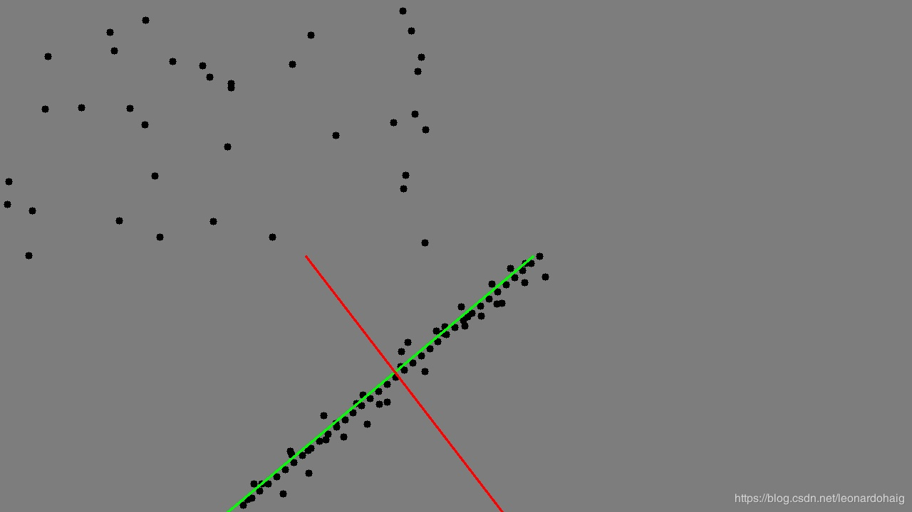
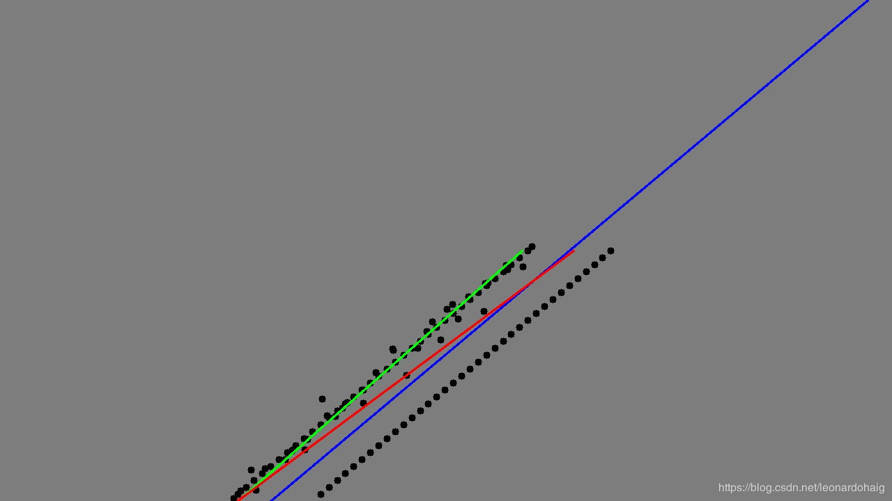

[TOC]

## RANSAC简介

RANSAC（RANdom SAmple Consensus）随机抽样一致算法，**是一种在包含离群点在内的数据集里，通过迭代的方式估计模型的参数**。举个例子，我们计算单应性矩阵时，初始匹配有很多的误匹配即是一个有离群点的数据集，然后我们估计出单应性矩阵。

RANSAC是一种算法的思路，在计算机视觉中应用较多。它是一种不确定的算法，即有一定的概率得出一个合理的结果，当然也会出现错误的结果。如果要提高概率，一个要提高迭代的次数，在一个就是减少数据集离群点的比例。

RANSAC 在视觉中有很多的应用，比如2D特征点匹配，3D点云匹配，在图片或者点云中识别直线，识别可以参数化的形状。RANSAC还可以用来拟合函数等。

## RANSAC 步骤

RANSAC核心思想就是**随机性和假设性**，随机性用于减少计算，循环次数是利用正确数据出现的概率。而假设性，就是说随机抽出来的数据都认为是正确的，并以此去计算其他点，获得其他满足变换关系的点，然后利用投票机制，选出获票最多的那一个变换。

1. 随机从数据集中随机抽出4个样本数据 (此4个样本之间不能共线)，计算出变换矩阵H，记为模型M；

2. 计算数据集中所有数据与模型M的投影误差，若误差小于阈值，加入内点集 I ；

3. 如果当前内点集 I 元素个数大于最优内点集 I_best , 则更新 I_best = I，同时更新迭代次数k ;

4. 如果迭代次数大于k,则退出 ; 否则迭代次数加1，并重复上述步骤；						

      注：迭代次数k在不大于最大迭代次数的情况下，是在不断更新而不是固定的；

      

      其中，p为置信度，一般取0.995；w为"内点"的比例 ; m为计算模型所需要的最少样本数=4；
      

## RANSAC 原理

例如给定两个点p1与p2的坐标，确定这两点所构成的直线，要求对于输入的任意点p3，都可以判断它是否在该直线上。初中解析几何知识告诉我们，判断一个点在直线上，只需其与直线上任意两点点斜率都相同即可。实际操作当中，往往会先根据已知的两点算出直线的表达式（点斜式、截距式等等），然后通过向量计算即可方便地判断p3是否在该直线上。 

生产实践中的数据往往会有一定的偏差。例如我们知道两个变量X与Y之间呈线性关系，Y=aX+b，我们想确定参数a与b的具体值。通过实验，可以得到一组X与Y的测试值。虽然理论上两个未知数的方程只需要两组值即可确认，但由于系统误差的原因，任意取两点算出的a与b的值都不尽相同。我们希望的是，最后计算得出的理论模型与测试值的误差最小。大学的高等数学课程中，详细阐述了最小二乘法的思想。通过计算最小均方差关于参数a、b的偏导数为零时的值。事实上，在很多情况下，最小二乘法都是线性回归的代名词。 

遗憾的是，最小二乘法只适合与误差较小的情况。试想一下这种情况，假使需要从一个噪音较大的数据集中提取模型（比方说只有20%的数据时符合模型的）时，最小二乘法就显得力不从心了。例如下图，肉眼可以很轻易地看出一条直线（模式），但算法却找错了。

 

RANSAC算法的输入是一组观测数据（往往含有较大的噪声或无效点），一个用于解释观测数据的参数化模型以及一些可信的参数。RANSAC通过反复选择数据中的一组随机子集来达成目标。被选取的子集被假设为局内点，并用下述方法进行验证： 

- 有一个模型适应于假设的局内点，即所有的未知参数都能从假设的局内点计算得出。
- 用1中得到的模型去测试所有的其它数据，如果某个点适用于估计的模型，认为它也是局内点。
- 如果有足够多的点被归类为假设的局内点，那么估计的模型就足够合理。
- 然后，用所有假设的局内点去重新估计模型（譬如使用最小二乘法），因为它仅仅被初始的假设局内点估计过。
- 最后，通过估计局内点与模型的错误率来评估模型。
- 上述过程被重复执行固定的次数，每次产生的模型要么因为局内点太少而被舍弃，要么因为比现有的模型更好而被选用。

整个过程可参考下图：


## RANSAC 迭代次数推导

在这算法流程中存在两个重要的参数需要设置，迭代次数（采样次数）和距离阈值。

迭代的次数我们应该选择多大呢？这个值是否可以事先知道应该设为多少呢？还是只能凭经验决定呢？ 这个值其实是可以估算出来的。下面我们就来推算一下。

假设内点在数据中的占比为*t*:


那么我们每次计算模型使用`n`个点的情况下，选取的点至少有一个外点的概率为：


那么，在迭代`k`次计算模型都至少采样的一个外点的概率为：


那么，能采样到正确的`n`个内点去计算出正模型的概率就是：


上式等效为：


然后，对上式的两边取对数，得到：


注：内点的概率`t`通常是一个先验值。然后**P** 是我们希望RANSAC得到正确模型的概率。如果事先不知道`t` 的值，可以使用自适应迭代次数的方法。也就是一开始设定一个无穷大的迭代次数，然后每次更新模型参数估计的时候，用当前的内点比值当成`t` 来估算出迭代次数。

## OpenCV RANSAC的效果展示

| 初步匹配效果                                                 | ransac后匹配效果                                             |
| ------------------------------------------------------------ | ------------------------------------------------------------ |
|  |  |

## RANSAC直线拟合代码（C++及Python版本）

C++版本代码如下：

```C++
//Program:RANSAC直线拟合，并与最小二乘法结果进行对比
//Data:2020.2.29
//Author:liheng
//Version:V1.0
//====================================================================//
#include <iostream>
#include <opencv2/opencv.hpp>

//RANSAC 拟合2D 直线
//输入参数：points--输入点集
//        iterations--迭代次数
//        sigma--数据和模型之间可接受的差值,车道线像素宽带一般为10左右
//              （Parameter use to compute the fitting score）
//        k_min/k_max--拟合的直线斜率的取值范围.
//                     考虑到左右车道线在图像中的斜率位于一定范围内，
//                      添加此参数，同时可以避免检测垂线和水平线
//输出参数:line--拟合的直线参数,It is a vector of 4 floats
//              (vx, vy, x0, y0) where (vx, vy) is a normalized
//              vector collinear to the line and (x0, y0) is some
//              point on the line.
//返回值：无

void fitLineRansac(const std::vector<cv::Point2f>& points,
                   cv::Vec4f &line,
                   int iterations = 1000,
                   double sigma = 1.,
                   double k_min = -7.,
                   double k_max = 7.)
{
    unsigned int n = points.size();

    if(n<2)
    {
        return;
    }

    cv::RNG rng;
    double bestScore = -1.;
    for(int k=0; k<iterations; k++)
    {
        int i1=0, i2=0;
        while(i1==i2)
        {
            i1 = rng(n);
            i2 = rng(n);
        }
        const cv::Point2f& p1 = points[i1];
        const cv::Point2f& p2 = points[i2];

        cv::Point2f dp = p2-p1;//直线的方向向量
        dp *= 1./norm(dp);
        double score = 0;

        if(dp.y/dp.x<=k_max && dp.y/dp.x>=k_min )
        {
            for(int i=0; i<n; i++)
            {
                cv::Point2f v = points[i]-p1;
                double d = v.y*dp.x - v.x*dp.y;//向量a与b叉乘/向量b的摸.||b||=1./norm(dp)
                //score += exp(-0.5*d*d/(sigma*sigma));//误差定义方式的一种
                if( fabs(d)<sigma )
                    score += 1;
            }
        }
        if(score > bestScore)
        {
            line = cv::Vec4f(dp.x, dp.y, p1.x, p1.y);
            bestScore = score;
        }
    }
}

int main()
{
    cv::Mat image(720,1280,CV_8UC3,cv::Scalar(125,125,125));
    //以车道线参数为(0.7657,-0.6432,534,548)生成一系列点
    double k = -0.6432/0.7657;
    double b = 548 - k*534;

    std::vector<cv::Point2f> points;

    for (int i = 360; i < 720; i+=10)
    {
        cv::Point2f point(int((i-b)/k),i);
        points.emplace_back(point);
    }

    //加入直线的随机噪声
    cv::RNG rng((unsigned)time(NULL));
    for (int i = 360; i < 720; i+=10)
    {
        int x = int((i-b)/k);
        x = rng.uniform(x-10,x+10);
        int y = i;
        y = rng.uniform(y-30,y+30);
        cv::Point2f point(x,y);
        points.emplace_back(point);
    }

    //加入噪声
    for (int i = 0; i < 720; i+=20)
    {
        int x = rng.uniform(1,640);
        int y = rng.uniform(1,360);
        cv::Point2f point(x,y);
        points.emplace_back(point);
    }
    int n = points.size();
    for (int j = 0; j < n; ++j)
    {
        cv::circle(image,points[j],5,cv::Scalar(0,0,0),-1);
    }
    //RANSAC 拟合
    if(1)
    {
        cv::Vec4f lineParam;
        fitLineRansac(points,lineParam,1000,10);
        double k = lineParam[1] / lineParam[0];
        double b = lineParam[3] - k*lineParam[2];
        cv::Point p1,p2;
        p1.y = 720;
        p1.x = ( p1.y - b) / k;
        p2.y = 360;
        p2.x = (p2.y-b) / k;
        cv::line(image,p1,p2,cv::Scalar(0,255,0),2);
    }
    //最小二乘法拟合
    if(1)
    {
        cv::Vec4f lineParam;
        cv::fitLine(points,lineParam,cv::DIST_L2,0,0.01,0.01);
        double k = lineParam[1] / lineParam[0];
        double b = lineParam[3] - k*lineParam[2];
        cv::Point p1,p2;
        p1.y = 720;
        p1.x = ( p1.y - b) / k;
        p2.y = 360;
        p2.x = (p2.y-b) / k;
        cv::line(image,p1,p2,cv::Scalar(0,0,255),2);
    }
    cv::imshow("image",image);
    cv::waitKey(0);
    return 0;
}
```

代码运行结果如下：



其中绿色直线为RANSAC直线拟合结果，红色直线为最小二乘法拟合直线结果。

Python版本代码如下：

```python
#!/usr/bin/env python3
#coding=utf-8

#============================#
#Program:RANSAC_Line.py
#       
#Date:20-2-29
#Author:liheng
#Version:V1.0
#============================#

import numpy as np
import random
import math

import cv2

def fitLineRansac(points,iterations=1000,sigma=1.0,k_min=-7,k_max=7):
    """
    RANSAC 拟合2D 直线
    :param points:输入点集,numpy [points_num,1,2],np.float32
    :param iterations:迭代次数
    :param sigma:数据和模型之间可接受的差值,车道线像素宽带一般为10左右
                （Parameter use to compute the fitting score）
    :param k_min:
    :param k_max:k_min/k_max--拟合的直线斜率的取值范围.
                考虑到左右车道线在图像中的斜率位于一定范围内，
                添加此参数，同时可以避免检测垂线和水平线
    :return:拟合的直线参数,It is a vector of 4 floats
                (vx, vy, x0, y0) where (vx, vy) is a normalized
                vector collinear to the line and (x0, y0) is some
                point on the line.
    """
    line = [0,0,0,0]
    points_num = points.shape[0]

    if points_num<2:
        return line

    bestScore = -1
    for k in range(iterations):
        i1,i2 = random.sample(range(points_num), 2)
        p1 = points[i1][0]
        p2 = points[i2][0]

        dp = p1 - p2 #直线的方向向量
        dp *= 1./np.linalg.norm(dp) # 除以模长，进行归一化

        score = 0
        a = dp[1]/dp[0]
        if a <= k_max and a>=k_min:
            for i in range(points_num):
                v = points[i][0] - p1
                dis = v[1]*dp[0] - v[0]*dp[1]#向量a与b叉乘/向量b的摸.||b||=1./norm(dp)
                # score += math.exp(-0.5*dis*dis/(sigma*sigma))误差定义方式的一种
                if math.fabs(dis)<sigma:
                    score += 1
        if score > bestScore:
            line = [dp[0],dp[1],p1[0],p1[1]]
            bestScore = score

    return line


if __name__ == '__main__':
    image = np.ones([720,1280,3],dtype=np.ubyte)*125

    # 以车道线参数为(0.7657, -0.6432, 534, 548)生成一系列点
    k = -0.6432 / 0.7657
    b = 548 - k * 534

    points = []
    for i in range(360,720,10):
        point = (int((i-b)/k),i)
        points.append(point)

    # 加入直线的随机噪声
    for i in range(360,720,10):
        x = int((i-b)/k)
        x = random.sample(range(x-10,x+10),1)
        y = i
        y = random.sample(range(y - 30, y + 30),1)

        point = (x[0],y[0])
        points.append(point)

    # 加入噪声
    for i in range(0,720,20):
        x = random.sample(range(1, 640), 1)
        y = random.sample(range(1, 360), 1)
        point = (x[0], y[0])
        points.append(point)

    for point in points:
        cv2.circle(image,point,5,(0,0,0),-1)


    points = np.array(points).astype(np.float32)
    points = points[:,np.newaxis,:]

    # RANSAC 拟合
    if 1:
        [vx, vy, x, y] = fitLineRansac(points,1000,10)
        k = float(vy) / float(vx)  # 直线斜率
        b = -k * x + y

        p1_y = 720
        p1_x = (p1_y-b) / k
        p2_y = 360
        p2_x = (p2_y-b) / k

        p1 = (int(p1_x),int(p1_y))
        p2 = (int(p2_x), int(p2_y))

        cv2.line(image,p1,p2,(0,255,0),2)

    # 最小二乘法拟合
    if 1:
        [vx, vy, x, y] = cv2.fitLine(points, cv2.DIST_L2, 0, 0.1, 0.01)
        k = float(vy) / float(vx)  # 直线斜率
        b = -k * x + y

        p1_y = 720
        p1_x = (p1_y - b) / k
        p2_y = 360
        p2_x = (p2_y - b) / k

        p1 = (int(p1_x), int(p1_y))
        p2 = (int(p2_x), int(p2_y))

        cv2.line(image, p1, p2, (0, 0, 255), 2)

    cv2.imshow('image',image)
    cv2.waitKey(0)
```

注：上述代码可以改进的地方：迭代求取直线参数过程中，将每次迭代的直线的内点保存下来，当迭代结束时，可以对这些内点采用最小二乘法拟合出最佳的直线参数

## RANSAC优缺点

RANSAC的优点是它能鲁棒的估计模型参数。例如，它能从包含大量局外点的数据集中估计出高精度的参数。

RANSAC的缺点是它计算参数的迭代次数没有上限；如果设置迭代次数的上限，得到的结果可能不是最优的结果，甚至可能得到错误的结果。RANSAC只有一定的概率得到可信的模型，概率与迭代次数成正比。RANSAC的另一个缺点是它要求设置跟问题相关的阀值。

RANSAC只能从特定的数据集中估计出一个模型，如果存在两个（或多个）模型，RANSAC不能找到别的模型。

RANSAC可以对局外点进行剔除，这一点是比较好的，但它也并不是完美的，当它对于拟合两条平近似平行直线分布的点时，拟合出来的结果并不是最好的，甚至可以说拟合的结果是不对的。因为最终的正确结果有可能并不是经过所给的数据点的，如下图所示：



注：绿色线：RANSA拟合结果;红色线:最小二乘法拟合结果;蓝色线:期望的理想结果

当我们要从如图所示的数据点中拟合出一条直线的时候（即把两条离得较近的近似的平行的线当做一条线来拟合），理想的情况是蓝色线所示，但实际情况会如绿色线所示，因为蓝色线所示的点并没有经过数据点中的两个点，RANSAC是从给的数据点中进行拟合选择内点最多的情况，而实际情况可能理想直线并不经过数据点，这是这个算法的局限所在。可以考虑将RANSAC和最小二乘结合进行，这样可以结合二者的优势，得到较为理想的结果。

## 参考资料

- [RANSAC算法学习笔记](https://www.jianshu.com/p/4e426f0c48cc)
- [RANSAC算法原理与源码解析](https://blog.csdn.net/luoshixian099/article/details/50217655)
- [[我的数学之美(一)——RANSAC算法详解](https://www.baidu.com/link?url=X3PPVBu0grFjaHz7XHJ2EyR5k_kUPddaq77JxDX3q7RAYVFCJyPX5PSBY_deA6etGhziTXohFJHVkTg4RlLj2cW1zNcRY_UFZfeCezvIF2bjQpYPwmAfMgp-ad5P2m5M&wd=&eqid=9c9040c5002a6184000000035f01c815)
- [RANSAC算法(附RANSAC直线拟合C++与Python版本)](https://blog.csdn.net/leonardohaig/article/details/104570965#t2)

