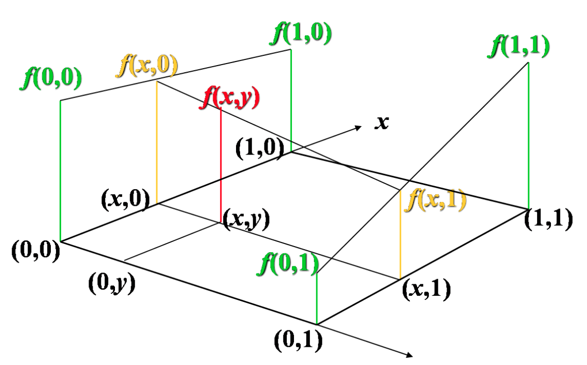
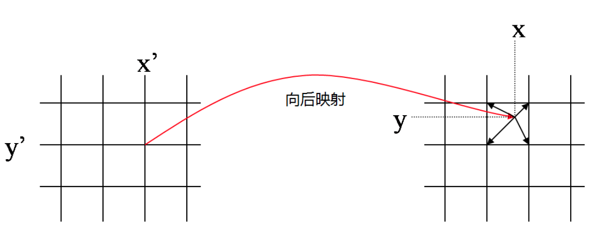
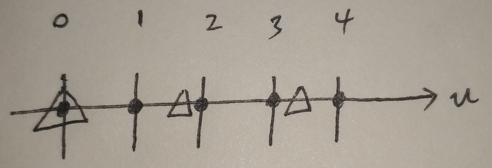
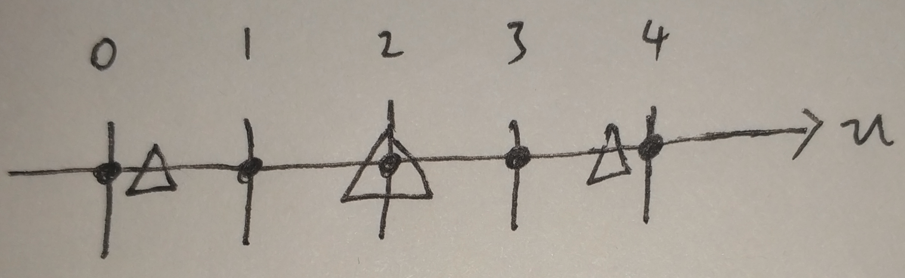

[TOC]

## 双线性插值(Bilinear Interpolation)性质

- 当对相邻四个像素点采用双线性插值时，所得表面在邻域处是吻合的，但斜率不吻合。并且双线性灰度插值的平滑作用可能使得图像的细节产生退化，这种现象在进行图像放大时尤其明显。


## 单线性插值原理

注：单线性插值是我自己取的名字，为了便于说明

为了方便说明，先以一条直线的插值为例，说明直线一维的线性插值，再说明二维的。


如图，我们已经知道在x=x0处和x=x1处的y值分别为y0和y1，现在要插值得到x=x处的y值是多少。线性插值的原理就是在已知的两点之间作一条线段，用来估计两点之间的任一未知点的y值。

根据线段(x0,y0)->(x,y)的斜率与线段(x0,y0)->(x1,y1)相等，有
$$
\frac{y-y_0}{x-x_0} = \frac{y_1-y_0}{x_1-x_0}
$$
所以
$$
y = \frac{y_1-y_0}{x_1-x_0} \times (x-x_0) + y_0
$$


## 双线性插值原理

**基本原理**

有了上面单线性插值的介绍，现在来说明双线性插值原理。如下图所示，我们已知4个点(u', v')、(u'+1, v')、(u'+1, v'+1)、(u', v'+1)的灰度值分别为g(u', v')、g(u'+1, v')、g(u'+1, v'+1)、g(u', v'+1)。现在要通过这4个点插值得到点(u0, v0)的灰度值g(u0, v0)。


我们可以将插值分解为多个单线性插值来处理：

1. 在v=v'这条直线的u方向上，通过单线性插值得到点(u0, v')的灰度值 ：
    $$
    g(u_0, v') = \frac{g(u'+1, v') - g(u', v')}{u'+1 - u'} \times (u_0 - u') + g(u', v')
    $$
    
2. 在v=v'+1这条直线的u方向上，通过单线性插值得到点(u0, v'+1)的灰度值：
    $$
    g(u_0, v'+1) = \frac{g(u'+1, v'+1) - g(u', v'+1)}{u'+1 - u'} \times (u_0 - u') + g(u', v'+1)
    $$
    
3. 在u=u0这条直线的v方向上，通过单线性插值得到点(u0, v0)的灰度值：
    $$
    g(u_0, v_0) = \frac{g(u_0, v'+1) - g(u_0, v')}{v'+1 - v'} \times (v_0 - v') + g(u_0, v')
    $$
    

**简化公式**

上面的公式比较复杂，如果选择一个坐标系统，如下图，使得的四个已知点坐标分别为 (0, 0)、(0, 1)、(1, 0) 和 (1, 1)，那么插值公式就可以简化为：
$$
g(u_0,v_0)=g(0,0)(1-u_0)(1-v_0)+g(1,0)u_0(1-v_0)+g(0,1)(1-u_0)v_0+g(1,1)u_0v_0
$$
或者用矩阵运算表示为：
$$
g(u_0, v_0) = \begin{bmatrix}
 1-u_0 & u_0 
\end{bmatrix} \begin{bmatrix}
 g(0,0) & g(0,1) \\
 g(1,0) & g(1,1)
\end{bmatrix}\begin{bmatrix}
1-v_0 \\
v_0
\end{bmatrix}
$$





## 图像坐标的前向映射和反向映射

参考：[图像变换——向前映射和向后映射](https://blog.csdn.net/glorydream2015/article/details/44873703)

### 前向映射

- 计算量大。计算量与原图大小有关，随着原图大小增大而增大。
- 不方便并行。输出图像某一点的像素值不能直接得到，需要遍历输入图像的**所有像素值**，对其进行坐标变换，分配像素值到整数位置，才能得到输出图像各像素点的像素值。
- 必须归一化，虽然分配系数之和 $(1-u_0)(1-v_0)+u_0(1-v_0)+(1-u_0)v_0+u_0v_0$ 为1。但输出图像上每个点的像素值是多个分配值叠加而成的，不能保证所有分配到其上的权重之和为1。因此必须记录下所有分配到其上的权重并累加起来，最后利用累加权重进行归一化，才能得到正确的插值结果。
- 可能出现空洞？如果输出图像比原图像大很多的话，可能会有空洞？例如原图两个相邻像素映射到输出图像中相距几十个像素距离，那他们中间的像素值时不是不好插值了？

下图为向前映射的示意图。输入图像上整数点坐标映射到输出图像之后，变成了非整数点坐标。因此，需要将其像素值按一定权重分配到其周围四个像素点上。对于输出图像而言，其整数点像素值周围会有很多输入图像像素映射过来，每个到其周围的非整数点像素值都会分配一定的灰度值到它上面，将这些分配而来的像素值叠加，就是输出图像整数点位置的像素值。由于这个分配、叠加的特性，向前映射法有时也叫像素移交映射。


因此，对于向前映射而言，输出图像某一点的像素值不能直接得到，需要遍历输入图像的所有像素值，对其进行坐标变换，分配像素值到整数位置，才能得到输出图像各像素点的像素值。这是向前映射法的缺点。

对向前映射而言，虽然分配系数之和 $(1-u_0)(1-v_0)+u_0(1-v_0)+(1-u_0)v_0+u_0v_0$ 为1。但输出图像上每个点的像素值是多个分配值叠加而成的，不能保证所有分配到其上的权重之和为1。因此必须记录下所有分配到其上的权重并累加起来，最后利用累加权重进行归一化，才能得到正确的插值结果。

### 反向映射

- 计算量小。计算量与输出图像大小有关，随着输出图像大小增大而增大。
- 方便并行。将输出图像某个像素点映射回原图，取原图相邻四个点插值可直接得到，不用遍历完整个原图。
- 不需要归一化。以双线性插值为例，对反向映射而言，系数之和 $(1-u_0)(1-v_0)+u_0(1-v_0)+(1-u_0)v_0+u_0v_0$ 为1。
- 不会出现空洞。

通常我们都使用反向映射。

向后映射法就比较直观。在这种情况下，我们知道输出图像上整数点位置(x’,y’)在变换前位于输入图像上的位置(x,y)，一般来说这是个非整数点位置，利用其周围整数点位置的输入图像像素值进行插值，就得到了该点的像素值。我们遍历输出图像，经过坐标变换、插值两步操作，我们就能将其像素值一个个地计算出来，因此向后映射又叫图像填充映射。如下图所示。




以双线性插值为例，对反向映射而言，系数之和 $(1-u_0)(1-v_0)+u_0(1-v_0)+(1-u_0)v_0+u_0v_0$ 为1。

## 原图像和输出图像几何中心的对齐

参考：[双线性插值算法及需要注意事项](https://www.iteye.com/blog/handspeaker-1545126)

如果按照上面的方法进行双线性插值，你会发现计算出来的结果和matlab、openCV对应的resize（）函数得到的结果不一样。那这个究竟是怎么回事呢？

其实答案很简单，就是坐标系的选择问题，或者说源图像和目标图像之间的对应问题。

以图像缩小为例说明问题。假设源图像大小为w1xh1，目标图像为w2xh2。那么两幅图像的边长比分别为：w1/w2和h1/h2。目标图像的像素点(j, i)（第i行j列）可以通过边长比对应回源图像。其对应坐标为（ $j*w1/w2, i*w1/w2$ ）。

```cpp
float u = j*w1/w2;
float v = i*w1/w2;
```

**注意：我们的坐标是从0开始的，即640x480大小的图像，它的宽和高取值范围分别是[0, 639]和[0,479]。这个坐标对齐于左上角，但不是几何中心对齐的，会有问题，每进行一个未对齐的处理，都会使得图像往左上角偏移一点点，下面会进行说明。**

这样的计算会使得像素映射回原图偏左上角。例如当原图像大小为5x5，目标图像为3x3时，映射关系如下，为了方便，这里只画出了图像的第一行：



上图中，黑点表示原图第一行的5个像素，三角形表示目标图第一行的3个像素映射回原图所在的位置。有没有发现有一点奇怪？目标图像的像素值是在原图中靠左位置取的。而实际上，我们都知道，正确的方式应该如下图：



后面这幅图是把图像几何中心对齐了的，那么如何才能得到这种正确的映射关系呢？我们可以看一看，为什么原来的坐标映射关系会出错。

因为图像坐标从0开始，要想几何中心对齐，意味着3x3图像中间元素(u=1)要和5x5图像中间元素(u=2)重合，但是按照前面的计算公式，$u = j*w1/w2;$ 可以得到

3x3图像中间元素(u=1)在5x5图像中的坐标为1.666，没有和u=2对齐。**这一切的错误的源头正是因为图像坐标从0开始！这导致了图像右边界坐标永远比宽要少1，即宽640图像的坐标最大只有639。**

要解决这个问题，我们只需要将图像坐标从0.5开始即可。这样处理后，对于640宽的图像，图像左边界为0.5，与0相差0.5；图像右边界为639.5，与640差0.5；这样就对齐了。这样子处理后，要想几何中心对齐，意味着3x3图像中间元素(u=1.5)要和5x5图像中间元素(u=2.5)重合，按照前面的计算公式，$u = j*w1/w2;$ 正好可以得到3x3图像中间元素(u=1.5)在5x5图像中的坐标为2.5，对齐了。

到目前为止，我们通过转换坐标系的原点，使得原图像与输出图像几何中心能够对齐，但是还存在一个小问题。那就是我们的计算机存储图像都是从坐标0开始，我们以0.5作为起始点的坐标体系，在计算机这里是不兼容的，所以，当我们计算得到2.5以后，还需要再进行一个坐标转换，将坐标转为从0开始。这同样很好处理，对得到的结果减0.5即可(2.5-0.5=2)。

最终，我们的映射公式改为如下：

```cpp
// 原来是这样
float u = j*w1/w2;
float v = i*w1/w2;

// 现在改为这样
float u = (j+0.5)*w1/w2 - 0.5;
float v = (i+0.5)*w1/w2 - 0.5;
```

至此，几何中心不对齐的问题得到解决，回顾一下我们的方法，整个流程如下：


**注意：几何中心对齐后，放大图像时，坐标0会映射回原图的负值。**

## 优化方法

思路：**浮点数-->整数**，这样对于乘法操作就从浮点运算-->整数运算；此外，在浮点数-->整数过程中，我们也使用**左右位移运算**实现，可以快一点。


## 代码实现

完整可执行工程在[这里](../src/ImageProcessing/双线性插值)。

**未优化速度版本：**坐标大于宽高或小于0的处理不太合理，暂时先这样吧。

将对齐的结果、未对齐的结果和opencv的结果做对比，可以发现未对齐图像每次放大后都会往左上角偏移。

```cpp
#include <opencv2/core.hpp>
#include <opencv2/highgui.hpp>
#include <iostream>
#include <math.h>

using namespace std;
using namespace cv;

// bilinear
// x方向放大倍数rx
// y方向放大倍数ry
cv::Mat bilinear(cv::Mat img, double rx, double ry, bool is_align){
  // get height and width
  int width = img.cols;
  int height = img.rows;
  int channel = img.channels();

  // get resized shape
  int resized_width = (int)(width * rx);
  int resized_height = (int)(height * ry);
  int x_before, y_before;
  double dx, dy;
  double val;

  // output image
  cv::Mat out = cv::Mat::zeros(resized_height, resized_width, CV_8UC3);

  // bi-linear interpolation
  for (int y = 0; y < resized_height; y++){
    if(is_align){
      // 对齐几何中心
      dy = (y+0.5)/ry - 0.5;
    }
    else{
      // 没对齐几何中心
      dy = y / ry;
    }
    y_before = (int)floor(dy);
    dy -= y_before;
    y_before = fmin(y_before, height - 1);
    y_before = max(y_before, 0);

    for (int x = 0; x < resized_width; x++){
      if(is_align){
        // 对齐几何中心
        dx = ((x+0.5)/rx - 0.5);
      }
      else{
        // 没对齐几何中心
        dx = x / rx;
      }
      x_before = (int)floor(dx);
      dx -= x_before;
      x_before = min(x_before, width - 1);
      x_before = max(x_before, 0);

      // compute bi-linear
      for (int c = 0; c < channel; c++){
        val = (1. - dx) * (1. - dy) * img.at<cv::Vec3b>(y_before, x_before)[c];
        if(y_before + 1 < height){
          val += (1. - dx) * dy * img.at<cv::Vec3b>(y_before + 1, x_before)[c];
          if(x_before + 1 < width){
            val += dx * dy * img.at<cv::Vec3b>(y_before + 1, x_before + 1)[c];
          }
        }
        if(x_before + 1 < width){
          val += dx * (1. - dy) * img.at<cv::Vec3b>(y_before, x_before + 1)[c];
        }
        // assign pixel to new position
        out.at<cv::Vec3b>(y, x)[c] = (uchar)val;
      }
    }
  }
  return out;
}

int main(int argc, const char* argv[]){
  // read image
  cv::Mat img = cv::imread("../imori.jpg", cv::IMREAD_COLOR);

  // bilinear
  cv::Mat out = bilinear(img, 10.0, 10.0, false);
  cv::Mat out_align = bilinear(img, 10.0, 10.0, true);
  //cv::imwrite("out.jpg", out);
  cv::imshow("out", out);
  cv::imshow("out_align", out_align);
  cv::waitKey(0);
  int aa;
  cin >> aa;
  cv::destroyAllWindows();

  return 0;
}
```

**优化速度版本：**

有空再写。

## 参考资料

- [图像插值----双线性插值完全解析](https://blog.csdn.net/u013355826/article/details/56680521)
- [百度百科——双线性插值]([https://baike.baidu.com/item/%E5%8F%8C%E7%BA%BF%E6%80%A7%E6%8F%92%E5%80%BC/11055945](https://baike.baidu.com/item/双线性插值/11055945))
- [图像变换——向前映射和向后映射](https://blog.csdn.net/glorydream2015/article/details/44873703)
- [双线性插值算法及需要注意事项](https://www.iteye.com/blog/handspeaker-1545126)
- [图像处理一百问 | 双线性插值部分](https://github.com/gzr2017/ImageProcessing100Wen/)
- [OpenCV ——双线性插值（Bilinear interpolation）](https://www.cnblogs.com/yssongest/p/5303151.html)