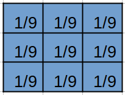
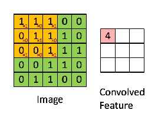
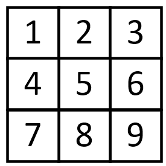
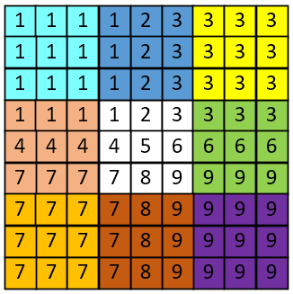
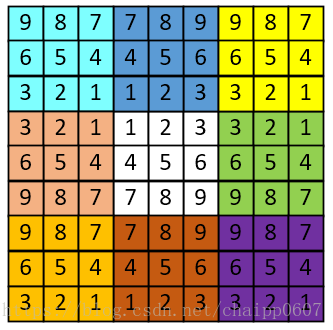
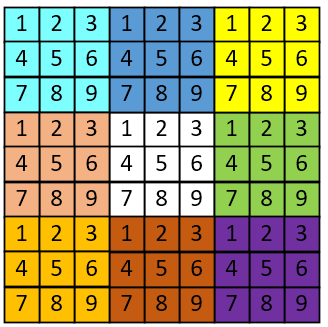

[TOC]

## 概念

`均值滤波` 是将每个像素点的像素值，用该像素点周围邻域(包括该像素点本身)的平均像素值替代。从频域来看，均值滤波属于低通滤波，即过滤掉图像高频成分（图像细节部分），保留图像低频成分（图像平滑区域），所以对图像进行 '均值滤波' 后，图像会变得模糊。

## 均值滤波性质

- 优点：算法简单，计算速度快；

- 缺点：降低噪声的同时，也会使得图像产生模糊。

## 均值滤波原理

均值滤波指定一个大小为n*n的窗口（这个窗口又叫做`均值滤波器的模板`），n一般为奇数，窗口滑过原始图像的每个像素，每次滑动都进行一次计算，计算方法是用窗口内所有元素像素值求平均，得到的均值作为窗口中心点覆盖的那个像素的灰度值。窗口滑过原始图像的过程如下图：


### 均值滤波模板

以窗口大小为3x3的均值滤波器为例，均值滤波器模板的每个权重都为 $\frac{1}{n*n} = \frac{1}{3*3} = \frac{1}{9}$ ，如下图：



同理，若窗口大小为5x5，则每个权重都为 $\frac{1}{n*n} = \frac{1}{5*5} = \frac{1}{25}$ 。

### 均值滤波的计算

有了滤波器模板后，我们就可以利用这个模板对图像进行卷积操作，得到滤波后的图像了。那么怎么卷积呢？其实就是对应点相乘即可。具体操作见下图：（注意，下图仅作示例，其权重对应的不是本文所说的均值滤波，实际实现时，需要把权重换成均值滤波的权重）



### 边界处理

上面的图片说明了图像的卷积操作，但是他也反映出一个问题，如上图，原始图片尺寸为5x5，卷积核的大小为3x3，当卷积核沿着图片滑动后只能滑动出一个5x5的图片出来，这就造成了卷积后的图片和卷积前的图片尺寸不一致，这显然不是我们想要的结果，所以为了避免这种情况，需要先对原始图片做边界填充处理。在上面的情况中，我们需要先把原始图像填充为7x7的尺寸。

常用的区域填充方法包括：**图片上的颜色只为方便观看，并没有任何其他含义。**

**原始图像：**



#### 补零填充


#### 边界复制填充



#### 镜像填充



#### 块填充




### 优化方法

参考[优化均值滤波算法](https://blog.csdn.net/jgj123321/article/details/95195277)。

有三种方法

- 积分图

- 卷积核分离：均值核是可分离卷积核（顺带一提，高斯核也是可卷积的），可以分为垂直和水平方向两个核进行卷积，而一维的均值核卷积过程，又是一个典型的leetcode的滑动窗口问题，可以优化成与卷积核大小无关的时间复杂度。
- SSE指令集

## 代码实现

完整可执行工程在[这里](../src/ImageProcessing/均值滤波)。

```cpp
#include <opencv2/core.hpp>
#include <opencv2/highgui.hpp>
#include <iostream>
#include <math.h>


// mean filter
cv::Mat mean_filter(cv::Mat img, int kernel_size){
  int height = img.rows;
  int width = img.cols;
  int channel = img.channels();

  // prepare output
  cv::Mat out = cv::Mat::zeros(height, width, CV_8UC3);

  // prepare kernel
  int pad = floor(kernel_size / 2);
  
  // filtering
  
  int vs[kernel_size * kernel_size];
  int count = 0;
  
  for (int y = 0; y < height; y++){
    for (int x = 0; x < width; x++){
      for (int c = 0; c < channel; c++){
        double v = 0;
        // get pixel sum
        for (int dy = -pad; dy < pad + 1; dy++){
          for (int dx = -pad; dx < pad + 1; dx++){
            if (((y + dy) >= 0) && ((x + dx) >= 0)){
              v += (int)img.at<cv::Vec3b>(y + dy, x + dx)[c];
            }
          }
        }
        // assign mean value
        v /= (kernel_size * kernel_size);
        out.at<cv::Vec3b>(y, x)[c] = (uchar)v;
        }
    }
  }
  return out;
}

int main(int argc, const char* argv[]){
  // read image
  cv::Mat img = cv::imread("../imori_noise.jpg", cv::IMREAD_COLOR);

  // mean filter
  cv::Mat out = mean_filter(img, 3);
  
  //cv::imwrite("out.jpg", out);
  cv::imshow("answer", out);
  cv::waitKey(0);
  cv::destroyAllWindows();

  return 0;
}

```


## 参考资料

- [图像处理一百问 | 均值滤波部分](https://github.com/gzr2017/ImageProcessing100Wen/)
- [理解图像卷积操作的意义](https://blog.csdn.net/chaipp0607/article/details/72236892) | 博文里的边界补充问题
- [优化均值滤波算法](https://blog.csdn.net/jgj123321/article/details/95195277)
