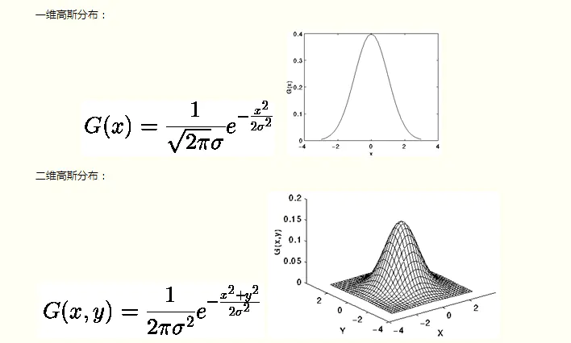
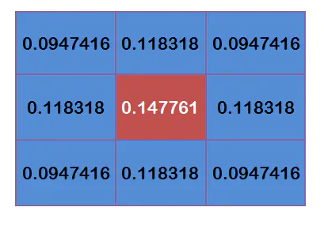
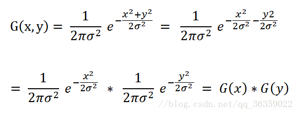
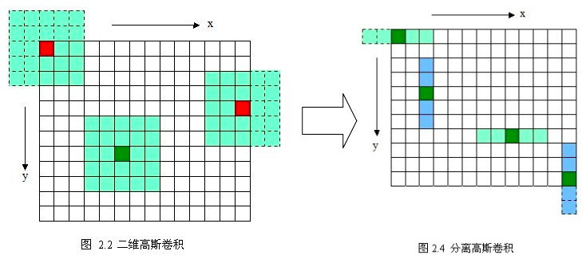
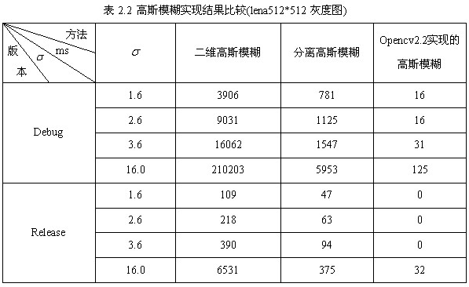

[TOC]

## 概念

`高斯滤波(Gaussian filter)` 包含许多种，包括低通、带通和高通等，我们通常图像上说的高斯滤波，指的是 `高斯模糊(Gaussian Blur)` ，是一种 `高斯低通滤波` ，其过滤掉图像高频成分（图像细节部分），保留图像低频成分（图像平滑区域），所以对图像进行 '高斯模糊' 后，图像会变得模糊。

`高斯模糊`对于抑制 `高斯噪声` (服从正态分布的噪声) 非常有效。

## 高斯滤波性质

高斯函数具有五个重要的性质，这些性质使得它在早期图像处理中特别有用．这些性质表明，高斯平滑滤波器无论在空间域还是在频率域都是十分有效的低通滤波器，且在实际图像处理中得到了工程人员的有效使用．高斯函数具有五个十分重要的性质，它们是： 

1. 二维高斯函数具有旋转对称性，即滤波器在各个方向上的平滑程度是相同的．一般来说，一幅图像的边缘方向是事先不知道的，因此，在滤波前是无法确定一个方向上比另一方向上需要更多的平滑．旋转对称性意味着高斯平滑滤波器在后续边缘检测中不会偏向任一方向． 

2. 高斯函数是单值函数．这表明，高斯滤波器用像素邻域的加权均值来代替该点的像素值，而每一邻域像素点权值是随该点与中心点的距离单调增减的．这一性质是很重要的，因为边缘是一种图像局部特征，如果平滑运算对离算子中心很远的像素点仍然有很大作用，则平滑运算会使图像失真． 

3. 高斯函数的傅立叶变换频谱是单瓣的．正如下面所示，这一性质是高斯函数付立叶变换等于高斯函数本身这一事实的直接推论．图像常被不希望的高频信号所污染(噪声和细纹理)．而所希望的图像特征（如边缘），既含有低频分量，又含有高频分量．高斯函数付立叶变换的单瓣意味着平滑图像不会被不需要的高频信号所污染，同时保留了大部分所需信号． 

4. 高斯滤波器宽度(决定着平滑程度)是由参数σ表征的，而且σ和平滑程度的关系是非常简单的．σ越大，高斯滤波器的频带就越宽，平滑程度就越好．通过调节平滑程度参数σ，可在图像特征过分模糊(过平滑)与平滑图像中由于噪声和细纹理所引起的过多的不希望突变量(欠平滑)之间取得折衷． 

5. 由于高斯函数的可分离性，较大尺寸的高斯滤波器可以得以有效地实现．二维高斯函数卷积可以分两步来进行，首先将图像与一维高斯函数进行卷积，然后将卷积结果与方向垂直的相同一维高斯函数卷积．因此，二维高斯滤波的计算量随滤波模板宽度成线性增长而不是成平方增长．

## 高斯模糊原理

要模糊一张图像，可以这么做：对于每个像素点，以它为中心，取其3x3区域内所有像素灰度值的平均作为中心点的灰度值。可是，如果仅使用简单平均，显然不是很合理，因为图像都是连续的，越靠近的点关系越密切，越远离的点关系越疏远。

因此，加权平均更合理，距离越近的点权重越大，距离越远的点权重越小。而正态分布显然是一种可取的权重分配模式。由于图像是二维的，所以需要使用二维的高斯函数。

高斯模糊本质上就是利用 `高斯函数` 生成的 `高斯核(高斯模板)` 对图像进行卷积操作。

### 高斯函数

在计算每个像素时，都把当前中心点看作坐标原点，可以使得均值 $\mu=0$ ，简化高斯函数的公式： 



### 高斯核(高斯模板)

理论上，高斯分布在所有定义域上都有非负值，这就需要一个无限大的卷积核。实际上，仅需要取均值周围3倍标准差(即3$\delta$)内的值，以外部份直接去掉即可。
**高斯滤波的重要两步就是先找到高斯模板然后再进行卷积**，模板（mask在查阅中有的地方也称作掩膜或者是高斯核）。所以这个时候需要知道它怎么来？又怎么用？
举个栗子：
假定中心点的坐标是（0,0），那么取距离它最近的8个点坐标，为了计算，需要设定σ的值。假定σ=1.5，则模糊半径为1的高斯模板就算如下


这个时候我们我们还要确保这九个点加起来为1（即归一化，这个是高斯模板的特性），否则的话，使用总值大于1的模板会让图像偏亮，小于1的模板会让图像偏暗。这9个点的权重总和等于0.4787147，因此上面9个值还要分别除以0.4787147，得到最终的高斯模板：



### 高斯滤波计算

有了高斯模板，就可以利用高斯模板对图像进行卷积了。对图像进行卷积的原理，其实就是将模板作为权值，与对应像素相乘再求和，得到的结果就是中心点卷积后的结果，本质上就是个加权平均操作。

举个栗子：
假设现有9个像素点，灰度值（0-255）的高斯滤波计算如下：


将这9个值加起来，就是中心点25进行高斯滤波后的值。对所有点重复这个过程，就得到了高斯模糊后的图像。

### 边界处理

高斯模板在对图像边缘像素进行卷积时，会有一部分权重没有对应像素，因此我们需要在图像的边缘补$0$。这种方法称作**Zero Padding**。并且权值$g$（卷积核）要进行[归一化操作](https://blog.csdn.net/lz0499/article/details/54015150)（$\sum\ g = 1$）。

实际上代码里我没进行归一化，所以滤波后图像边缘像素比较暗。

### 优化：高斯函数分离特性

直接进行二维高斯模糊效率较低，实际上高斯模糊也可以在二维图像上对两个独立的一维空间分别进行计算，这叫作线性可分：



上式说明，可以先对图像进行y(或x)轴方向的一维高斯模糊，**再在得到的结果上**进行x(或y)轴方向的一维高斯模糊，其结果与直接对图像进行二维高斯模糊效果相同。




将二维高斯模糊分离为两个一维高斯模糊后，时间复杂度从$O(w*h*c*r*r)$降到$O(2*w*h*c*r)$（详情见代码实现），这里w和h表示图像宽高，c表示图像通道数，一般彩色图是3通道，r表示高斯模板的宽高，一般为奇数，例如上图的高斯核为5x5大小，r=5。下面是优化前后时间对比参考（来源网上）：



## 代码实现

完整可执行工程在[这里](../src/ImageProcessing/高斯滤波器)。

```cpp
#include <opencv2/core.hpp>
#include <opencv2/highgui.hpp>
#include <iostream>
#include <math.h>

using namespace std;
using namespace cv;

// 方法一：将二维高斯滤波
cv::Mat gaussian_filter(cv::Mat img, double sigma, int kernel_size){
  int height = img.rows;
  int width = img.cols;
  int channel = img.channels();

  // prepare output
  cv::Mat out = cv::Mat::zeros(height, width, CV_8UC3);

  // prepare kernel
  int pad = floor(kernel_size / 2); // 用于坐标系转换
  int _x = 0, _y = 0;
  double kernel_sum = 0;
  
  // get gaussian kernel
  float kernel[kernel_size][kernel_size];

  for (int y = 0; y < kernel_size; y++){
    for (int x = 0; x < kernel_size; x++){
      _y = y - pad;
      _x = x - pad; 
      kernel[y][x] = 1 / (2 * M_PI * sigma * sigma) * exp( - (_x * _x + _y * _y) / (2 * sigma * sigma));
      kernel_sum += kernel[y][x];
    }
  }
  // 归一化到1
  for (int y = 0; y < kernel_size; y++){
    for (int x = 0; x < kernel_size; x++){
      kernel[y][x] /= kernel_sum;
    }
  }
  

  // filtering
  for (int y = 0; y < height; y++){
    for (int x = 0; x < width; x++){
      for (int c = 0; c < channel; c++){
        double v = 0;
        for (int dy = -pad; dy < pad + 1; dy++){
          for (int dx = -pad; dx < pad + 1; dx++){
            int xx = x + dx;
            int yy = y + dy;
            // 超过边缘的就不处理了
            if ( 0 <= xx && xx < width && 0 <= yy && yy < height)
            {
              v += (double)img.ptr<Vec3b>(yy)[xx][c] * kernel[dy + pad][dx + pad];
            }
          }
        }
        out.ptr<Vec3b>(y)[x][c] = v;
      }
    }
  }
  return out;
}

// 方法二：优化。将二维高斯滤波分离为两个一维高斯滤波，可以加速
cv::Mat gaussian_filter_1D(cv::Mat img, double sigma, int kernel_size){
  int height = img.rows;
  int width = img.cols;
  int channel = img.channels();

  // prepare output
  cv::Mat out_y = cv::Mat::zeros(height, width, CV_8UC3);// y轴卷积后的结果
  cv::Mat out = cv::Mat::zeros(height, width, CV_8UC3);

  // prepare kernel
  int pad = floor(kernel_size / 2); // 用于坐标系转换
  int _x = 0, _y = 0;
  
  // get gaussian kernel
  float kernel_x[kernel_size];
  float kernel_y[kernel_size];
  double kernel_sum = 0;
  for (int x = 0; x < kernel_size; x++){
    _x = x - pad; 
    kernel_x[x] = 1 / sqrt(2 * M_PI * sigma * sigma) * exp( - (_x * _x) / (2 * sigma * sigma));
    kernel_sum += kernel_x[x];
  }
  // 归一化到1
  for (int x = 0; x < kernel_size; x++){
    kernel_x[x] /= kernel_sum;
  }

  kernel_sum = 0;
  for (int y = 0; y < kernel_size; y++){
    _y = y - pad;
    kernel_y[y] = 1 / sqrt(2 * M_PI * sigma * sigma) * exp( - (_y * _y) / (2 * sigma * sigma));
    kernel_sum += kernel_y[y];
  }
  // 归一化到1
  for (int y = 0; y < kernel_size; y++){
    kernel_y[y] /= kernel_sum;
  }
  
  // filtering_y
  for (int y = 0; y < height; y++){
    for (int x = 0; x < width; x++){
      for (int c = 0; c < channel; c++){
        double v = 0;
        for (int dy = -pad; dy < pad + 1; dy++){
          int yy = y + dy;
          // 超过边缘的就不处理了
          if (0 <= yy && yy < height)
          {
            v += (double)img.ptr<Vec3b>(y + dy)[x][c] * kernel_y[dy + pad];
          }
        }
        out_y.ptr<Vec3b>(y)[x][c] = v;
      }
    }
  }

  // filtering_x
  // 注意，这里取的是上次的结果来卷积，而不是img
  for (int y = 0; y < height; y++){
    for (int x = 0; x < width; x++){
      for (int c = 0; c < channel; c++){
        double v = 0;
        for (int dx = -pad; dx < pad + 1; dx++){
          int xx = x + dx;
          // 超过边缘的就不处理了
          if (0 <= xx && xx < width )
          {
            v += (double)out_y.ptr<Vec3b>(y)[xx][c] * kernel_x[dx + pad];
          }
        }
        out.ptr<Vec3b>(y)[x][c] = v;
      }
    }
  }

  return out;
}

int main(int argc, const char* argv[]){
  // read image
  cv::Mat img = cv::imread("../imori_noise.jpg", cv::IMREAD_COLOR);
  cv::imshow("raw", img);

  clock_t start = clock();
  // gaussian filter
  // cv::Mat out = gaussian_filter(img, 1.3, 3); // 5400 us
  cv::Mat out = gaussian_filter_1D(img, 1.3, 3); // 3600 us
  clock_t end = clock();
  printf("time: %d us\n", (end-start)); // us //(CLOCKS_PER_SEC/1000)
  
  //cv::imwrite("out.jpg", out);
  cv::namedWindow("answer", cv::WINDOW_NORMAL);
  cv::imshow("answer", out);
  cv::waitKey(0);
  cv::destroyAllWindows();

  return 0;
}

```


## 参考资料

- [简单易懂的高斯滤波](https://www.jianshu.com/p/73e6ccbd8f3f)
- [高斯滤波](https://blog.csdn.net/sunmc1204953974/article/details/50634652)
- [图像滤波之高斯滤波介绍](https://www.cnblogs.com/qiqibaby/p/5289977.html)
- [SIFT算法详解](https://blog.csdn.net/zddblog/article/details/7521424) | 前面的高斯模糊部分
- [图像处理一百问/问题九 高斯滤波](https://github.com/gzr2017/ImageProcessing100Wen/blob/master/Question_01_10/README.md)
- [快速高斯滤波、高斯模糊、高斯平滑(二维卷积分步为一维卷积)](https://blog.csdn.net/qq_36359022/article/details/80188873)