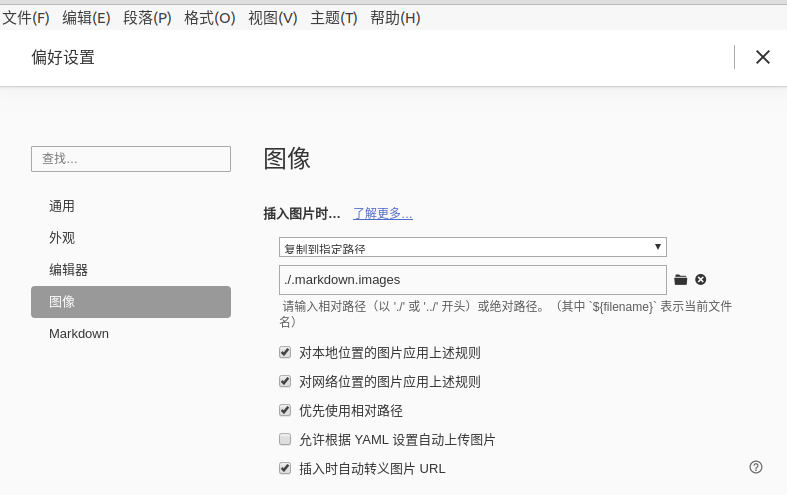
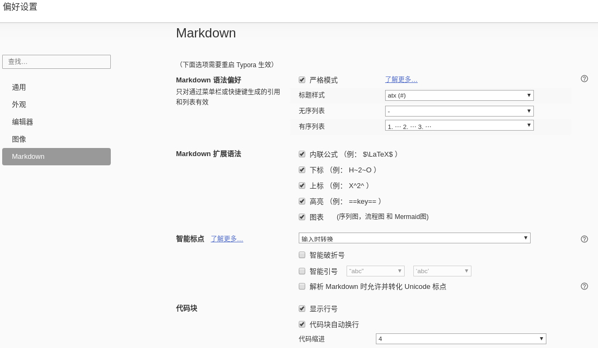

**💡 关于**

本人为 `3D视觉+传统图像处理方向`，在准备秋招时发现网上竟然找不到对应的求职复习资料，只好自己整理。

本仓库整理 `3D视觉(三维重建、SLAM、AR/VR) + 传统图像处理 + 计算机视觉(偏AI)` 重要知识点和面试问题。

目前已知的其它求职复习资料有：

- C/C++开发：[interview](https://github.com/huihut/interview)
- java开发：[CS-Notes](https://github.com/CyC2018/CS-Notes)、[javaGuide](https://github.com/Snailclimb/JavaGuide)
- CV算法岗（偏AI方向）：[CV_interviews_Q-A](https://github.com/GYee/CV_interviews_Q-A)、[AI-Job-Notes](https://github.com/amusi/AI-Job-Notes)

---

## 🔍使用方法

- 在线使用。直接在线浏览本仓库。
- 本地使用。clone本仓库到本地，使用markdown阅读器 `typora` 打开对应内容阅读。

## 📑 目录

### [📷 3D视觉(三维重建、SLAM、AR/VR)](./3D_Vision)

- 

### [🎨 图像处理](./ImageProcessing)

* [图像滤波——高斯滤波。代码实现以及优化](./ImageProcessing/高斯滤波器.md)
* [图像滤波——均值滤波。代码实现以及优化](./ImageProcessing/均值滤波.md)
* [图像滤波——中值滤波。代码实现](./ImageProcessing/中值滤波.md)
* [随机采样一致(RANSAC)原理和实现](./ImageProcessing/RANSAC.md)

### [👁计算机视觉(偏AI)](./CV)

- [2D和3D空间中的变换](./CV/2D和3D空间中的变换.md)
- 

## 📌TODO

### 📷 3D视觉(三维重建、SLAM、AR/VR)

- [x] [几种变换矩阵（透视、仿射、相似等），他们的自由度，特点](./CV/2D和3D空间中的变换.md)
- [ ] 针孔相机模型
- [ ] SVD分解、二维相似变换的求解为例
- [ ] 相机加畸变与去畸变
- [ ] 3*3的几何变换矩阵，每个参数代表啥意思？
- [ ] 特征降维有哪些方式？下采样，NMS，1*1，pca，LDA？
- [ ] 相机的3A参数（自动对焦（AF）、自动曝光（AE）及自动白平衡（AWB））
- [ ] 3D-3D：ICP
- [ ] 2D-3D：PnP
- [ ] 2D-2D：基本矩阵、本质矩阵
- [ ] 相机标定 - DLT、PnP及其变种、张定友标定法
- [ ] 光线追踪
- [ ] 参数矩阵求逆
- [ ] 齐次坐标、点到直线距离
- [ ] 方程组的解
- [ ] 线性方程解的判定
- [ ] K-D tree
- [ ] BA、LM算法
- [ ] 双目立体视觉、视差图、深度图。双目相机获得深度图伪代码
- [ ] 光流算法
- [ ] 最小二乘法拟合数据，以拟合直线为例
- [ ] 

### 🎨 图像处理

- [x] [图像滤波——高斯滤波。代码实现以及优化](./ImageProcessing/高斯滤波器.md)
- [x] [图像滤波——均值滤波。代码实现以及优化](./ImageProcessing/均值滤波.md)
- [x] [图像滤波——中值滤波。代码实现](./ImageProcessing/中值滤波.md)
- [x] [随机采样一致(RANSAC)原理和实现](./ImageProcessing/RANSAC.md)
- [ ] SIFT特征。
    SIFT的原理（尺度不变性、旋转不变性），如何下采样，下采样因子多少，为什么要求解DOG，为什么要使用三线插值函数，128维度描述子怎么来的，梯度直方图怎么算的，梯度怎么算的，梯度方向怎么算的，邻域范围选的多大等等
- [ ] 除了SIFT，还知道哪些特征，除了SIFT、SURF、ASIFT、ORB、HOG还有啥
- [ ] 图像降噪算法。
- [ ] 图像增强算法。
- [ ] 边缘检测算子：Robert prewit sobel 拉普拉斯 canddy
- [ ] 手写马赛克代码
- [ ] LBP特征。原理，如何计算相似性（汉明距离），汉明距离怎么计算
- [ ] 数据增强有哪些方式，具体的图像处理操作又有哪些？
- [ ] 图像格式：bayer、rgb、yuv、hsv等等

### 👁计算机视觉(偏AI)

- [ ] 

## 数学基础

- [ ] 一层楼共有n级台阶，一次可以上至少一级但不超过m级台阶，求有多少种不同的上楼方案数。由于结果可能很大，你只需要输出结果对10007取模的值即可
- [ ] 拟合二维平面中的带噪声直线，其中有不超过20%的样本点远离了直线，另外80%的样本点可能有高斯噪声的偏移，要求输出为ax+by+c=0的形式，其中a>0且a^2+b^2=1
- [ ] 切比雪夫不等式、协方差与相关系数、各种分布、多元高斯分布
- [ ] 线性回归推导回归系数（y=kx，y=kx+b）
- [ ] 甲乙两人约好在某地碰面，时间段为10点到11点。若甲先到，最多会等待10分钟，10分钟内乙未出现则离开；若乙先到，最多会等待15分钟，15分钟内甲未出现则离开，请问两人见面的概率是多少？
- [ ] ABCDE5个人互相传球，由A开始第一次传球，经5次传球最后回到A的手上，其中A与B不会互相传球，C只会传给D，E不会传给C，共有多少种传球方法？
- [ ] MLE、MAP和贝叶斯估计
- [ ] MLE，MAP，EM 和 point estimation 之间的关系是怎样的？
- [ ] 如何求解Ax=b (非迭代Cholesky分解、QR分解，迭代)
- [ ] 最小二乘封闭解与迭代解的取舍
- [ ] 梯度下降法、牛顿法、GN、LM，推导、优缺点
- [ ] 如何判断点在多边形内
- [ ] 一阶、二阶优化，Jacobian、hessian矩阵
- [ ] 1000个数的阶乘，求有多少个0
- [ ] 递推法求数学期望，反证法，数学归纳法等

## 👉🏼贡献指南

想要一起把内容完善，可以按照 `合作要求` 提交 `Pull requests` 。

详细的贡献指南参考[这里](贡献指南/贡献指南.md)，包括要求和git使用

### 合作要求

- 如果有参考资料，请务必注明整理笔记时的参考资料，一方面是版权问题，另一方面是方便读者参考。参考资料包括但不限于书籍名、论文标题和博客链接。
- 对于面试问题，建议在文档开头给出面试问题出处，方便读者参考。如“问题来自头条互娱-图形图像岗，链接：https://www.nowcoder.com/discuss/262804”。
- 笔记内容按照 [中文文案排版指北](https://github.com/sparanoid/chinese-copywriting-guidelines/blob/master/README.zh-CN.md) 进行排版，以保证内容的可读性。

### markdown 编辑器选择

推荐使用 `typora` 作为 markdown 阅读器，并进行如下设置：

- [x] 插入图像时... `复制到制定路径` `./.markdown.images` 。设置完成后，图片可以直接粘贴进markdown中，并自动保存在 `./.markdown.images` 隐藏目录下 
- [x] 对本地位置的图片应用上述规则
- [x] 对网络位置的图片应用上述规则
- [x] 优先使用相对路径
- [x] 插入时自动转义图片URL
- [x] 开启markdown扩展语法，全部打钩

设置完成后如下图：

## License

遵循[ CC 4.0 BY ](http://creativecommons.org/licenses/by/4.0/)版权协议，转载请附上原文出处链接和本声明。

